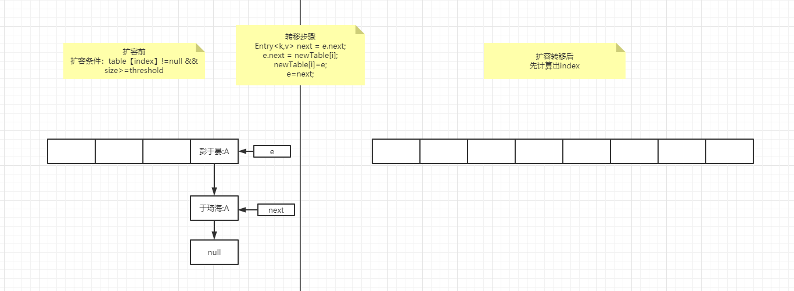
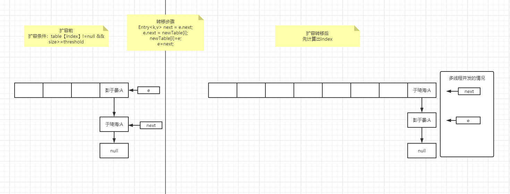
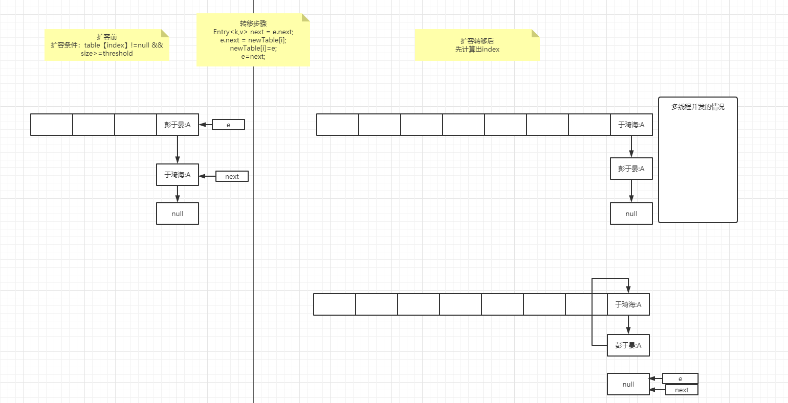

# HashMap1.7

### 前言

1、jdk1.7的hashMap数据结构是怎样的？

2、怎么扩容的？扩容的过程

3、HashMap在jdk1.7的时候有个循环链表的问题。

4、快速失败机制是什么玩意？

5、为什么容量是2的幂次方？

6、为什么使用头插法？用尾插法行不行？

整个jdk1.7的hashMap要关注的问题并不多，结合源码来一起解决这几个问题。

### 正文

> jdk1.7的hashMap数据结构是怎样的？

回答：准确的说是数组加单向链表，单向链表体现在Entry对象中只有Entry<K,V> next，只有next，没有pre啥的。数组体现在hashmap中局部变量table的定义，transient Entry<K,V>[] table = (Entry<K,V>[]) EMPTY_TABLE，很明显就是数组。


> 怎么扩容？什么时候扩容？扩容的过程是什么？

首先我们需要找到put方法，国际惯例，查看hashmap源码的时候先看put方法，这边就先把put方法copy出来展示一下。

```java
public V put(K key, V value) {
        if (table == EMPTY_TABLE) {
            inflateTable(threshold);
        }
        if (key == null)
            return putForNullKey(value);
        int hash = hash(key);
        int i = indexFor(hash, table.length);
        for (Entry<K,V> e = table[i]; e != null; e = e.next) {
            Object k;
            if (e.hash == hash && ((k = e.key) == key || key.equals(k))) {
                V oldValue = e.value;
                e.value = value;
                e.recordAccess(this);
                return oldValue;
            }
        }
        modCount++;
        addEntry(hash, key, value, i);
        return null;
    }
```

> 扩容的时机：扩容的时机是size>threshold并且table[index]！=null；

```java
void addEntry(int hash, K key, V value, int bucketIndex) {
    // 这里的判断就是扩容的时机
        if ((size >= threshold) && (null != table[bucketIndex])) {
            // 扩容的过程
            resize(2 * table.length);
            // key为null的时候默认放在0的位置，并不是说只有0放的是key为null的。
            hash = (null != key) ? hash(key) : 0;
            bucketIndex = indexFor(hash, table.length);
        }
        createEntry(hash, key, value, bucketIndex);
    }
```

> 扩容的过程：先扩容

```java
void resize(int newCapacity) {
        Entry[] oldTable = table;
        int oldCapacity = oldTable.length;
        if (oldCapacity == MAXIMUM_CAPACITY) {
            threshold = Integer.MAX_VALUE;
            return;
        }
		// 扩容，数据长度*2
        Entry[] newTable = new Entry[newCapacity];
		// 进行转移
    	transfer(newTable, initHashSeedAsNeeded(newCapacity));
        table = newTable;
        threshold = (int)Math.min(newCapacity * loadFactor, MAXIMUM_CAPACITY + 1);
    }
```

> 扩容的过程：再转移

```java
// 这里可以不太关注这个rehash，就假设是false来走底下的逻辑
void transfer(Entry[] newTable, boolean rehash) {
        int newCapacity = newTable.length;
    	// 遍历当前的table数组，然后需要转移到新的数组中也就是newTable
        for (Entry<K,V> e : table) {
            // while里面就是核心的转移逻辑，可以用图来进行表示
            while(null != e) {
                Entry<K,V> next = e.next;
                if (rehash) {
                    e.hash = null == e.key ? 0 : hash(e.key);
                }
                // 不考虑rehash的情况下，i要么和原来保持一致，要么是oldTable.length+i
                int i = indexFor(e.hash, newCapacity);
                // 多线程A执行完，B卡住在此处
                e.next = newTable[i];
                newTable[i] = e;
                e = next;
            }
        }
    }
```

> 转移的过程：循环链表的问题，有人把这个问题反馈给了Sun，不过Sun认为这不是一个问题，因为HashMap本来就不支持并发，但是面试经常会提循环链表这点。如何解决循环链表？用ConcurrentHashMap。

1. 首先定义一个HashMap，容量为4，阈值为4*0.75（默认加载因子）=3，扩容后容量为8。如下图所示：

2. 当需要插入数据吴彦祖:A的时候，刚好index也为3，将会触发扩容和数据转移，newTable的index要么是3要么是7，假定newTable[index]为7来进行转移；不存在并发的情况下转移如下图所示：
   根据源码可得，当前table[index=3]为e，next=e.next,转移之后由于是头插法数据将会倒置，如下图所示：

3. 当多线程A和B并发的时候，A线程执行完了扩容和转移，B线程卡在上述代码的注释处时，将会出现循环链表问题，如下图所示:
   
   首先时next指针指向于琦海:A,e指针指向彭于晏:A;
   e.next指向newTable[7]，然后newTable[7]=e,当前元素彭于晏:A下移;然后e=next，指针同时指向于琦海:A;

   next指向彭于晏:A;
   于琦海:A元素的next指向newTable[7]，元素下移，指针e指向next也就是元素彭于晏:A;
   next指向null；
   e指针指向的彭于晏:A,e.next=newTable[7]，这时候就形成了闭环，元素上移动。（我图里面元素没有向上移动这一步，画的时候忘记了，抱歉）

   

> 什么是快速失败机制？fail-fast是java集合(Collection)中的一种错误检测机制。当在迭代集合的过程中该集合在结构上发生改变的时候，就有可能会发生fail-fast，即抛出 ConcurrentModificationException异常。其原理就是集合类的remove方法不会去改变expectedModCount，而迭代器中的remove方法会expectedModCount = modCount;

```java
if (modCount != expectedModCount)
    throw new ConcurrentModificationException();
```


> 为什么容量是2的幂次方?

首先我们看下计算index的方法：

```java
// 用hashcode值和length-1进行与运算
static int indexFor(int h, int length) {
    // assert Integer.bitCount(length) == 1 : "length must be a non-zero power of 2";
    return h & (length-1);
}
```

用hashcode值和length-1进行与运算，我们都知道index是从0开始的，并且算出来的下表不可能大于length，在进行与运算的时候刚好能满足这一特性，类似我们数学中的求余运算。配套使用此处的方法就是必须得2得幂次方

> 为什么jdk1.7中的hashmap使用的头插法，使用尾插法不行吗？

我在一些推送的文章上看到有说使用头插法是效率更快，我们在这里打个问号？？？？先看一下代码中的头插法是怎么实现的

```java
void createEntry(int hash, K key, V value, int bucketIndex) {
    Entry<K,V> e = table[bucketIndex];
    table[bucketIndex] = new Entry<>(hash, key, value, e);
    size++;
}
```

很明显，就是把新建一个Entry对象然后将hash key value放入，next属性为之前的table[index]，就这样进行插入。也就是所谓的头插法。这里貌似看起来确实像那么回事，如果使用的是尾插法，那么就需要循环一次然后插入到最后，确实会消耗更多时间。但是但是但是！！！！！

我们回想到put方法中的一个for循环，我单独拿出来看一下，不想往上翻了

```java
for (Entry<K,V> e = table[i]; e != null; e = e.next) {
    Object k;
    if (e.hash == hash && ((k = e.key) == key || key.equals(k))) {
        V oldValue = e.value;
        e.value = value;
        e.recordAccess(this);
        return oldValue;
    }
}
```

在hashmap1.7中，我们看到其实是有返回值的，也就是说在有hash值相同，且key值一样的时候会将oldvalue返回，也就是说在这里会像table[index]循环一遍，看是否有key相同的，如果key不同那么会循环完，如果找到了相同的就直接替换，那么效率问题好像就不成立，因为不存在key相同的情况下是遍历了整个tablep[index]。

也许也许也许也许

是开发者觉得我最近插入的，可能最近被使用，使用头插法能更快的get到？有更好的理解欢迎沟通~

