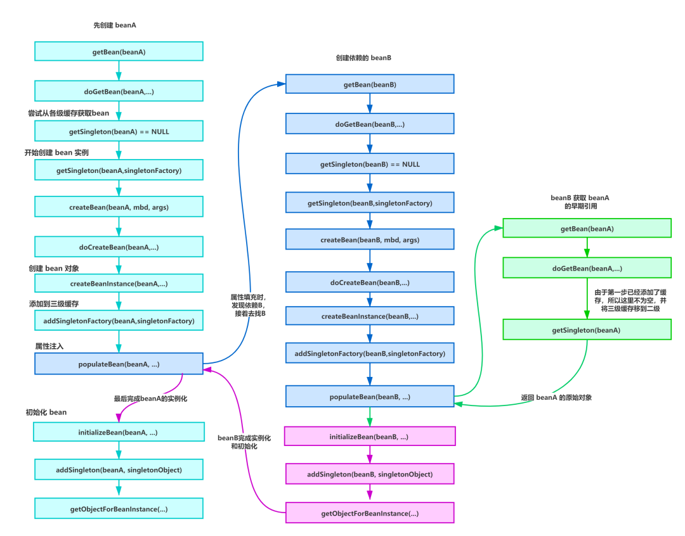

# Spring源码解析

- 谈谈你对spring的理解
  - spring首先是一个框架，在我们整个开发流程中所有的框架生产几乎都依赖于spring，spring帮我们起到了一个ioc容器的作用，用来承载我们整体的bean对象，他帮我们进行了整个对象从创建到销毁的整个生命周期的管理，我们在使用spring的时候，可以使用配置文件或者注解的方式来进行相关实现，但是当我们程序启动起来的时候，spring会把我们配置文件或者注解定义好的那些bean对象转换成BeanDefinition，然后需要完成整个BeanDefinition的解析和加载过程，当获取到这些完整的对象的时候，下一步需要对整个BeanDefinition进行实例化操作。在进行实例化最简单的方式就是利用反射创建对象。对象创建完成后没完，只是在堆里面开辟了空间，并没有完成后续的初始化操作。所以在后面还会实现aware接口，初始化方法的操作，实现aop还需要实现BeanpostProcessor接口，并且在之前的BeanDefinition环节也会去实现BeanFactoryPostProcessor接口去实现相关的扩展工作。
  - Spring是一个轻量级的控制反转IOC和面向切面AOP的容器框架，用来装载java对象，也可以起到连接的作用，比如hibernate粘合在一起，让企业开发更加简洁。
    - 从大小与开销两方面而言Spring都是轻量级的。
    - 通过控制反转的技术达到松耦合的目的。
    - 提供面向切面编程的丰富支持
- 什么是AOP
  - AOP是处理一些横切性问题，这些横切性问题不会影响到主逻辑的实现，但是会散落到代码的各个部分，难以维护。AOP就是把这些问题和主业务逻辑分开，达到与主业务逻辑解耦的目的。
- 谈谈你对IOC的理解（容器概念、控制反转、依赖注入）
  - IOC容器：实际上就是个map，里面存放的是各种对象，这里可以拓展到bean的生命周期
  - 控制反转: 就是把对对象的控制权力上缴给IOC容器
  - 依赖注入：就是IOC容器运行期间，动态的将某种依赖关系注入到对象中
- BeanFactory和ApplicationContext有什么区别？
  - 这里有提到ApplicationContext有一些高级的特性，同时重要的时BeanFactory使用的是延迟初始化，Bean使用的时候才去初始化。这样就是为什么Springboot启动慢但是获取Bean的速度非常快。
- spring为什么需要三级缓存解决循环依赖，而不是二级缓存
  - 
  - 
  - 两级缓存确实可以解决循环依赖的问题。**如果加上AOP，两级缓存是无法解决的，不可能每次执行singleFactory.getObject()方法都给我产生一个新的代理对象，所以还要借助另外一个缓存来保存产生的代理对象**
  - 
- SpringAop中的advice执行顺序是什么？
  - around before after afterReturning afterThrowing  daima  chain
  - around before 谁先执行谁后执行影响不大
  - sortAdvisor

