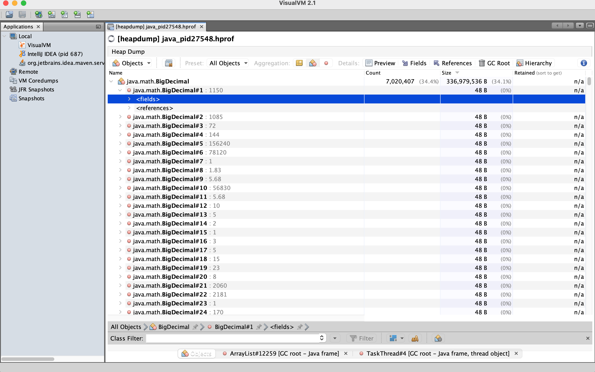
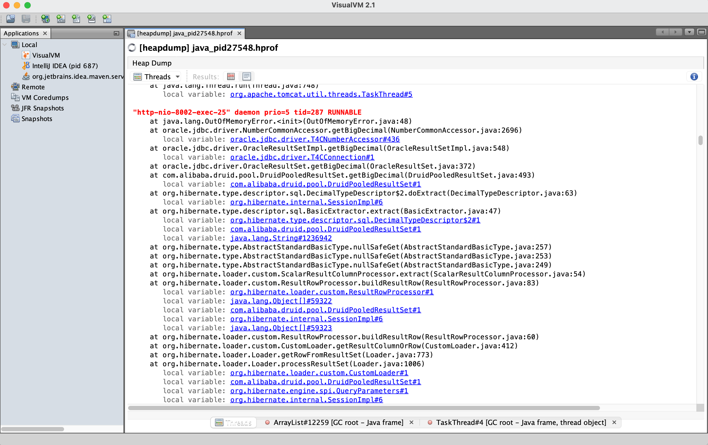
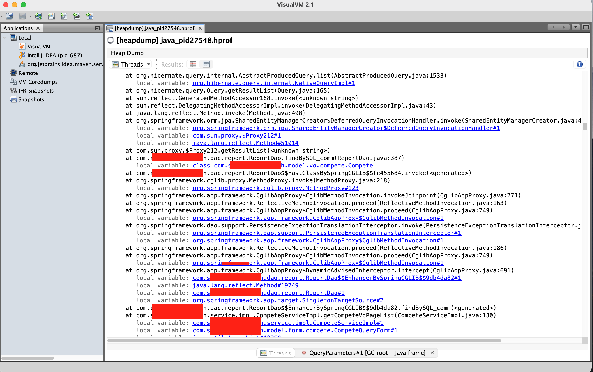
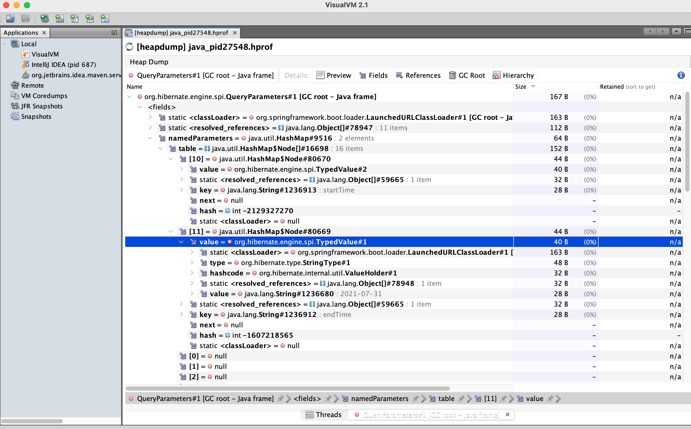
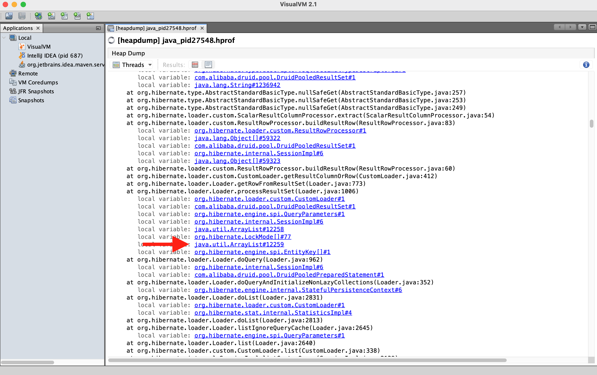
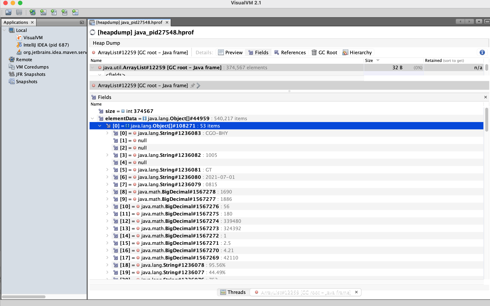

阳光明媚的下午，突然甲方打电话过来说系统用不了，验证码一直加载不出来，登陆不了系统了。然后开始bibibi，你们怎么回事啊，赶快排查恢复并且交给我们一份故障检查报告。当时就心态就崩了，打开电脑登陆VPN连接到远程服务器上开始排查问题。

#### 问题排查

连上服务器后，第一反应检查redis集群是不是有问题，登陆redis服务器的一台节点，查看cluster info和cluster nodes发现redis并无异常。因为验证码这玩意是存在redis的，所以第一反应就是看redis是不是有问题。

redis正常，那么就去看web服务器的web-error.log日志，惊呆了，java.lang.OutOfMemoryError: Java heap space，这时候我就已经确定了，我们JVM的堆空间不足导致内存溢出的问题。

#### dump日志的获取

此处有个小提示，在部署这种系统的时候都是需要加上一些必要的jvm参数的，比如我在部署这台web的时候就增加了：

**-XX:+HeapDumpOnOutOfMemoryError -XX:HeapDumpPath=/opt/jvmdump**，所以遇到这个问题我并不是太担心，进入目录/opt/jvmdump看到java_pid27548.hprof文件，大小在1.12G，还是挺大的，这个文件会挺大的，相当于当时的内存使用大小，不必惊讶。

我将java_pid27548.hprof文件进行压缩，传输回本地，然后就将开启我的排查之路。

#### 开始排查

首先我们倒入hprof文件到VisualVM，可以看到分为6个区域。

1区域是堆信息展示，堆大约是1G，还有类、实例等一些信息。

2区域是服务器上的一些参数信息。

3区域是按实例数划分的类，最大的是BigDecimal其次是char[]，以及string等等，以及分别占用了总实例数的百分比。char的实例数达到了5001143占总数量的24.5%。我们在一区域看到instances为20402517，用计算器核查了一下，确实是这样。

4区域是按实例大小划分的类，也是由大到小依次排序，单位是B，BigDecimal占用的大小为336979536B，大概就是337M，占总堆的34.1%，我们的总Size为987908640B，除一下为0.3411也就是34.1%。

漏掉了一个很重要的区域，就是1区域和3区域中间的标题为：OutOfMemoryError Thread，内存溢出线程区域。这个区域的提示就是告诉我们造成这次堆空间溢出的线程是哪个，所以我们的重点就在这个地方。

首先我们看到这些信息时，是不是一脸懵逼，我们可以点开4区域，查看到这一个很大的BigDecimal对象，但是这些东西怎么定位到我的代码？？？，怎么看是哪里导致的大对象呢？？？这里展示的内容只是一些凌乱的单个对象的信息，和我们的Service，Controller等关联不到一起。显然这里是无法排查出问题的。

通过上面的图我们可以很清楚的知道是因为一些对象占用太多空间，导致的堆溢出异常，所以后续就是需要定位那些地方会产生较大的对象，所以我们回到OutOfMemoryError Thread[view all]区域，点击view all找到标红的异常线程信息。

通常由于代码编写的不够严谨，在使用List或者Map对象的时候塞入了很多值，然后再内存中进行各种处理的时候会出现堆过大的问题，因为大对象是直接到老年代的。或者我们查询了一个时间跨度很大的数据，几十万条这种导致返回的集合过大。

说这么多就是为了告诉你，我们看这个区域内的线程信息时，找自己写的类的全限定路径，比如我们的com.qhyu.cloud.****Service;类似这种我们自己项目的路径信息。

我是从下往上慢慢开始找，很快我就找到了这个项目内的类名，毕竟保密协议，所以打了马塞克。这些类似超链接一样的蓝色的链接都是可以点的，可以查看运行时的状况。从下往上我依次找到了相关的controller，service，dao等信息，我点了一个最上面的NativeQueryImpl#1的链接。

点进去发现其实是这个线程是在查询一次数据库，绑定的参数很明显只有两个startTime和endTime，区间在2021-07-01到2021-07-31。然而这并不是我想要的，继续回到Threads模块往上找。

然后我就找到了一个ArrayList，我想看看这个查询出来的对象有多大，所以直接点进去看看详情。

我们点击Fields查看元素，发现elementData是个大对象，size大小有374567，里面全是String和BigDecimal，这时候我反应过来了，刚刚4区域的信息都是因为这个返回造成的。也就是说导致我们生产上出现假死的就是这个线程查询的时候返回的对象太大，当线程还没有结束的时候其他线程想要分配堆空间的时候，执行full gc也还是没有回收，一段时间后就报异常了。

当然这个问题是由于我们的某些大表数据量在千万级别，查询一个月的数据也在几十万数据量，只是这个朋友在写代码的时候没有调用分页的dao层方法，导致这个模块在使用的时候出现了问题，所以还是得细心呀，码农也得有自己的职业操守不是。

