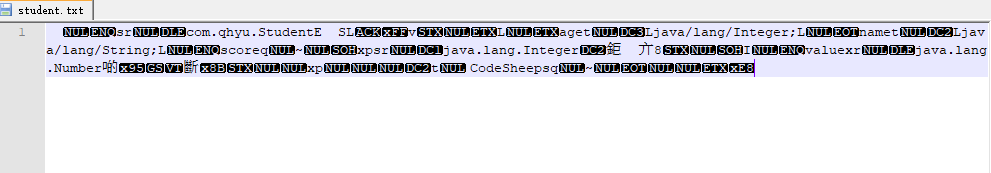
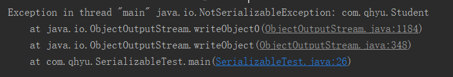
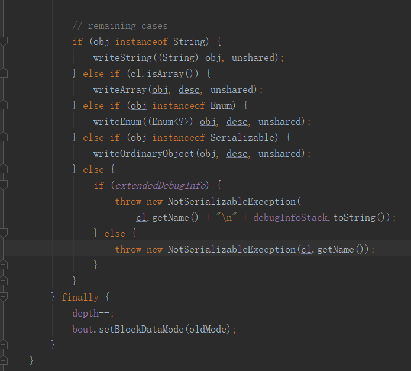
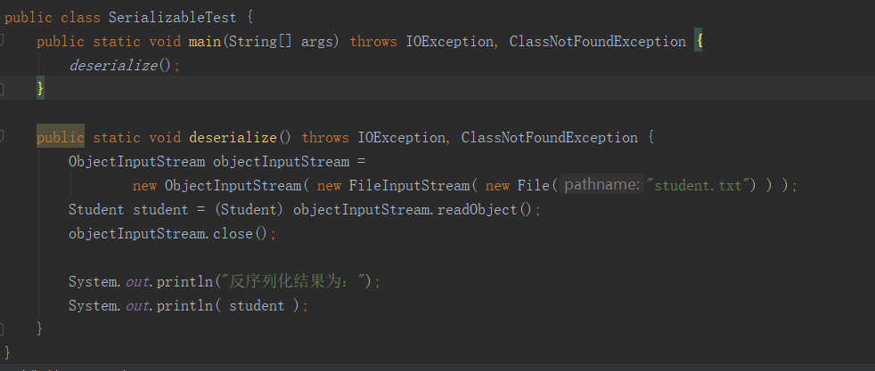
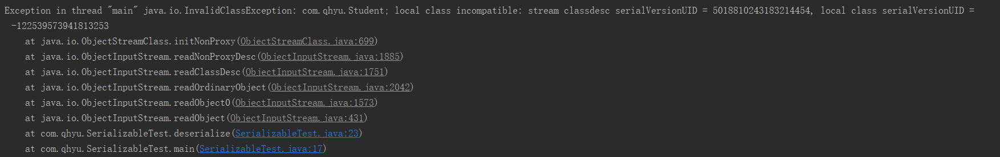
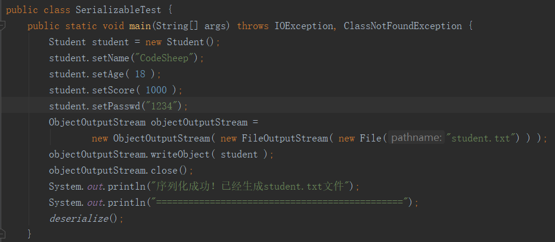
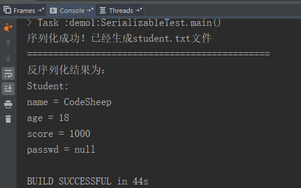
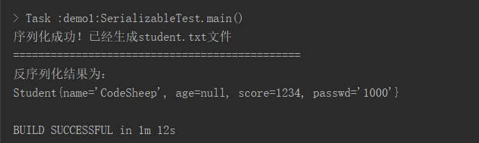
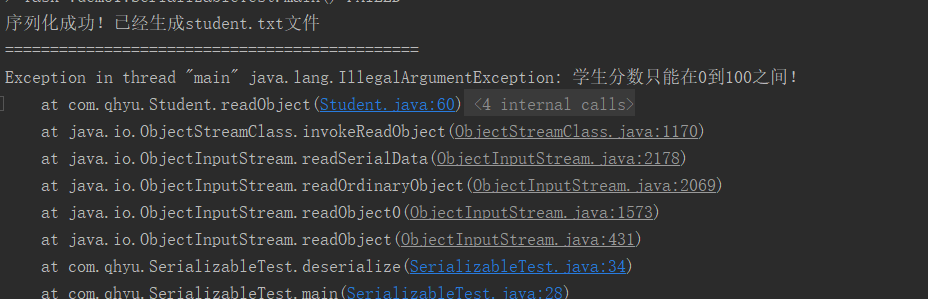

#### 1、序列化是干啥用的？

序列化的原本意图是希望对一个java对象做一下“变换”，变成字节序列，这样一来方便持久化存储到磁盘，另外变换成字节序列也更方便在网络运输和传播，所以概念上很好理解：

- **序列化：**把java对象转换为字节序列。
- **反序列化：**把字节序列恢复为原来的对象。

而且序列化机制从某种意义上来说也弥补了平台化的一些差异，毕竟转换后的字节流可以在其他任意平台上进行反序列化来恢复对象。

#### 2、对象序列化的方式？

在java中，如果一个对象想要实现序列化，必须要实现下面两个接口之一：

- Serializable接口
- Externalizable接口

我们平常使用的最多的是Serializable接口，那么这两个接口是如何工作的？两者又有什么关系呢，我们分别进行介绍。

##### 2.1 Serializable接口

一个对象想要被序列化，那么它的类就要实现此接口或者它的子接口。

这个对象的所有属性(包括private属性、包含其他引用的对象)都可以被序列化和反序列化来保存、传递。不像序列化的字段可以使用transient修饰。

由于Serializable对象完全以它存储的二进制为基础来构造，因此并不会调用任何构造函数，因此Serializable类无需默认构造函数，但是当Serializable类的父类没有实现Serializable接口时，反序列化过程会调用父类的默认构造函数，因此该父类必须要有默认的构造函数，否则会抛异常。

使用transient关键字阻止序列化虽然简单方便，但被它修饰的属性被完全隔离在序列化机制之外，导致了在反序列化时无法获取该属性的值，而通过在需要序列化的对象的java类里加入writeObject()方法与readObject()方法可以控制如何序列化各属性，甚至完全不序列化某些属性或者加密序列化某些属性。

##### 2.2 Externalizable接口

它是Serializable接口的子类，用户要实现的writeExternal()和readExternal() 方法，用来决定如何序列化和反序列化。

因为序列化和反序列化方法需要自己实现，因此可以指定序列化哪些属性，而transient在这里无效。

对Externalizable对象反序列化时，会先调用类的无参构造方法，这是有别于默认反序列方式的。如果把类的不带参数的构造方法删除，或者把该构造方法的访问权限设置为private、默认或protected级别，会抛出java.io.InvalidException: no valid constructor异常，因此Externalizable对象必须有默认构造函数，而且必需是public的。

##### 2.3 对比

使用时，你只想隐藏一个属性，比如用户对象user的密码pwd，如果使用Externalizable，并除了pwd之外的每个属性都写在writeExternal()方法里，这样显得麻烦，可以使用Serializable接口，并在要隐藏的属性pwd前面加上transient就可以实现了。如果要定义很多的特殊处理，就可以使用Externalizable。

当然这里我们有一些疑惑，Serializable 中的writeObject()方法与readObject()方法科可以实现自定义序列化，而Externalizable 中的writeExternal()和readExternal() 方法也可以，他们有什么异同呢？

- readExternal(),writeExternal()两个方法，这两个方法除了方法签名和readObject(),writeObject()两个方法的方法签名不同之外，其方法体完全一样。
- 需要指出的是，当使用Externalizable机制反序列化该对象时，程序会使用public的无参构造器创建实例，然后才执行readExternal()方法进行反序列化，因此实现Externalizable的序列化类必须提供public的无参构造。
- 虽然实现Externalizable接口能带来一定的性能提升，但由于实现ExternaLizable接口导致了编程复杂度的增加，所以大部分时候都是采用实现Serializable接口方式来实现序列化。

#### 3、Serializable如何序列化对象？

##### 3.1 Serializable演示

然而Java目前并没有一个关键字可以直接去定义一个所谓的“可持久化”对象。

对象的持久化和反持久化需要靠程序员在代码里手动**显式地**进行序列化和反序列化还原的动作。

举个例子，假如我们要对Student类对象序列化到一个名为student.txt的文本文件中，然后再通过文本文件反序列化成Student类对象：

1、Student类定义

```java
public class Student {
	private String name;
	private Integer age;
	private Integer score;

	@Override
	public String toString() {
		return "Student:" + '\n' +
				"name = " + this.name + '\n' +
				"age = " + this.age + '\n' +
				"score = " + this.score + '\n'
				;
	// set get方法省略
	}
}
```

2、序列化

```java
public class SerializableTest {
	public static void main(String[] args) throws IOException {
		Student student = new Student();
		student.setName("CodeSheep");
		student.setAge( 18 );
		student.setScore( 1000 );
		ObjectOutputStream objectOutputStream =
				new ObjectOutputStream( new FileOutputStream( new File("student.txt") ) );
		objectOutputStream.writeObject( student );
		objectOutputStream.close();
		System.out.println("序列化成功！已经生成student.txt文件");
		System.out.println("==============================================");
	}
}
```

文件打开如下图所示：



3、反序列化

```java
public static void deserialize(  ) throws IOException, ClassNotFoundException {
    ObjectInputStream objectInputStream = 
        new ObjectInputStream( new FileInputStream( new File("student.txt") ) );
    Student student = (Student) objectInputStream.readObject();
    objectInputStream.close();
 
    System.out.println("反序列化结果为：");
    System.out.println( student );
}
```

4、结果打印

```
序列化成功！已经生成student.txt文件
==============================================
反序列化结果为：
Student:
name = CodeSheep
age = 18
score = 1000
```

##### 3.2 Serializable接口有何用？

上面在定义Student类时，实现了一个Serializable接口，然而当我们点进Serializable接口内部查看，发现它竟然是一个空接口，并没有包含任何方法！

试想，如果上面在定义Student类时忘了加implements Serializable时会发生什么呢？

实验结果是：此时的程序运行会报错，并抛出NotSerializableException异常：



我们按照错误提示，由源码一直跟到ObjectOutputStream的writeObject0()方法底层一看，才恍然大悟：



如果一个对象既不是字符串、数组、枚举，而且也没有实现Serializable接口的话，在序列化时就会抛出NotSerializableException异常！

原来Serializable接口也仅仅只是做一个标记用！！！它告诉代码只要是实现了Serializable接口的类都是可以被序列化的！然而真正的序列化动作不需要靠它完成。

##### 3.3  **serialVersionUID号有何用？**

相信你一定经常看到有些类中定义了如下代码行，即定义了一个名为serialVersionUID的字段：

```java
private static final long serialVersionUID = 1L;
```

你知道这句声明的含义吗？为什么要搞一个名为serialVersionUID的序列号？

继续来做一个简单实验，还拿上面的Student类为例，我们并没有人为在里面显式地声明一个serialVersionUID字段。

```java
public class Student implements Serializable {
   private String name;
   private Integer age;
   private Integer score;
   private Integer id;
```

这时候，我们拿刚才已经序列化到本地的student.txt文件，还用如下代码进行反序列化，试图还原出刚才那个Student对象：



运行发现报错了，并且抛出了InvalidClassException异常



这地方提示的信息非常明确了：序列化前后的serialVersionUID号码不兼容！

从这地方最起码可以得出两个重要信息：

1、serialVersionUID是序列化前后的唯一标识符

2、默认如果没有人为显式定义过serialVersionUID，那编译器会为它自动声明一个！

第1个问题： serialVersionUID序列化ID，可以看成是序列化和反序列化过程中的“暗号”，在反序列化时，JVM会把字节流中的序列号ID和被序列化类中的序列号ID做比对，只有两者一致，才能重新反序列化，否则就会报异常来终止反序列化的过程。

第2个问题： 如果在定义一个可序列化的类时，没有人为显式地给它定义一个serialVersionUID的话，则Java运行时环境会根据该类的各方面信息自动地为它生成一个默认的serialVersionUID，一旦像上面一样更改了类的结构或者信息，则类的serialVersionUID也会跟着变化！

所以，为了serialVersionUID的确定性，写代码时还是建议，凡是implements Serializable的类，都最好人为显式地为它声明一个serialVersionUID明确值！

当然，如果不想手动赋值，你也可以借助IDE的自动添加功能，比如我使用的IntelliJ IDEA，按alt + enter就可以为类自动生成和添加serialVersionUID字段，十分方便。

**两种特殊情况**

1、凡是被static修饰的字段是不会被序列化的

2、凡是被transient修饰符修饰的字段也是不会被序列化的

对于第一点，因为序列化保存的是对象的状态而非类的状态，所以会忽略static静态域也是理所应当的。

对于第二点，就需要了解一下transient修饰符的作用了。

如果在序列化某个类的对象时，就是不希望某个字段被序列化（比如这个字段存放的是隐私值，如：密码等），那这时就可以用transient修饰符来修饰该字段。

比如在之前定义的Student类中，加入一个密码字段，但是不希望序列化到txt文本，则可以:





#### 4、实现Externalizable

```java
	@Override
	public void writeExternal(ObjectOutput out) throws IOException {
		out.writeObject(name);
		out.writeObject(passwd);
		out.writeObject(score);
	}

	@Override
	public void readExternal(ObjectInput in) throws IOException, ClassNotFoundException {
		name = (String) in.readObject();
		score = Integer.parseInt((String) in.readObject()) ;
		passwd = String.valueOf(in.readObject());
	}
```

我们在序列化对象的时候，由于这个类实现了Externalizable接口，在writeExternal()方法里定义了哪些可以序列化，哪些不能序列化，所以，对象经过这里就把能被序列化的属性保存进文件，不能序列化的不处理。然后在反序列化的时候调用readExternal方法，根据序列顺序挨个读取进行反序列，并自动封装成对象返回。



Externalizable 实例类的唯一特性是可以被写入序列化流中，该类负责保存和恢复实例内容。 若某个要完全控制某一对象及其超类型的流格式和内容，则它要实现 Externalizable 接口的 writeExternal 和 readExternal 方法。这些方法必须显式与超类型进行协调以保存其状态。这些方法将代替定制的 writeObject 和 readObject 方法实现。

writeExternal(ObjectOutput out)
     该对象可实现 writeExternal 方法来保存其内容，它可以通过调用 DataOutput 的方法来保存其基本值，或调用 ObjectOutput 的 writeObject 方法来保存对象、字符串和数组。

readExternal(ObjectInput in)
     对象实现 readExternal 方法来恢复其内容，它通过调用 DataInput 的方法来恢复其基础类型，调用 readObject 来恢复对象、字符串和数组。

**externalizable和Serializable的区别：**

1、实现serializable接口是默认序列化所有属性，如果有不需要序列化的属性使用transient修饰。externalizable接口是serializable的子类，实现这个接口需要重写writeExternal和readExternal方法，指定对象序列化的属性和从序列化文件中读取对象属性的行为。

2、实现serializable接口的对象序列化文件进行反序列化不走构造方法，载入的是该类对象的一个持久化状态，再将这个状态赋值给该类的另一个变量。实现externalizable接口的对象序列化文件进行反序列化先走构造方法得到控对象，然后调用readExternal方法读取序列化文件中的内容给对应的属性赋值。

#### 5、序列化的受控和加强

从上面的过程可以看出，序列化和反序列化的过程其实是有漏洞的，因为从序列化到反序列化是有中间过程的，如果被别人拿到了中间字节流，然后加以伪造或者篡改，那反序列化出来的对象就会有一定风险了。

毕竟反序列化也相当于一种 “隐式的”对象构造 ，因此我们希望在反序列化时，进行受控的对象反序列化动作。

那怎么个受控法呢？

答案就是： 自行编写readObject()函数，用于对象的反序列化构造，从而提供约束性。

既然自行编写readObject()函数，那就可以做很多可控的事情：比如各种判断工作。

还以上面的Student类为例，一般来说学生的成绩应该在0 ~ 100之间，我们为了防止学生的考试成绩在反序列化时被别人篡改成一个奇葩值，我们可以自行编写readObject()函数用于反序列化的控制：

```java
private void readObject( ObjectInputStream objectInputStream ) throws IOException, ClassNotFoundException {

   // 调用默认的反序列化函数
   objectInputStream.defaultReadObject();

   // 手工检查反序列化后学生成绩的有效性，若发现有问题，即终止操作！
   if( 0 > score || 100 < score ) {
      throw new IllegalArgumentException("学生分数只能在0到100之间！");
   }
}
```

比如将学生的分数改为1000，此时反序列化立马终止并且报错：



