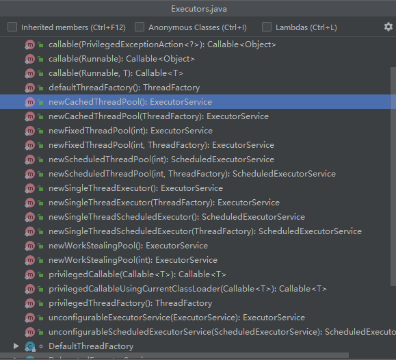

# 为什么线程池不允许使用 Executors 创建

### 前言

在《阿里巴巴java开发手册》的并发处理章节，【强制】线程池不允许使用Executors去创建，本文将围绕这个问题来分析一下为什么？怎么解决。

### 创建一个线程

在java中创建线程的方式有多种，创建的方式也比较简单。

```java
public class ThreadTest {
    public static void main(String[] args) {
      new Thread(()-> System.out.println("创建一个线程")).start();
    }
}
```

在并发编程中，我们不可能每次都是这样单独的去创建线程，这样会造成很大的性能开销。所以就引入了线程池，通过预先创建多个线程，放在池中，在需要的时候直接获取，避免多此重复创建、销毁带来的开销。

### Executors

经常在微信的文章中有推送线程池面试的相关文章，有一个问题是：线程池的创建方式有几种？



我们可以看出用Executors创建线程池的方式有很多种，比如:newFiexedThreadPool、newCachedThreadPool、newSingleThreadExecutor、newScheduledThreadPool等等，这些文章不严谨的告诉你有三种的或者四种创建方式，严谨一点点的告诉你常用的有三种或者四种。

但是我们稍微深入一点，可以发现像newFiexedThreadPool、newCachedThreadPool、newSingleThreadExecutor、newScheduledThreadPool其实都是通过下面这个方法创建的

```java
public ThreadPoolExecutor(int corePoolSize,
                              int maximumPoolSize,
                              long keepAliveTime,
                              TimeUnit unit,
                              BlockingQueue<Runnable> workQueue) {
        this(corePoolSize, maximumPoolSize, keepAliveTime, unit, workQueue,
             Executors.defaultThreadFactory(), defaultHandler);
    }
```

实际上可以回答Executors创建和ThreadPoolExecutor创建这两种。言归正传，我们查看一下ThreadPoolExecutor这个方法的参数含义：

1. corePoolSize:核心线程数量
2. maximumPoolSize：最大的线程数量
3. keepAliveTime：非核心线程空闲时间，超过了时间就释放了
4. TimeUnit：时间单位
5. BlockingQueue<Runnable>:处理不过来的任务放入等待队列
6. ThreadFactory：创建线程的工厂，在这个地方可以统一处理创建的线程的属性
7. RejectedExecutionHandler：线程池拒绝策略，线程数量处理不过来那么多任务的时候，抛异常

### 通过示例分为什么不允许使用 Executors 创建线程池 


