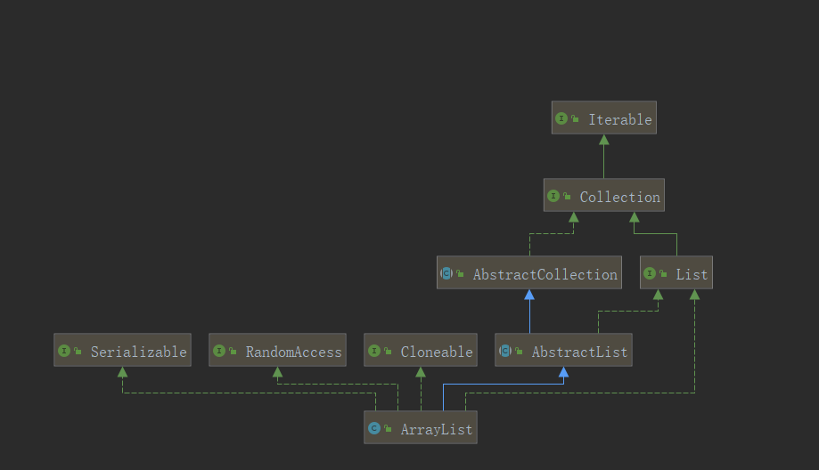

# ArrayList源码解析

1.  数组介绍

    在java中当创建数组时会在内存中划分一块连续的内存，然后将数据顺序存储在连续的内存中。当需要读取数组中的数据时需要提供数组中的索引。在java中只有相同类型的数据才可以一起存储到数组中。

    因为数组在存储数据是按顺序存储的，存储数据的内存也是连续的，所以他的特点就是**寻址读取数据比较容易，插入和删除比较困难。**

    
2.  ArrayList源码分析

    *   构造方法，三种类型的构造方法

        ```java
        // 默认初始化容量
        private static final int DEFAULT_CAPACITY = 10;

        // 空对象数组
        private static final Object[] EMPTY_ELEMENTDATA = {};

        //缺省空对象数组
        private static final Object[] DEFAULTCAPACITY_EMPTY_ELEMENTDATA = {};

        //EMPTY_ELEMENTDATA，DEFAULTCAPACITY_EMPTY_ELEMENTDATA两个空的数据意思不太明确，后续看用到的地方具体分析。

        // ArrayList的大小 包含elementData数量，这个size在add或者remove的时候会自己改变
        private int size;

        //存储ArrayList元素的数组缓冲区，该数组缓冲区的长度就是ArrayList的容量
        //如果有一个为空的（DEFAULTCAPACITY_EMPTY_ELEMENTDATA）数组，放入第一元素的时候，会默认容量为DEFAULT_CAPACITY，具体的看add方法就好了
        transient Object[] elementData;

        // 无参构造函数
        public ArrayList() {
            this.elementData = DEFAULTCAPACITY_EMPTY_ELEMENTDATA;
        }

        // 有默认初始容量的构造方法
        public ArrayList(int initialCapacity) {
            // 如果传入的容量值大于0 new一个object数组，大小为initialCapacity
            if (initialCapacity > 0) {
                this.elementData = new Object[initialCapacity];
            } else if (initialCapacity == 0) {
                this.elementData = EMPTY_ELEMENTDATA;
            } else {
                throw new IllegalArgumentException("Illegal Capacity: "+
                                                   initialCapacity);
            }
        }

        public ArrayList(Collection<? extends E> c) {
            elementData = c.toArray();
            if ((size = elementData.length) != 0) {
                // 官方bug
                // c.toArray might (incorrectly) not return Object[] (see 6260652)
                if (elementData.getClass() != Object[].class)
                 // 创建了一个object数组 长度为size 内容时elementData
                    elementData = Arrays.copyOf(elementData, size, Object[].class);
            } else {
                // size等于零，初始化一个空数据对象 replace with empty array.
                this.elementData = EMPTY_ELEMENTDATA;
            }
         }
        ```
    *   Add方法

        ```java
        /**
          * Appends the specified element to the end of this list.
          * 追加这个指定得元素到列表的末尾
          * @param e element to be appended to this list
          * @return <tt>true</tt> (as specified by {@link Collection#add})
          */
        public boolean add(E e) {
            // 扩容机制
            ensureCapacityInternal(size + 1);  // Increments modCount!!
            // 数组长度+1，把元素e放到最后
            elementData[size++] = e;
            return true;
        }

        	/**
             * Inserts the specified element at the specified position in this
             * list. Shifts the element currently at that position (if any) and
             * any subsequent elements to the right (adds one to their indices).
             *将指定的元素插入此列表中的指定位置。将当前在该位置的元素（如果有的话）和任何后续元素向右移动（向其索引添加一个）。
             * @param index index at which the specified element is to be inserted
             * @param element element to be inserted
             * @throws IndexOutOfBoundsException {@inheritDoc}
             */
        public void add(int index, E element) {
            // 相当于健康检查，查看数据元素是否越界
            rangeCheckForAdd(index);
            ensureCapacityInternal(size + 1);  // Increments modCount!!
            //index都是从0开始的
            System.arraycopy(elementData, index, elementData, index + 1,
                             size - index);
            elementData[index] = element;
            size++;
         }

        /**
          * A version of rangeCheck used by add and addAll.
          */
        private void rangeCheckForAdd(int index) {
            if (index > size || index < 0)
                throw new IndexOutOfBoundsException(outOfBoundsMsg(index));
        }
            /**
        	 * @param      src      the source array.
             * @param      srcPos   starting position in the source array.
             * @param      dest     the destination array.
             * @param      destPos  starting position in the destination data.
             * @param      length   the number of array elements to be copied.
             */
        public static native void arraycopy(Object src,  int  srcPos,
                                                Object dest, int destPos,
                                                int length);
        例子：System.arraycopy(elementData, index, elementData, index + 1,
                             size - index);
        elementData为["A","B","C","D"] index = 1 size为4
        执行结果elementData为为["A","B","B","C","D"]
        ```
    *   addAll()

        ```java
        public boolean addAll(Collection<? extends E> c) {
            // 转换为数组
            Object[] a = c.toArray();
            // 需要插入到列表的数据的长度
            int numNew = a.length;
            // 看是否需要扩容 当前容量大于size + numNew 就不需要
            ensureCapacityInternal(size + numNew);  // Increments modCount
            
            System.arraycopy(a, 0, elementData, size, numNew);
            size += numNew;
            return numNew != 0;
        }
        /**
        * @param      src      the source array.源数组
        * @param      srcPos   starting position in the source array.源数组中的起始位置
        * @param      dest     the destination array.目标数组
        * @param      destPos  starting position in the destination data.目标数组中的起始位置
        * @param      length   the number of array elements to be copied.要复制的数组元素数量
        * @exception  IndexOutOfBoundsException  if copying would cause
        *               access of data outside array bounds.
        * @exception  ArrayStoreException  if an element in the <code>src</code>
        *               array could not be stored into the <code>dest</code> array
        *               because of a type mismatch.
        * @exception  NullPointerException if either <code>src</code> or
        *               <code>dest</code> is <code>null</code>.
        */
        public static native void arraycopy(Object src,  int  srcPos,
                                            Object dest, int destPos,
                                            int length);

        public boolean addAll(int index, Collection<? extends E> c) {
            rangeCheckForAdd(index);

            Object[] a = c.toArray();
            int numNew = a.length;
            ensureCapacityInternal(size + numNew);  // Increments modCount

            int numMoved = size - index;
            if (numMoved > 0){
            // 举例说明:
            // 目标数组数组[1,2,3,4]，index=2 源数组[5,6] 生成[1,2,5,6,3,4]
            // 此处目标数组为[1,2, 3,4, 3,4]
            System.arraycopy(elementData, index, elementData, index + numNew,
                                 numMoved);
            }
            // 源数组[5,6] 目标数组[1,2,3,4,3,4]-->[1,2,5,6,3,4]
            System.arraycopy(a, 0, elementData, index, numNew);
            size += numNew;
            return numNew != 0;
        }
        ```
    *   扩容机制

        ```java
        // 确保内部容量
        private void ensureCapacityInternal(int minCapacity) {
            ensureExplicitCapacity(calculateCapacity(elementData, minCapacity));
        }
        // 计算容量
        // 传入对象数组和最小容量，minCapacity = size+1 这个地方可以看add方法
        private static int calculateCapacity(Object[] elementData, int minCapacity) {
            if (elementData == DEFAULTCAPACITY_EMPTY_ELEMENTDATA) {
                // 对比默认的容量10，谁大返回谁
                return Math.max(DEFAULT_CAPACITY, minCapacity);
            }
            return minCapacity;
        }

        private void ensureExplicitCapacity(int minCapacity) {
            modCount++;
            // overflow-conscious code
            if (minCapacity - elementData.length > 0){
                grow(minCapacity);
            }
        }
        /**
        * Increases the capacity to ensure that it can hold at least the
        * number of elements specified by the minimum capacity argument.
        * 增加容量以确保它至少可以容纳最小容量参数指定的元素数。
        * @param minCapacity the desired minimum capacity
        */
        private void grow(int minCapacity) {
            // overflow-conscious code
            int oldCapacity = elementData.length;
            // 假定oldCapacity = 10，新增一个数据，那么minCapacity = 11
        // 11右移1位，二进制为0101，十进制为5，minca扩容后的newCapacity = 15.为oldCapacity的1.5倍。
            int newCapacity = oldCapacity + (oldCapacity >> 1);
            if (newCapacity - minCapacity < 0)
                newCapacity = minCapacity;
            if (newCapacity - MAX_ARRAY_SIZE > 0)
                newCapacity = hugeCapacity(minCapacity);
            // minCapacity is usually close to size, so this is a win:
            // minCapacity通常接近于size，所以这是一个优势:
            // 那种角度来说是一种优势？
            elementData = Arrays.copyOf(elementData, newCapacity);
        } 
        private static final int MAX_ARRAY_SIZE = Integer.MAX_VALUE - 8;
        // 巨大的容量，假设生成的newCapacity比MAX_ARRAY_SIZE还大，但是不能超过Integer.MAX_VALUE最大值，否则抛出内存溢出异常。
        private static int hugeCapacity(int minCapacity) {
                if (minCapacity < 0) // overflow
                    throw new OutOfMemoryError();
                return (minCapacity > MAX_ARRAY_SIZE) ?
                    Integer.MAX_VALUE :
                    MAX_ARRAY_SIZE;
            }
        ```
    *   删除方法

        ```java
        //ArrayIndexOutOfBoundsException，如果下标越界
        private void rangeCheck(int index) {
            if (index >= size)
                throw new IndexOutOfBoundsException(outOfBoundsMsg(index));
        }

        public E remove(int index) {
            rangeCheck(index);
        	// modcount记录操作次数
            modCount++;
            E oldValue = elementData(index);

            int numMoved = size - index - 1;
            if (numMoved > 0)
                //[1,2,3,4] index+1=3 [1,2,3,4] 2 1 -->[1,2,4,4]
                System.arraycopy(elementData, index+1, elementData, index,
                                 numMoved);
            // [1,2,4]
            elementData[--size] = null; // clear to let GC do its work
        	
            return oldValue;
        }

        public boolean remove(Object o) {
            if (o == null) {
                for (int index = 0; index < size; index++)
                    if (elementData[index] == null) {
                        fastRemove(index);
                        return true;
                    }
            } else {
                for (int index = 0; index < size; index++)
                    if (o.equals(elementData[index])) {
                        fastRemove(index);
                        return true;
                    }
            }
            return false;
        }
        // 这个fastremove和remove（index）一样，只不过不返回删除的值
        private void fastRemove(int index) {
            modCount++;
            int numMoved = size - index - 1;
            if (numMoved > 0)
                System.arraycopy(elementData, index+1, elementData, index,
                                 numMoved);
            elementData[--size] = null; // clear to let GC do its work
        }

        public boolean removeAll(Collection<?> c) {
            Objects.requireNonNull(c);
            // 批量删除
            return batchRemove(c, false);
        }

        private boolean batchRemove(Collection<?> c, boolean complement) {
            // 获取当前的列表元素
            final Object[] elementData = this.elementData;
            int r = 0, w = 0;
            boolean modified = false;
            try {
                for (; r < size; r++)
                    // 当前complement为false时:排除掉c中的数据
                    // 当complement为true时:交集
                    if (c.contains(elementData[r]) == complement)
                        // 其实这个地方就是把要删除的元素去掉了。
                        elementData[w++] = elementData[r];
            } finally {
                // Preserve behavioral compatibility with AbstractCollection,
                // even if c.contains() throws.
                // 避免c.contains抛异常
                // r什么情况下会不等于size呢？上面for循环size的嘛？？？？
                // 底下的代码有待考究
                if (r != size) {
                    System.arraycopy(elementData, r,
                                     elementData, w,
                                     size - r);
                    w += size - r;
                }
                // w等于size的时候，相当于不需要删除任何元素，直接return modified false
                if (w != size) {
                    // clear to let GC do its work
                    for (int i = w; i < size; i++){
                        // 清空多余的元素
                        elementData[i] = null;
                    }
                    modCount += size - w;
                    size = w;
                    modified = true;
                }
            }
            return modified;
        }

        // 清空所有数据，easy
        public void clear() {
            modCount++;

            // clear to let GC do its work
            for (int i = 0; i < size; i++)
                elementData[i] = null;

            size = 0;
        }
        ```
    * retainAll()

    ```java
    // 查询集合的交集
    public boolean retainAll(Collection<?> c) {
        Objects.requireNonNull(c);
        return batchRemove(c, true);
    }
    // 和removeall一样的方法complement为true的时候 查询交集
    private boolean batchRemove(Collection<?> c, boolean complement) {
        final Object[] elementData = this.elementData;
        int r = 0, w = 0;
        boolean modified = false;
        try {
            for (; r < size; r++)
                if (c.contains(elementData[r]) == complement)
                    elementData[w++] = elementData[r];
        } finally {
            // Preserve behavioral compatibility with AbstractCollection,
            // even if c.contains() throws.
            if (r != size) {
                System.arraycopy(elementData, r,
                                 elementData, w,
                                 size - r);
                w += size - r;
            }
            if (w != size) {
                // clear to let GC do its work
                for (int i = w; i < size; i++)
                    elementData[i] = null;
                modCount += size - w;
                size = w;
                modified = true;
            }
        }
        return modified;
    }
    ```

    *   indexOf() lastIndexOf()

        ```java
        public int indexOf(Object o) {
            // 之所以这样处理是应为ArrayList是允许有null值的，避免空指针异常
            // 为什么支持null？因为从源码看存null不会有错，所有的null值都被当为正常值处理
            if (o == null) {
                for (int i = 0; i < size; i++)
                    if (elementData[i]==null)
                        return i;
            } else {
                for (int i = 0; i < size; i++)
                    if (o.equals(elementData[i]))
                        return i;
            }
            return -1;
        }

        //和上面唯一的不通就是此处循环为i--
        public int lastIndexOf(Object o) {
            if (o == null) {
                for (int i = size-1; i >= 0; i--)
                    if (elementData[i]==null)
                        return i;
            } else {
                for (int i = size-1; i >= 0; i--)
                    if (o.equals(elementData[i]))
                        return i;
            }
            return -1;
        }
        ```
    *   sort 排序

        ```java
        @Override
        @SuppressWarnings("unchecked")
        public void sort(Comparator<? super E> c) {
            final int expectedModCount = modCount;
            Arrays.sort((E[]) elementData, 0, size, c);
            if (modCount != expectedModCount) {
                throw new ConcurrentModificationException();
            }
            modCount++;
        }
        // 调用Arrays工具类进行排序
        public static <T> void sort(T[] a, int fromIndex, int toIndex,
                                    Comparator<? super T> c) {
            if (c == null) {
                sort(a, fromIndex, toIndex);
            } else {
                rangeCheck(a.length, fromIndex, toIndex);
                if (LegacyMergeSort.userRequested)
                    legacyMergeSort(a, fromIndex, toIndex, c);
                else
                    TimSort.sort(a, fromIndex, toIndex, c, null, 0, 0);
            }
        }
        ```
