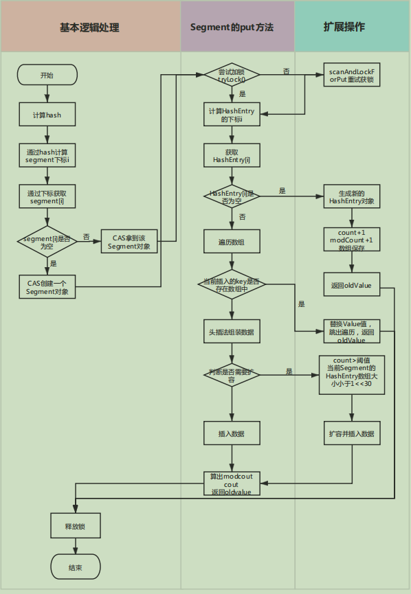

### 构造函数

默认的初始容量为16，加载因子为0.75，默认的并发级别也为16，对比1.7中的HashMap，对这个并发级别的作用产生疑问，现在这里提出一个问题，DEFAULT_CONCURRENCY_LEVEL有啥用？

```java
static final int DEFAULT_INITIAL_CAPACITY = 16;
static final float DEFAULT_LOAD_FACTOR = 0.75f;
static final int DEFAULT_CONCURRENCY_LEVEL = 16;
/**
 * Creates a new, empty map with a default initial capacity (16),
 * load factor (0.75) and concurrencyLevel (16).
 */ 
 public ConcurrentHashMap() {
     this(DEFAULT_INITIAL_CAPACITY, DEFAULT_LOAD_FACTOR, DEFAULT_CONCURRENCY_LEVEL);
 }
```

### 数据结构

从默认构造函数进入，可以看到关键性代码如下，创建了一个Segment数组对象，并且Segment对象中存放了HashEntry数组，HashEntry对象只有next属性，是单向的链表。所以ConcurrentHashMap的数据结构为单向链表加数组。

```java
public ConcurrentHashMap(int initialCapacity,
                             float loadFactor, int concurrencyLevel) {
     .....
	// create segments and segments[0]
	Segment<K,V> s0 =new Segment<K,V>(loadFactor, (int)(cap * loadFactor),
                     (HashEntry<K,V>[])new HashEntry[cap]);
	Segment<K,V>[] ss = (Segment<K,V>[])new Segment[ssize];
    ......
 }
```

### 初始化方法的源码解析

问题导向：我们知道ConcurrentHashMap的数据结构是数组加单向链表了，数组为Segment和HashEntry，这两个数组的大小的计算规则是怎样的？

```java
public ConcurrentHashMap(int initialCapacity,
                             float loadFactor, int concurrencyLevel) {
  		// 省略了一些校验性代码，只保留核心的逻辑
        // Find power-of-two sizes best matching arguments
        int sshift = 0;
        int ssize = 1;
        while (ssize < concurrencyLevel) {
            ++sshift;
            ssize <<= 1;
        }
        this.segmentShift = 32 - sshift;
        this.segmentMask = ssize - 1;
        if (initialCapacity > MAXIMUM_CAPACITY)
            initialCapacity = MAXIMUM_CAPACITY;
        int c = initialCapacity / ssize;
        if (c * ssize < initialCapacity)
            ++c;
        int cap = MIN_SEGMENT_TABLE_CAPACITY;
        while (cap < c)
            cap <<= 1;
        // create segments and segments[0]
        Segment<K,V> s0 =
            new Segment<K,V>(loadFactor, (int)(cap * loadFactor),
                             (HashEntry<K,V>[])new HashEntry[cap]);
        Segment<K,V>[] ss = (Segment<K,V>[])new Segment[ssize];
        UNSAFE.putOrderedObject(ss, SBASE, s0); // ordered write of segments[0]
        this.segments = ss;
    }
```

首先我们知道核心代码是**Segment<K,V>[] ss = (Segment<K,V>[])new Segment[ssize]**，Segment的数组长度由ssize决定，那么我们就来分析ssize产生的过程，下面就是ssize的核心代码；

```java
int ssize = 1;
while (ssize < concurrencyLevel) {
    ++sshift;
    ssize <<= 1;
}
```

也就是说并发级别这个参数其实会控制segment数组的大小，并且ssize的值是2的幂次方数。

另外一个核心代码为**Segment<K,V> s0 = new Segment<K,V>(loadFactor, (int)(cap * loadFactor), (HashEntry<K,V>[])new HashEntry[cap])**，这个就是初始化Segment数组的第0个位置，可以看到HashEntry的数组大小由cap属性决定，所以我们可以从整个方法中找到核心代码进行分析

```java
int c = initialCapacity / ssize;
if (c * ssize < initialCapacity)
    ++c;
//MIN_SEGMENT_TABLE_CAPACITY = 2;
int cap = MIN_SEGMENT_TABLE_CAPACITY ;
while (cap < c)
    cap <<= 1;
// create segments and segments[0]
Segment<K,V> s0 =
    new Segment<K,V>(loadFactor, (int)(cap * loadFactor),
                     (HashEntry<K,V>[])new HashEntry[cap]);
```

根据代码的逻辑，可以看到cap的值由初始化容量和segment数组的大小（并发级别）和MIN_SEGMENT_TABLE_CAPACITY属性决定，顾名思义hashEntry数组的最小值为2。通过initialCapacity/ssize的值整除得出变量c的值，用默认的最小hashEntry值去比较，如果c大于最小hashEntry值，那么cap左移，直到相等或大于的时候跳出循环，得到HashEntry数组的大小值cap。

最后通过UNSAFE类把生成的s0放入到segment数组的第0个位置，也就是代码中的**UNSAFE.putOrderedObject(ss, SBASE, s0)**。

### put方法源码解析

1.7hashmap中key和value都可以为null，1.8可以吗？久闻分段锁的大名，是怎么实现的？1.7hashmap并发的时候可能出现循环链表的问题，ConcurrentHashMap就安全了吗？下面是1.7ConcurrentHashMap的源码，带着问题来分析源码。

```java
public V put(K key, V value) {
    Segment<K,V> s;
    if (value == null)
        throw new NullPointerException();
    int hash = hash(key);
    int j = (hash >>> segmentShift) & segmentMask;
    if ((s = (Segment<K,V>)UNSAFE.getObject          // nonvolatile; recheck
         (segments, (j << SSHIFT) + SBASE)) == null) //  in ensureSegment
        s = ensureSegment(j);
    return s.put(key, hash, value, false);
}
```

当value为空的时候会有空指针异常，所以1.7ConcurrentHashMap的value值不允许为null。既然没有判断key的值是不是可以为空，是不是就说明......接下来看下hash(key)的方法

```java
private int hash(Object k) {
    ......
    int h = hashSeed;
    h ^= k.hashCode();
    .......
}
```

这里面一堆算法，我并没有完全去看，猜测就是通过k的值获取hashcode值，通过查看**h ^= k.hashCode()**,可以发现1.7ConcurrentHashMap的key也不能为空，如果k为空，也会抛出空指针异常。到此为止，我们就破案了。<span style='background-color:yellow'>key value为空为啥不支持？</span>

继续往下查看put的源码，源码中使用**int j =(hash >>> segmentShift) & segmentMask**计算出变量j，也就是我们segment的下标位置。与之相关的变量为segmentShift和segmentMask。

在初始化源码解析的代码中对segmentShift和segmentMask的赋值，segmentMask = ssize - 1很好理解，为了做与运算让其不超过segment数组的最大下标，我们着重看一下segmentShift是干嘛的，把核心代码提取如下：

```java
int sshift = 0;
int ssize = 1;
while (ssize < concurrencyLevel) {
    ++sshift;
    ssize <<= 1;
}
this.segmentShift = 32 - sshift;
```

sshift默认为0，当计算segment数组大小的时候会改变sshift的值，首先ssize的值我们之前说过肯定会是2的幂次方，2的n次方的n就是sshift的值。我们可以套用几个值来计算一下，当concurrencyLevel=16，ssize=16，sshift=4、当concurrencyLevel=17，ssize=32，sshift=5；这个规律大家可以仔细观察一下。最后int为32位减去sshift就等于segmentShift。到这里我们还是不知道segmentShift的作用是什么。

回到代码**(hash >>> segmentShift) & segmentMask**，发现hash值右移和segmentShift有关，也就是说只使用了hash的segmentShift个高位来进行segment的下标运算。<span style='background-color:yellow'>为什么要用高位来进行下标运算，我直接使用有没有问题，是不是多此一举?</span>

接下来使用unsafe类来获取segment对应下标的segment对象，如果为空的话，猜测是需要创建一个新的segment对象，查看源代码ensureSegment(j)方法，看是如何处理的

```java
private Segment<K,V> ensureSegment(int k) {
    final Segment<K,V>[] ss = this.segments;
    long u = (k << SSHIFT) + SBASE; // raw offset
    Segment<K,V> seg;
    if ((seg = (Segment<K,V>)UNSAFE.getObjectVolatile(ss, u)) == null) {
        Segment<K,V> proto = ss[0]; // use segment 0 as prototype
        int cap = proto.table.length;
        float lf = proto.loadFactor;
        int threshold = (int)(cap * lf);
        HashEntry<K,V>[] tab = (HashEntry<K,V>[])new HashEntry[cap];
        if ((seg = (Segment<K,V>)UNSAFE.getObjectVolatile(ss, u))
            == null) { // recheck
            Segment<K,V> s = new Segment<K,V>(lf, threshold, tab);
            while ((seg = (Segment<K,V>)UNSAFE.getObjectVolatile(ss, u))
                   == null) {
                if (UNSAFE.compareAndSwapObject(ss, u, null, seg = s))
                    break;
            }
        }
    }
    return seg;
}
```

**long u = (k << SSHIFT) + SBASE**就是去获取原始的偏移量，通过UNSAFE类去从ss中获取对应下标的对象是需要用原始偏移量去获取，有兴趣的可以去学一下UNSAFE类，这里就不多阐述了。

在if判断的代码中我们发现有多个判断，都是去查询ss中的u下标是不是为null，<span style='background-color:yellow'>为什么要这么使用呢，如果单纯使用cas不是一样的吗？</span>这里面有个比较好玩的就是创建新得Segment对象会使用初始化Segment<K,V>的index=0的table长度、加载因子以及阈值。

仔细看一下上面的这么多if判断，是不是和DCL单例模式的写法有点相似？Double Check Lock中最值得注意的地方就是禁止指令重排，带着同样的思路去审视这段代码，发现核心就是CAS，第一个if判断中生成了HashEntry对象，第二个if判断生成了Segment对象，如果去掉这两个if判断，生成完这两个对象再进行CAS并没有问题，只是加了两个判断的情况下可能会更少的去创建对象，相对来说是减少了消耗。

到目前为止，整个put的方法还是线程安全的，接下就是Segment类中的put方法，这个是重中之重。

```java
// 注意：这里的hash值就是原始Hash，高位计算的是下标值，onlyIfAbsent默认为false
final V put(K key, int hash, V value, boolean onlyIfAbsent) {
            HashEntry<K,V> node = tryLock() ? null :
                scanAndLockForPut(key, hash, value);
           .........
            return oldValue;
        }
```

一进来就看到了tryLock尝试获取锁，如果获取不到，就会进入scanAndLockForPut(key, hash, value)方法。一起看下这个方法是在干啥。

```java
private HashEntry<K,V> scanAndLockForPut(K key, int hash, V value) {
    // 用hash值获取hashEntry数组下标对应的对象
    HashEntry<K,V> first = entryForHash(this, hash);
    HashEntry<K,V> e = first;
    HashEntry<K,V> node = null;
    // 重试标记
    int retries = -1; // negative while locating node
    
    while (!tryLock()) {
        HashEntry<K,V> f; // to recheck first below
        if (retries < 0) {
            if (e == null) {
                if (node == null) // speculatively create node
                    node = new HashEntry<K,V>(hash, key, value, null);
                retries = 0;
            }
            else if (key.equals(e.key))
                retries = 0;
            else
                e = e.next;
        }
        else if (++retries > MAX_SCAN_RETRIES) {
            // 等待，不循环了，知道获取到锁为止
            lock();
            // 获取到了break循环
            break;
        }
        // retries = 0 的时候(retries & 1) == 0为true
        // f = entryForHash(this, hash)) != first这个很好理解
        // 就是说当前这个segment获取的hashEntry对象变了，就重新赋值一下，并且设置重试标记为-1
        else if ((retries & 1) == 0 &&
                 (f = entryForHash(this, hash)) != first) {
            e = first = f; // re-traverse if entry changed
            retries = -1;
        }
    }
    return node;
}
```

整个方法代码这么多，根据上面代码的注释可以发现核心就是创建了一个HashEntry对象,和超过最大重试次数获取锁，<span style='background-color:yellow'>获取锁的意义还说的过去，但是初始化node真的有必要吗，如果下次来e不为空了，之前创建的node有啥用呢？</span>反正暂时我还是没有悟，可能是想在获取锁的时间里去干点别的事情，但是初始化node感觉就是没必要的。

重新回到主流程Segment中的put方法，可以跟读注释来了解整个源码的流程

```java
final V put(K key, int hash, V value, boolean onlyIfAbsent) {
    HashEntry<K,V> node = tryLock() ? null :
        scanAndLockForPut(key, hash, value);
    // 有返回值的，这个put方法
    V oldValue;
    try {
        // 当前这个segment对象中的HashEntry数组大小
        HashEntry<K,V>[] tab = table;
        // 计算index下标
        int index = (tab.length - 1) & hash;
        // 拿到index下表的HashEntry对象first
        HashEntry<K,V> first = entryAt(tab, index);
        // 遍历first，因为first有next属性，同时这个first方法没有限制和结束条件，可以重点看下结束条件
        for (HashEntry<K,V> e = first;;) {
            // 也就是说first是有值的情况
            if (e != null) {
                K k;
                if ((k = e.key) == key ||
                    (e.hash == hash && key.equals(k))) {
                    oldValue = e.value;
                    // 相同的时候替补替换，默认为false也就是替换
                    if (!onlyIfAbsent) {
                        e.value = value;
                        ++modCount;
                    }
                    break;
                }
                e = e.next;
            }
            // 当first为null的时候进入，或者first有值，遍历到next=null的这个值的时候进入
            else {
                // 头插法
                if (node != null)
                    node.setNext(first);
                else
                    node = new HashEntry<K,V>(hash, key, value, first);
                // 当前segment中HashEntry的长度
                int c = count + 1;
                // 扩容条件
                if (c > threshold && tab.length < MAXIMUM_CAPACITY)
                    // 扩容
                    rehash(node);
                else
                    // 将新的node节点写入HashEnrty数组的指定下标
                    setEntryAt(tab, index, node);
                ++modCount;
                count = c;
                oldValue = null;
                break;
            }
        }
    } finally {
        unlock();
    }
    return oldValue;
}
```

根据注释一步步来上面的代码应该没啥问题，重点关注的**rehash(node)**方法，扩容的时机为c > threshold && tab.length < (1<<30));<span style='color:red'>*ConcurrentHashMap中只有Segment内部内有扩容，也就是说只有HashEntry数组扩容，外部的Segment数组并不会变了。*</span>

下面接着看扩容源码，关注的点为容量的变化oldCapacity << 1，阈值的变化newCapacity * loadFactor。另外提一句，rehash在put方法内部，是在锁中间执行，也是线程安全的。

```java
private void rehash(HashEntry<K,V> node) {
    HashEntry<K,V>[] oldTable = table;
    // 记录老容量
    int oldCapacity = oldTable.length;
    // 计算新容量，新容量比老容量多1倍
    int newCapacity = oldCapacity << 1;
    threshold = (int)(newCapacity * loadFactor);
    // 生成新的HashEntry数组,容量为newCapacity
    HashEntry<K,V>[] newTable =
        (HashEntry<K,V>[]) new HashEntry[newCapacity];
    // sizeMask做&运算用，避免下标越界
    int sizeMask = newCapacity - 1;
    // 循环oldCapacity次，为的就是拿出对应下标的HashEntry[index]，再一一取值扩容
    for (int i = 0; i < oldCapacity ; i++) {
        HashEntry<K,V> e = oldTable[i];
        // e如果为null，转移个锤子，直接下一次循环了
        if (e != null) {
            // 获取e的next，后续需要循环去获取最后一个不同的元素和下标
            HashEntry<K,V> next = e.next;
            // 获取当前e元素的下标
            int idx = e.hash & sizeMask;
            // 如果next等于空，说明只有一个元素，直接设置就行了。
            if (next == null)   //  Single node on list
                newTable[idx] = e;
            else { // Reuse consecutive sequence at same slot
                HashEntry<K,V> lastRun = e;
                int lastIdx = idx;
                // 循环next
                for (HashEntry<K,V> last = next;
                     last != null;
                     last = last.next) {
                    // 计算下标
                    int k = last.hash & sizeMask;
                    // 整个for循环如果存在k和外部lastIdx不相等的时候才会进入
                    if (k != lastIdx) {
                        // 不想等的存放下标
                        lastIdx = k;
                        // 会找到最后一个不相等的HashEntry对象
                        lastRun = last;
                    }
                }
                // 直接把最后一个不相等的放入新的table下标中
                // 第二种情况就是，上面都相等的情况，直接把e=lastRun放入新的table-index
                newTable[lastIdx] = lastRun;
                // Clone remaining nodes
                // 当k和lastIdx都相等的时候不会进入，否则都会进入组装
                for (HashEntry<K,V> p = e; p != lastRun; p = p.next) {
                    V v = p.value;
                    int h = p.hash;
                    int k = h & sizeMask;
                    HashEntry<K,V> n = newTable[k];
                    newTable[k] = new HashEntry<K,V>(h, p.key, v, n);
                }
            }
        }
    }
    // 计算当前node的新index值
    int nodeIndex = node.hash & sizeMask; // add the new node
    // 头插法，直接把对象的下标HashEntry对象放入next中
    node.setNext(newTable[nodeIndex]);
    // 设置之后的node其实就等于当前新得newTable[nodeIndex]
    newTable[nodeIndex] = node;
    // 赋值,完成扩容
    table = newTable;
}
```

在扩容的时候，如果segment的table为2，扩容后就为4，当值A:1原来在HashEnrty[0]的时候,扩容后要么还是newHashEntry[0],要么就是是newHashEntry[2]。其实JDK官方的注释说的很清楚了,<span style='color:red'>由于扩容是按照2的幂次方进行的，所以扩展前在同一个桶中的元素，现在要么还是在原来序号的桶里，或者就是原来的序号再加上一个2的幂次方，就这两种选择</span>。当然个人觉得其中的循环用的还是挺精髓，提高了效率。

画了一个put方法的流程图总结一下：



### Size（）方法

size方法单独拿出来讲是因为它挺有意思的，典型的跨段操作。Size方法主要思路是先在没有锁的情况下对所有段大小求和，这种求和策略最多执行三次，这个for循环也是没有开始没有结束，那么我们看结束条件break，只有当sum==last的时候才结束。

如果我们要统计整个ConcurrentHashMap里元素的大小，那么必须统计所有Segment里HashEntry元素的大小后求和。Segment类中count是一个volatile变量，在多线程的情景下，我们是不是把每个Segment中的count变量加起来就是ConcurrentHashMap的大小了呢？显然是不能，已经计算的count变量可能后续发生了变化，这样就不准了。

所以定义了sum变量和last变量来记录modcount，modcount变量会在引发结构性改变的所有操作（put remove clean）进行加1，因此源码中就是去无锁的情况下判断这次和上次获取的modcount值是否一样，如果一样说明没有变动操作，直接返回size的值。

```java
public int size() {
    // Try a few times to get accurate count. On failure due to
    // continuous async changes in table, resort to locking.
    final Segment<K,V>[] segments = this.segments;
    int size;
    boolean overflow; // true if size overflows 32 bits
    long sum;         // sum of modCounts
    long last = 0L;   // previous sum
    int retries = -1; // first iteration isn't retry
    try {
        for (;;) {
            if (retries++ == RETRIES_BEFORE_LOCK) {
                for (int j = 0; j < segments.length; ++j)
                    ensureSegment(j).lock(); // force creation
            }
            sum = 0L;
            size = 0;
            overflow = false;
            for (int j = 0; j < segments.length; ++j) {
                Segment<K,V> seg = segmentAt(segments, j);
                if (seg != null) {
                    sum += seg.modCount;
                    int c = seg.count;
                    if (c < 0 || (size += c) < 0)
                        overflow = true;
                }
            }
            if (sum == last)
                break;
            last = sum;
        }
    } finally {
        if (retries > RETRIES_BEFORE_LOCK) {
            for (int j = 0; j < segments.length; ++j)
                segmentAt(segments, j).unlock();
        }
    }
    return overflow ? Integer.MAX_VALUE : size;
}
```

