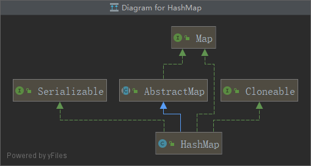
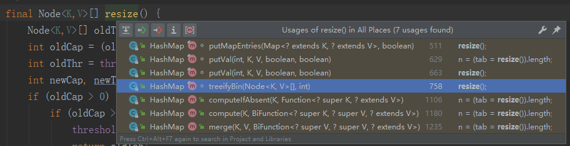

# HashMap1.8源码解析

### 面试常见问题以及答案

> HashMap的数据结构是什么样子的？

* 数组+链表+红黑树

> hash冲突是如何解决的？为什么hashmap中的链表需要转成红黑树

* 根据对冲突的处理方式不同，哈希表有两种实现方式，一种开放地址方式(Open addressing)，另一种是冲突链表方式(Separate chaining with linked lists)。**Java HashMap采用的是冲突链表方式**。
* 主要是为了提升在 hash 冲突严重时（链表过长）的查找性能，使用链表的查找性能是 O(n)，而使用红黑树是 O(logn)。

> 那在什么时候使用链表，又在什么时候使用红黑树？

* 插入默认情况使用链表结点，当同一个索引位置的结点数量达到9个（阈值8）并且此时数组长度大于64才会出发链表结点转红黑树，源码方法为put中的treeifyBin。如果小于等于64那么就会进行扩容，因为此时数据的量还比较小。
* 移除，当前索引位置的结点在移除后达到6个，并且该索引位置的结点为红黑树结点，就会出发红黑树转链表，源码方法为untreeify

> HashMap的扩容机制是什么样子的？什么时候会触发扩容

* 查看resize方法源码
* hashmap元素越来越多的时候，hash碰撞的几率也会越来越高，因为table的长度是固定的，所以为了提高效率，就是进行扩容。
* 扩容的机制就是threshold = 加载因子\*数组大小，超过这个阈值扩容，扩容就是oldcap<<1,threshold <<1。

> 扩容怎么避免rehash？

* 其实这个问题不应该出现在jdk1.8中，但是面试官喜欢混淆看你是否理解透彻，所以就会问你1.8rehash什么什么的
* java8实际上没有将原来数组中的元素rehash再作映射，他用的一个非常巧妙的方法newcap = oldcap<<1。

> jdk1.8之前并发操作hashmap为什么会有死循环问题？

* 结合jdk1.7的扩容可找到答案，1.7的源码解析后续给出链接

> hashmap的数组长度为什么一定要是2的幂次方？

* 查看put方法源码
* 计算索引位置的公式为(lenth-1)\&hash,当lenth为2的N次方时，lenth-1的二进制低位全是1，达到了和取模相同的效果，实现了均匀分布，如果不为2的N次方，hash冲突的概率会明显增大。

> 负载因子为什么是0.75？

* 举个栗子，如果为1那么扩容的阈值就是数组大小，此时减少了空间的消耗，但是hash冲突的概率会增加，查询的成本也会增加；如果为0.5，hash冲突降低，空间会浪费。0.75也就是个这种值。当然我这个解释也是废话，感觉面试官问这个也是装\*。

> 为什么链表转红黑树的阈值为8？

* 从注释中我们可以看到链表中结点为8时的概率，写的是 0.00000006，概率是非常低的，这个值是按照泊松分布来计算的，所以在时间和空间上权衡的结果定义了此阈值为8。

### 前言

*   下面这张图就是HashMap类图，非常简单，继承了一个AbstractMap抽象类

    
*   默认初始容量-必须为2的幂次方。这里作者用的是位运算，在hashmap源码中位运算无处不在。

    ```java
        /**
         * The default initial capacity - MUST be a power of two.
         */
        static final int DEFAULT_INITIAL_CAPACITY = 1 << 4; // aka 16
    ```
*   为什么容量必须是2的幂次方？

    首先这里说的容量必须是2的幂次方，并不是说在初始化的时候调用HashMap(int initialCapacity)构造函数中必须填写initialCapacity的值为2的幂次方。因为tableSizeFor方法会返回一个大于等于容量的一个2的次方数。

    所谓的容量必须是2的幂次方，查看源码其实和计算数组的下标有关。

    ```java
    tab[i = (n - 1) & hash]
    ```

    假设n=3 二进制0011，如果按照上述的与运算计算，n-1 二进制为 0010，也就是说不管hash值为多少，这个下标都只会在tab\[2]中。

    假设n=15 二进制1111，n-1的二进制为1110，不管hash值为多少，下标tab\[1]都没有值。

    而当n为2的幂次方的时候，n-1的低位就都是1，具体的下标和hash值相关。
*   最大的容量，也就是2的30次方；如果使用构造函数进行声明的时候，超过了这个值就会以此为容量。

    ```java
    /**
     * The maximum capacity, used if a higher value is implicitly specified
     * by either of the constructors with arguments.
     * MUST be a power of two <= 1<<30.
     */
    static final int MAXIMUM_CAPACITY = 1 << 30;
    ```
*   加载因子默认为0.75

    ```java
    /**
     * The load factor used when none specified in constructor.
     */
    static final float DEFAULT_LOAD_FACTOR = 0.75f;
    ```
*   链表转红黑树的阈值，在存储数据时，当链表长度大于8的时候，将转换为红黑树

    ```java
    /**
     * The bin count threshold for using a tree rather than list for a
     * bin.  Bins are converted to trees when adding an element to a
     * bin with at least this many nodes. The value must be greater
     * than 2 and should be at least 8 to mesh with assumptions in
     * tree removal about conversion back to plain bins upon
     * shrinkage.
     */
    static final int TREEIFY_THRESHOLD = 8;
    ```
*   红黑树转为链表的阈值，应该小于TREEIFY\_THRESHOLD，当原有的红黑树内的结点数量小于6就将红黑树转换为链表。

    ```java
    /**
     * The bin count threshold for untreeifying a (split) bin during a
     * resize operation. Should be less than TREEIFY_THRESHOLD, and at
     * most 6 to mesh with shrinkage detection under removal.
     */
    static final int UNTREEIFY_THRESHOLD = 6;
    ```
*   最小树行化容量阈值，当哈希表中的容量大于该值，才允许将链表转为红黑树，若桶内元素太多则是直接扩容不是树化，为了避免进行扩容，树化的冲突，这个值不能小于4\*TREEIFY\_THRESHOLD

    ```java
    /**
     * The smallest table capacity for which bins may be treeified.
     * (Otherwise the table is resized if too many nodes in a bin.)
     * Should be at least 4 * TREEIFY_THRESHOLD to avoid conflicts
     * between resizing and treeification thresholds.
     */
    static final int MIN_TREEIFY_CAPACITY = 64;
    ```

### HashMap源码分析

#### 构造函数

开始分析源码，分析源码按照国际惯例从构造函数开始。

从源码中可以分析出阈值在无参构造函数的时候默认为0，而有参数的构造函数，并不是像其他文章说的阈值等于加载因子\*容量，而是initialCapacity的值返回一个大于等于容量的一个2的次方数。

```java
 /**
     * Constructs an empty <tt>HashMap</tt> with the specified initial
     * capacity and load factor.
     *
     * @param  initialCapacity 初始容量
     * @param  loadFactor      加载因子
     * @throws IllegalArgumentException if the initial capacity is negative
     *         or the load factor is nonpositive
     */
    public HashMap(int initialCapacity, float loadFactor) {
        // 如果容量小于零，抛出异常，小于零不行的。
        if (initialCapacity < 0)
            throw new IllegalArgumentException("Illegal initial capacity: " +
                                               initialCapacity);
        // MAXIMUM_CAPACITY成员变量
        // 容量超过了这个2的30次方就默认为MAXIMUM_CAPACITY的默认值，容量不允许超过这个值
        if (initialCapacity > MAXIMUM_CAPACITY)
            initialCapacity = MAXIMUM_CAPACITY;
        
        if (loadFactor <= 0 || Float.isNaN(loadFactor))
            throw new IllegalArgumentException("Illegal load factor: " +
                                               loadFactor);
        // 把传入的加载因子给成员变量
        this.loadFactor = loadFactor;
        //int threshold 很多文章都直接说是容量*加载因子，超过这个值需要扩容，当然注释也是这么说的，但是实际不是
        // 其实一开是初始化的时候并没有乘加载因子，初始化的值就是返回一个大于等于容量的一个2的次方数
        this.threshold = tableSizeFor(initialCapacity);
    }

	/**
     * Returns a power of two size for the given target capacity.
     */
	// 对于给定目标容量，返回两倍大小的幂，中间有无符号右移运算和|或运算
	// 1|0 = 1；1|1=1；0|0=0
	// 
    static final int tableSizeFor(int cap) {
        int n = cap - 1;
        n |= n >>> 1;
        n |= n >>> 2;
        n |= n >>> 4;
        n |= n >>> 8;
        n |= n >>> 16;
        return (n < 0) ? 1 : (n >= MAXIMUM_CAPACITY) ? MAXIMUM_CAPACITY : n + 1;
    }

/**
 * Constructs an empty <tt>HashMap</tt> with the specified initial
 * capacity and the default load factor (0.75).
 *
 * @param  initialCapacity the initial capacity.
 * @throws IllegalArgumentException if the initial capacity is negative.
 */
public HashMap(int initialCapacity) {
    this(initialCapacity, DEFAULT_LOAD_FACTOR);
}

/**
 * Constructs an empty <tt>HashMap</tt> with the default initial capacity
 * (16) and the default load factor (0.75).
 */
public HashMap() {
    this.loadFactor = DEFAULT_LOAD_FACTOR; // all other fields defaulted
}
```

#### putMapEntries()

单独把这个构造函数中的putMapEntries方法拿出来说是因为其中的int和float的转换还挺有意思。

```java
/**
 * Constructs a new <tt>HashMap</tt> with the same mappings as the
 * specified <tt>Map</tt>.  The <tt>HashMap</tt> is created with
 * default load factor (0.75) and an initial capacity sufficient to
 * hold the mappings in the specified <tt>Map</tt>.
 *
 * @param   m the map whose mappings are to be placed in this map
 * @throws  NullPointerException if the specified map is null
 */
public HashMap(Map<? extends K, ? extends V> m) {
    this.loadFactor = DEFAULT_LOAD_FACTOR;
    // 核心方法就是hashmap的put方法
    putMapEntries(m, false);
}

	/**
     * Implements Map.putAll and Map constructor
     *
     * @param m the map
     * @param evict false when initially constructing this map, else
     * true (relayed to method afterNodeInsertion).
     */
    final void putMapEntries(Map<? extends K, ? extends V> m, boolean evict) {
        int s = m.size();
        // 如果为0，就什么都不做了
        if (s > 0) {
            if (table == null) { // pre-size
                // 这段代码有点精彩，我仔细想了一下
          // 把传入的map的size作为阈值，除以加载因子，除的话肯定可能会有小数，所以+1方便后续向上取整
          // 如果传入的m.size为8，ft的值可能是11.66666667
                float ft = ((float)s / loadFactor) + 1.0F;
          // 转成int类型，精度丢失为11
                int t = ((ft < (float)MAXIMUM_CAPACITY) ?
                         (int)ft : MAXIMUM_CAPACITY);
                // 构造函数调用这个方法实例化的时候threshold是为0的
                if (t > threshold)
                    threshold = tableSizeFor(t);
            }
            else if (s > threshold)
                // resize方法要么是初始化要么是扩容，后面讲
                resize();
            for (Map.Entry<? extends K, ? extends V> e : m.entrySet()) {
                K key = e.getKey();
                V value = e.getValue();
                putVal(hash(key), key, value, false, evict);
            }
        }
    }
   
```

#### hash(key)

```java
/**
     * Computes key.hashCode() and spreads (XORs) higher bits of hash
     * to lower.  Because the table uses power-of-two masking, sets of
     * hashes that vary only in bits above the current mask will
     * always collide. (Among known examples are sets of Float keys
     * holding consecutive whole numbers in small tables.)  So we
     * apply a transform that spreads the impact of higher bits
     * downward. There is a tradeoff between speed, utility, and
     * quality of bit-spreading. Because many common sets of hashes
     * are already reasonably distributed (so don't benefit from
     * spreading), and because we use trees to handle large sets of
     * collisions in bins, we just XOR some shifted bits in the
     * cheapest possible way to reduce systematic lossage, as well as
     * to incorporate impact of the highest bits that would otherwise
     * never be used in index calculations because of table bounds.
     */
    static final int hash(Object key) {
        int h;
        //key.hashCode()返回的int类型，int类型4字节 1个字节8位，也就是32位
        //这里的数组下标就是通过key的哈希值与其无符号位无符号右移16位的异或运算
        //0^0=0；  0^1=1；  1^0=1；   1^1=0；
        return (key == null) ? 0 : (h = key.hashCode()) ^ (h >>> 16);
    }
```

#### put(K key, V value)

```java
/**
 * Associates the specified value with the specified key in this map.
 * If the map previously contained a mapping for the key, the old
 * value is replaced.
 *
 * @param key key with which the specified value is to be associated
 * @param value value to be associated with the specified key
 * @return the previous value associated with <tt>key</tt>, or
 *         <tt>null</tt> if there was no mapping for <tt>key</tt>.
 *         (A <tt>null</tt> return can also indicate that the map
 *         previously associated <tt>null</tt> with <tt>key</tt>.)
 */
public V put(K key, V value) {
    return putVal(hash(key), key, value, false, true);
}

	/**
     * Implements Map.put and related methods
     *
     * @param hash 这个用于计算数组的index值
     * @param key the key
     * @param value the value to put
     * @param onlyIfAbsent if true, don't change existing value
     * onlyIfAbsent默认位false，注释说的很明确，如果为true的时候不改变已经存在的value值
     * @param evict if false, the table is in creation mode.
     * @return previous value, or null if none
     */
    final V putVal(int hash, K key, V value, boolean onlyIfAbsent,
                   boolean evict) {
        // 定义了Node对象数组tab和Node对象p;tab用于接收table，p就是要插入key value键值对的地方的值
        Node<K,V>[] tab; Node<K,V> p;
        // n为tab的容量，i为插入的下标i = (n - 1) & hash
        int n, i;
        // table开始为null，初次使用的时候有必要调整大小
        if ((tab = table) == null || (n = tab.length) == 0)
            // resize在无参构造函数初始化的时候其实就是threshold的赋值和table的创建。
            // 容量为DEFAULT_INITIAL_CAPACITY=16
            // threshold为 (int)(DEFAULT_LOAD_FACTOR * DEFAULT_INITIAL_CAPACITY)
            // 详情看后面的resize源码
            n = (tab = resize()).length;//n就是table的长度也就是容量
        // i = (n - 1) & hash计算存放数据的inde下标
        // 这里也能解释为什么hashmap的数组长度为什么一定要是2的幂次方，与下标算法配套使用
        if ((p = tab[i = (n - 1) & hash]) == null)
            // 没有值就直接放进去，new Node<>(hash, key, value, next);
            tab[i] = newNode(hash, key, value, null);
        // 发生了hash冲突的时候，也就是当前tab[i]存在了值得时候走else逻辑
        else {
            // e是用来返回oldValue的值的
            Node<K,V> e; K k;
            // 此处的p.hash是说的结点p的key的hash值，而不是p.hash()，我在这纠结了很久。
            //如果当前这个值的key的hash和要put进来的key的hash一致并且值也是相等的
            // 还有就是为什么要把第一个结点单独弄出来判断？
            if (p.hash == hash &&
                ((k = p.key) == key || (key != null && key.equals(k))))
                e = p;
            // 树，将数据put到树中
            else if (p instanceof TreeNode)
                e = ((TreeNode<K,V>)p).putTreeVal(this, tab, hash, key, value);
            // 链表
            else {
                for (int binCount = 0; ; ++binCount) {
                    // 使用尾插法讲元素插入到链表最后
                    if ((e = p.next) == null) {
                        p.next = newNode(hash, key, value, null);
                        if (binCount >= TREEIFY_THRESHOLD - 1) // -1 for 1st
                            // 转红黑树。当binCount等于8的时候，也就是第九个元素进来的时候转树
                           // 上面的说法不严谨，进入方法可知，table的容量如果小于64还是使用的扩容
                            treeifyBin(tab, hash);
                        break;
                    }
                    if (e.hash == hash &&
                        ((k = e.key) == key || (key != null && key.equals(k))))
                        break;
                    // 这里是和p.next配套使用，遍历整个链表
                    p = e;
                }
            }
            if (e != null) { // existing mapping for key
                V oldValue = e.value;
                if (!onlyIfAbsent || oldValue == null)
                    e.value = value;
                // hashset才会使用，hashmap中为空方法
                afterNodeAccess(e);
                // 存在相同的key值得时候会返回老的value
                return oldValue;
            }
        }
        ++modCount;
        if (++size > threshold)
            resize();
        afterNodeInsertion(evict);
        return null;
    }
```

#### resize()扩容

首先了解一下扩容时机，点击方法使用快捷键查看一下有哪些方法调用了resize方法。



putMapEntries方法中调用resize方法是传入的map的size大于阈值的时候。

treeifyBin方法是转红黑树，当链表长度等于9并且tab的容量小于64的时候调用resize方法。

putVal方法中当table为空或者table的容量为0的时候会调用reize方法，或者当hashmap的size大于阈值的时候调用resize方法。

剩下的两个暂时没用到，有兴趣自己查看。

**接下来分析一下resize的源码，详细步骤可查看下方的代码注释。**


扩容就是重新计算容量，向HashMap对象里不停的添加元素，而HashMap对象内部的数组无法装载更多的元素时，对象就需要扩大数组的长度，以便加入更多的元素。当然java里的数组时无法自动扩容的，方法是使用一个新得数组替换已有的容量小的数组，就像我们用一个小桶装水，如果想要装更多的水，就得换大水桶。

根据上面得描述和代码得知，resize方法其实就是分为两步：

第一步：将小水桶换成大水桶。

1、如果老的table容量为0，就会创建一个新得table，默认容量为16，阈值为加载因子\*默认容量。

2、什么情况下老的table容量为0，且阈值大于0？则把老的阈值赋值给新table的容量。（调用有参构造函数的时候会将传入的initialCapacity转为阈值，而此时table就是null）

3、当老的table容量大于最大值的时候，直接返回，碰撞去吧，不管了；如果没有超过最大值，那么将老的table容量左移一位赋值给新的table容量，如果老的table容量大于等于默认的容量16的时候，新的阈值就等于老的阈值左移一位。

第二步:倒水（大水桶中不直接放水，里面用多个器皿分开装）

1、原先小水桶里面的水，用两个器皿装起来，通过hash值和oldCap小水桶的容量做与运算，得出来的位置要么是0要么是oldCap的容量值，分别对应低位器皿和高位器皿。

2、遍历链表，将链表中的元素也就是水分别放入低位器皿和高位器皿中。

3、将低位器皿直接放入新table的原index位置，而高位器皿放入新table的原index位置+oldCap。

```java
/**
 * Initializes or doubles table size.  If null, allocates in
 * accord with initial capacity target held in field threshold.
 * Otherwise, because we are using power-of-two expansion, the
 * elements from each bin must either stay at same index, or move
 * with a power of two offset in the new table.
 *
 * @return the table
 */
// 上面的注释说的就是初始化或者增加表大小，如果table为null就使用默认参数进行初始化；
// 否则就是用2的幂次方的方法进行扩容，每个bin的元素必须保持相同的索引，或者在新的表中以2的幂次方进行偏移
final Node<K,V>[] resize() {
    Node<K,V>[] oldTab = table;
    int oldCap = (oldTab == null) ? 0 : oldTab.length;
    int oldThr = threshold;
    int newCap, newThr = 0;
    if (oldCap > 0) {
        if (oldCap >= MAXIMUM_CAPACITY) {
            threshold = Integer.MAX_VALUE;
            return oldTab;
        }
        else if ((newCap = oldCap << 1) < MAXIMUM_CAPACITY &&
                 oldCap >= DEFAULT_INITIAL_CAPACITY)
            newThr = oldThr << 1; // double threshold
    }
    else if (oldThr > 0) // initial capacity was placed in threshold
        newCap = oldThr;
    else {               // zero initial threshold signifies using defaults
        newCap = DEFAULT_INITIAL_CAPACITY;
        newThr = (int)(DEFAULT_LOAD_FACTOR * DEFAULT_INITIAL_CAPACITY);
    }
    if (newThr == 0) {
        float ft = (float)newCap * loadFactor;
        newThr = (newCap < MAXIMUM_CAPACITY && ft < (float)MAXIMUM_CAPACITY ?
                  (int)ft : Integer.MAX_VALUE);
    }
    threshold = newThr;
    @SuppressWarnings({"rawtypes","unchecked"})
    // 初始化到这里就可以了
        Node<K,V>[] newTab = (Node<K,V>[])new Node[newCap];
    table = newTab;
    // 核心的扩容逻辑
    if (oldTab != null) {
        for (int j = 0; j < oldCap; ++j) {
            Node<K,V> e;
            if ((e = oldTab[j]) != null) {
                oldTab[j] = null;
                if (e.next == null)
                    newTab[e.hash & (newCap - 1)] = e;
                else if (e instanceof TreeNode)
                    // 树行结构的扩容中包含底下do while的核心方法，下一个模块讲解
                    ((TreeNode<K,V>)e).split(this, newTab, j, oldCap);
                else { // preserve order
                    // 把扩容分成了两个区域【】【】【】【】lo区域|【】【】【】【】hi区域
                    // 具体效果看下图，先double扩容，核心代码就是e.hash & oldCap
                    // e.hash & oldCap为0的处于低位 e.hash & oldCap不为0的处于高位
                    // 高位=低位+oldCap，先遍历数据组成两个链表，然后再迁移到table中
                    Node<K,V> loHead = null, loTail = null;
                    Node<K,V> hiHead = null, hiTail = null;
                    Node<K,V> next;
                    do {
                        next = e.next;
                        if ((e.hash & oldCap) == 0) {
                            if (loTail == null)
                                loHead = e;
                            else
                                loTail.next = e;
                            loTail = e;
                        }
                        else {
                            if (hiTail == null)
                                hiHead = e;
                            else
                                hiTail.next = e;
                            hiTail = e;
                        }
                    } while ((e = next) != null);
                    if (loTail != null) {
                        loTail.next = null;
                        newTab[j] = loHead;
                    }
                    if (hiTail != null) {
                        hiTail.next = null;
                        // 高位=低位+oldCap
                        newTab[j + oldCap] = hiHead;
                    }
                }
            }
        }
    }
    return newTab;
}
```

### TreeNode源码解析

我们都直到，目前HashMap采用数组+链表+红黑树的方式来存储和组织数据的。

如果两个key的hash值相同，那么对应数组位置上就需要用链表的方式将这两个数组组织起来，当同一个位置上链表中的元素大于8并且table的容量大于等于64的时候，就会构建成一个红黑树(RBT)。

了解过红黑树的朋友们一定知道，红黑树是一个基本平衡二叉树，特性如下：

**1、每个节点要么是黑色要么是红色(废话，不然叫啥红黑树)**

**2、根节点是黑色**

**3、每个叶子节点是黑色(叶子节点是指为空的叶子节点)**

**4、如果一个节点是红色的，则它的子节点必须是黑色的。（父子节点之间不可能出现两个连续的红节点）**

**5、任意一个节点到每个叶子节点的所有路径中所包含的黑色节点数量是相等的**

#### TreeNode的构造方法

静态内部类TreeNode继承了LinkedHashMap的静态内部类Entry，构造方法调用的父类的构造方法。

```java
static final class TreeNode<K,V> extends LinkedHashMap.Entry<K,V> {
        TreeNode<K,V> parent;  // red-black tree links
        TreeNode<K,V> left;
        TreeNode<K,V> right;
        TreeNode<K,V> prev;    // needed to unlink next upon deletion
        boolean red;
        TreeNode(int hash, K key, V val, Node<K,V> next) {
            super(hash, key, val, next);
        }
        ........
```

#### treeify(Node\<K,V>\[] tab)构建红黑树

```java
/**
  * Forms tree of the nodes linked from this node.
  * @return root of tree
  */
final void treeify(Node<K,V>[] tab) {
    TreeNode<K,V> root = null;
    for (TreeNode<K,V> x = this, next; x != null; x = next) {
        next = (TreeNode<K,V>)x.next;
        x.left = x.right = null;
        if (root == null) {
            x.parent = null;
            x.red = false;
            root = x;
        }
        else {
            K k = x.key;
            int h = x.hash;
            Class<?> kc = null;
            for (TreeNode<K,V> p = root;;) {
                int dir, ph;
                K pk = p.key;
                if ((ph = p.hash) > h)
                    dir = -1;
                else if (ph < h)
                    dir = 1;
                else if ((kc == null &&
                          (kc = comparableClassFor(k)) == null) ||
                         (dir = compareComparables(kc, k, pk)) == 0)
                    dir = tieBreakOrder(k, pk);

                TreeNode<K,V> xp = p;
                if ((p = (dir <= 0) ? p.left : p.right) == null) {
                    x.parent = xp;
                    if (dir <= 0)
                        xp.left = x;
                    else
                        xp.right = x;
                    root = balanceInsertion(root, x);
                    break;
                }
            }
        }
    }
    moveRootToFront(tab, root);
}
```

#### root()方法

```java
/**
  * Returns root of tree containing this node.
  */
final TreeNode<K,V> root() {
    for (TreeNode<K,V> r = this, p;;) {
        if ((p = r.parent) == null)
            return r;
        r = p;
    }
}
```

((TreeNode\<K,V>)e).split(this, newTab, j, oldCap);树行结构的扩容源码分析。要把红黑树拆分为高位和低位双向链表，然后进行处理。

```java
/**
 * Splits nodes in a tree bin into lower and upper tree bins,
 * or untreeifies if now too small. Called only from resize;
 * see above discussion about split bits and indices.
 *
 * @param map the map
 * @param tab the table for recording bin heads
 * @param index the index of the table being split
 * @param bit the bit of hash to split on
 */
final void split(HashMap<K,V> map, Node<K,V>[] tab, int index, int bit) {
    TreeNode<K,V> b = this;
    // Relink into lo and hi lists, preserving order
    // 定义一个高位的链表和一个低位的链表
    TreeNode<K,V> loHead = null, loTail = null;
    TreeNode<K,V> hiHead = null, hiTail = null;
    // 低位链表count和高位链表count
    int lc = 0, hc = 0;
    // 一开始非常纠结这个地方，考虑这个是拆分红黑树，那么为什么这里和外面链表扩容这么类似
    // 其实就是因为TreeNode继承了Enter<K,V>， Entry<K,V>继承了Node<K,V>，也就是说他隐藏了一个链表在里面
    for (TreeNode<K,V> e = b, next; e != null; e = next) {
        // 下边的代码和链表扩容的代码类似，除了++lc 和 ++hc
        next = (TreeNode<K,V>)e.next;
        e.next = null;
        if ((e.hash & bit) == 0) {
            if ((e.prev = loTail) == null)
                loHead = e;
            else
                loTail.next = e;
            loTail = e;
            // 记录低位链表的长度
            ++lc;
        }
        else {
            if ((e.prev = hiTail) == null)
                hiHead = e;
            else
                hiTail.next = e;
            hiTail = e;
            // 记录高位链表的长度
            ++hc;
        }
    }
	// static final int UNTREEIFY_THRESHOLD = 6;
    if (loHead != null) {
         // 低位链表的头部不为空，并且长度小于等于6的时候拆树变成链表
        if (lc <= UNTREEIFY_THRESHOLD)
            tab[index] = loHead.untreeify(map);
        // 长度大于6，要变成树，如果高位链表为空，就直接把当前这个树放在当前为止就行了，不用做任何处理
        else {
            tab[index] = loHead;
            if (hiHead != null) // (else is already treeified)
                loHead.treeify(tab);
        }
    }
    // index index+bit实际上和hash&lenth-1得到的值一样
    // 1100 0010
    // 0011 1111 64-1
    //------------
    // 0000 0010 =4 index = 4
    
    // 1100 0010
    // 0111 1111 128-1
    //-----------
    // 0100 0010 = index = 64+4 =68
    if (hiHead != null) {
        if (hc <= UNTREEIFY_THRESHOLD)
            tab[index + bit] = hiHead.untreeify(map);
        else {
            tab[index + bit] = hiHead;
            if (loHead != null)
                hiHead.treeify(tab);
        }
    }
    
}
```

根据key值获取元素的值

```java
/**
 * Returns the value to which the specified key is mapped,
 * or {@code null} if this map contains no mapping for the key.
 *
 * <p>More formally, if this map contains a mapping from a key
 * {@code k} to a value {@code v} such that {@code (key==null ? k==null :
 * key.equals(k))}, then this method returns {@code v}; otherwise
 * it returns {@code null}.  (There can be at most one such mapping.)
 *
 * <p>A return value of {@code null} does not <i>necessarily</i>
 * indicate that the map contains no mapping for the key; it's also
 * possible that the map explicitly maps the key to {@code null}.
 * The {@link #containsKey containsKey} operation may be used to
 * distinguish these two cases.
 *
 * @see #put(Object, Object)
 */
public V get(Object key) {
    Node<K,V> e;
    // 核心方法getNode()
    return (e = getNode(hash(key), key)) == null ? null : e.value;
}

/**
  * Implements Map.get and related methods
  * @param hash hash for key
  * @param key the key
  * @return the node, or null if none
  */
final Node<K,V> getNode(int hash, Object key) {
    Node<K,V>[] tab; Node<K,V> first, e; int n; K k;
    if ((tab = table) != null && (n = tab.length) > 0 &&
        (first = tab[(n - 1) & hash]) != null) {
        if (first.hash == hash && // always check first node
            ((k = first.key) == key || (key != null && key.equals(k))))
            return first;
        if ((e = first.next) != null) {
            if (first instanceof TreeNode)
                return ((TreeNode<K,V>)first).getTreeNode(hash, key);
            do {
                if (e.hash == hash &&
                    ((k = e.key) == key || (key != null && key.equals(k))))
                    return e;
            } while ((e = e.next) != null);
        }
    }
    return null;
}
```
