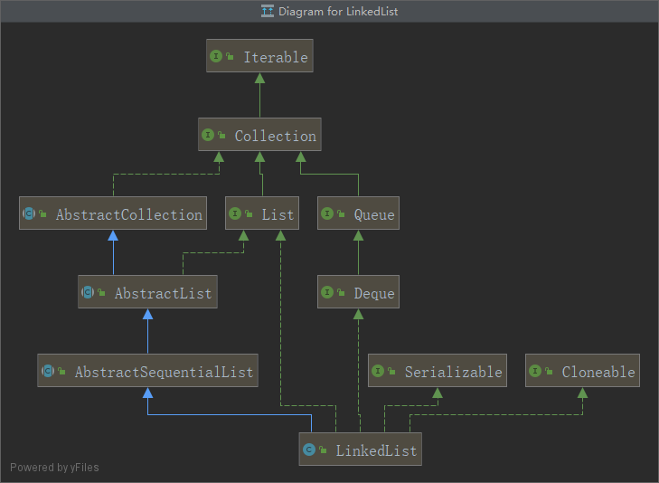

# LinkedList源码解析

* 从下面的UML类图可以得知，LinkedList继承了AbstractSequentialList抽象类，同时实现了List Deque Serializable Cloneable接口
* AbstractSequentialList:只支持按次序访问
* Deque：双向队列
* LinkedList与ArrayList的不同在于，ArrayList的实现是采用的时大小可变的数组，LinkedList采用的是双向链表的实现，基于链表的实现方式使得在插入核删除的效率比ArrayList要高，ArrayList的随机访问效率要高于LinkedList，数组的随机访问效率很高。



*   分析源码从构造函数开始-->Constructs：LinkedList有两个构造函数

    * 有两个构造函数，默认的构造函数和传入集合的构造函数
    * 三个成员变量，size为LinkedList的大小，first为链表的头结点，last为尾结点

    ```java
    /**
    * Constructs an empty list.
    */
    public LinkedList() {
    }

    /**
    * Constructs a list containing the elements of the specified
    * collection, in the order they are returned by the collection's
    * iterator.
    *
    * @param  c the collection whose elements are to be placed into this list
    * @throws NullPointerException if the specified collection is null
    */
    public LinkedList(Collection<? extends E> c) {
        // 默认构造函数
        this();
        // add all集合
        addAll(c);
    }

    	transient int size = 0;

        /**
         * Pointer to first node.
         * Invariant: (first == null && last == null) ||
         *            (first.prev == null && first.item != null)
         */
    	//前驱结点
        transient Node<E> first;

        /**
         * Pointer to last node.
         * Invariant: (first == null && last == null) ||
         *            (last.next == null && last.item != null)
         */
    	//后继结点
        transient Node<E> last;
    ```
*   Node

    * 了解Node next和prev的含义，先了解什么是双向链表
    * 双向链表也叫双链表，是链表一种，它的每个数据结点都有两个指针，分别指向直接后继和直接前驱。所以双向链表中的任意一个结点开始，都可以很方便的访问它的前驱结点和后续结点。

    ```java
    // 查看Node方法,私有静态方法
    private static class Node<E> {
        // LinkedList<E> 就是指的元素
        E item;
        // next指针指向item的下一个元素
        Node<E> next;
        // next指针指向item的上一个元素
        Node<E> prev;

        //构造方法
        Node(Node<E> prev, E element, Node<E> next) {
            this.item = element;
            this.next = next;
            this.prev = prev;
        }
    }
    ```
*   add方法和addAll差不多，先看Add方法

    * 其中node（）方法有点精髓，获取指定下标的数据的时候并不是从头到尾的去遍历，使用的是size>>1，右移一位，也就是一半，相对来说还是能省下很多时间

    ```java
    public boolean add(E e) {
        //主要就是这个方法，点进去看看
        linkLast(e);
        return true;
    }

    /**
    * Links e as last element(链接e最为最后一个元素).
    */
    void linkLast(E e) {
        // 把当前的DLL（双向链表）表中最后一个元素给l
        final Node<E> l = last;
        // 创建一个新节点 e, e的prev指针指向l，e的next指针指向null
        // 也就是说e是最后一个元素，last = e
        final Node<E> newNode = new Node<>(l, e, null);
        last = newNode;
        // 如果DLL的最后一个元素是null，说明当前就是第0个，所以first = last = e
        if (l == null)
            first = newNode;
        else
            l.next = newNode;
        size++;
        modCount++;
    }

    private boolean isPositionIndex(int index) {
        return index >= 0 && index <= size;
    }

    // 这个方法稍微特殊一点，单独提出来
    public void add(int index, E element) {
        checkPositionIndex(index);
    	// 如果add的index为size的时候就是往链表的最后加这个很容易理解
        if (index == size)
            linkLast(element);
        else
            // 在size长度前加元素，node（index）拿到该元素的node对象
            linkBefore(element, node(index));
    }

    /**
     * Inserts element e before non-null Node succ.
     */
    void linkBefore(E e, Node<E> succ) {
        // assert succ != null;
        // succ的前驱结点对象给pred
        final Node<E> pred = succ.prev;
        // 组装当前要插入元素的node对象，e的前驱结点为succ的前驱结点，e的后继结点为succ结点
        final Node<E> newNode = new Node<>(pred, e, succ);
        // 组装完结点的内容后，需要把链表串起来，那么原来succ结点的前继结点的后继结点需要改为新结点，succ的前驱结点也改为新结点。
        succ.prev = newNode;
        if (pred == null)
            first = newNode;
        else
            pred.next = newNode;
        size++;
        modCount++;
    }

    /**
     * Returns the (non-null) Node at the specified element index.
     */
    Node<E> node(int index) {
        // assert isElementIndex(index);
    	// 如果index小于（元素size/2）
        if (index < (size >> 1)) {
            // 从前往后找
            Node<E> x = first;
            for (int i = 0; i < index; i++)
                x = x.next;
            return x;
        } else {
            // 从后往前找
            Node<E> x = last;
            for (int i = size - 1; i > index; i--)
                x = x.prev;
            return x;
        }
    }

    // addAll(Collection<? extends E> c)和次方法一样，只是index传入的size值。
    public boolean addAll(int index, Collection<? extends E> c) {
        checkPositionIndex(index);
        
        Object[] a = c.toArray();
     
        int numNew = a.length;
        
        if (numNew == 0){
    	    return false;
        }
    	// 定义了两个Node对象 pred 和succ
        // pred 要插入结点的前一个结点
        // succ 要插入结点的后一个结点，也就是node(index)的那个值
        Node<E> pred, succ;
        if (index == size) {
            // 可以理解为两个LinkedList，List1为新建的对象或有值的对象，List2为有值的对象
            //List1.addAll(size,List2)
            // succ就不存
            succ = null;
            // pred节点为当前最后一个节点
            pred = last;
        } else {
            // 获取index下标的节点
            succ = node(index);
            // pred为succ节点的前一个节点
            pred = succ.prev;
        }
        // 循环将数据进行链接
        for (Object o : a) {
            @SuppressWarnings("unchecked") 
            E e = (E) o;
            Node<E> newNode = new Node<>(pred, e, null);
            if (pred == null)
                first = newNode;
            else
                pred.next = newNode;
            pred = newNode;
        }
        if (succ == null) {
            // 也就是addAll(size,List),最后一个就为最后链接的node结点
            last = pred;
        } else {
            // 否则就要把后面断开的链接上，形成双向链表
            pred.next = succ;
            succ.prev = pred;
        }
        // 更新List的长度值size
        size += numNew;
        modCount++;
        return true;
    }
    ```
*   remove方法源码解析

    ```java
    // 移除index的节点
    public E remove(int index) {
        // 下标检查
        // index >= 0 && index < size;
        checkElementIndex(index);
        // 调用unlink方法node(index) 获得index下标的节点对象
        return unlink(node(index));
    }


    public boolean remove(Object o) {
        if (o == null) {
            for (Node<E> x = first; x != null; x = x.next) {
                if (x.item == null) {
                    unlink(x);
                    return true;
                }
            }
        } else {
            for (Node<E> x = first; x != null; x = x.next) {
                if (o.equals(x.item)) {
                    unlink(x);
                    return true;
                }
            }
        }
        return false;
    }

    E unlink(Node<E> x) {
        // assert x != null;
        // 获取节点的值， 要删除的节点
        final E element = x.item;
        // x的后继节点
        final Node<E> next = x.next;
        // x的前继节点
        final Node<E> prev = x.prev;

        if (prev == null) {
            // 没有前继节点，那么就是第一个节点对象
            // 头部指向x删除节点的后继节点
            first = next;
        } else {
            // 删除元素的前继节点-->删除元素的后继节点
            prev.next = next;
            // 清空删除节点的前继指向
            x.prev = null;
        }
    	// 删除节点的后继节点=null
        if (next == null) {
            //尾部指向删除节点的前继节点
            last = prev;
        } else {
            //删除节点的后继节点，指向删除节点的前继节点
            next.prev = prev;
            // 清空删除节点x的后继指向
            x.next = null;
        }

        x.item = null;//便于GC
        // 更新size值
        size--;
        modCount++;
        return element;
    }
    ```
*   会有一些特殊的方法，关于头和尾的，都和上面差不多

    ```java
    /**
     * Links e as first element.
     */
    private void linkFirst(E e) {
        final Node<E> f = first;
        final Node<E> newNode = new Node<>(null, e, f);
        first = newNode;
        if (f == null)
            last = newNode;
        else
            f.prev = newNode;
        size++;
        modCount++;
    }

    /**
      * Links e as last element.
      */
    void linkLast(E e) {
        final Node<E> l = last;
        final Node<E> newNode = new Node<>(l, e, null);
        last = newNode;
        if (l == null)
            first = newNode;
        else
            l.next = newNode;
        size++;
        modCount++;
    }
    ```
*   查找方法

    * 先健康检查，然后node(index)获取元素对象，在获取item也就是元素的值

    ```java
    public E get(int index) {
      checkElementIndex(index);
        return node(index).item;
    }
    ```
*   遍历

    ```
    add 再get 效率特别低 没有ArrayList性能好。但是ArrayList的特点是寻址读取数据比较容易，插入和删除比较困难。
    ```
