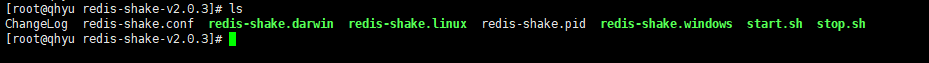
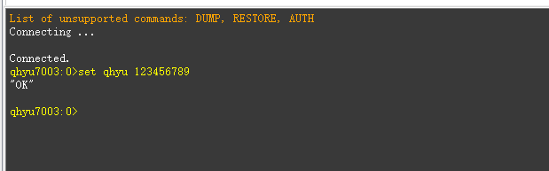
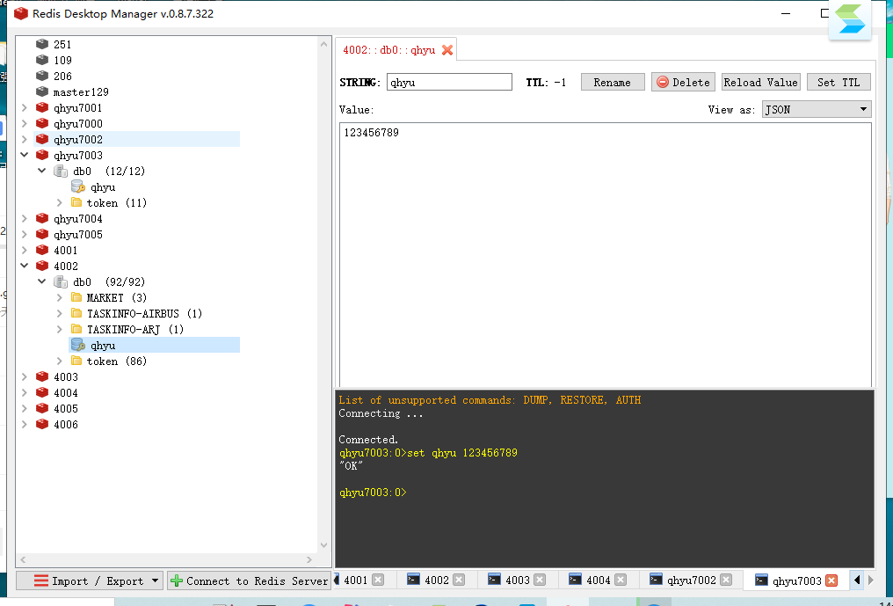

# Redis-Cluster数据迁移之redis-shake（集群到集群）

- **背景**
     - 在项目的实施过程中，由于有dev环境和pro环境，这时会有两个redis集群，但是部分数据从甲方的三方数据库中获取存入生产环境的redis集群中，为了方便测试和数据校验，需要将生产redis集群的各节点数据同步到测试环境的redis集群中，最好能实时的同步增量数据。
- **方案**
  - 写一个多数据源的redis项目，从一个redis集群读出来写到另外一个redis集群。PASS(太蠢了)
  - AOF，RDB直接COPY。PASS(增量数据呢？)
  - 本文介绍的redis-shake https://github.com/alibaba/RedisShake
- **条件准备**
  - 首先我们必须有两个redis集群（source:master[192.168.18.129:7001;192.168.18.130:7003;192.168.18.130:7005] target:master[192.168.1.71:4001;192.168.1.71:4002;192.168.1.71:4003]）为什么只要master呢？后面会解释~
  - 根据上面的路径下载最新版本的redis-shake
- **疑虑**
  - 要将生产数据迁移到测试环境，我生产redis集群里的数据肯定是不能丢失的。丢失了就完了。
  - 我当前的redis集群内的数据会被覆盖吗？
- 是否能将生产环境更新的数据也增量同步到测试环境？
  
- **动手**

  - 下载：https://github.com/alibaba/RedisShake/tree/release-v2.0.3-20200724 ，我当前最新的tags版本是release-v2.0.3-20200724。

  - 上传到liunx环境，当然也可以在windows上进行解压。

  - liunx环境使用tar -zxvf redis-shake-v2.0.3.tar.gz

  - 进入redis-shake-v2.0.3文件夹找到redis-shake.conf修改配置文件

    ~~~
    # 阿里的这个配置文件的注释特别详细，我只摘出我们需要修改的项目来进行修改。
    
    # source redis configuration.
    # used in `dump`, `sync` and `rump`.
    # source redis type, e.g. "standalone" (default), "sentinel" or "cluster".
    #   1. "standalone": standalone db mode.
    #   2. "sentinel": the redis address is read from sentinel.
    #   3. "cluster": the source redis has several db.
    #   4. "proxy": the proxy address, currently, only used in "rump" mode.
    # 源端redis的类型，支持standalone，sentinel，cluster和proxy四种模式，注意：目前proxy只用于rump模式。
    source.type = cluster
    # ip:port
    # the source address can be the following:
    #   1. single db address. for "standalone" type.
    #   2. ${sentinel_master_name}:${master or slave}@sentinel single/cluster address, e.g., mymaster:master@127.0.0.1:26379;127.0.0.1:26380, or @127.0.0.1:26379;127.0.0.1:26380. for "sentinel" type.
    #   3. cluster that has several db nodes split by semicolon(;). for "cluster" type. e.g., 10.1.1.1:20331;10.1.1.2:20441.
    #   4. proxy address(used in "rump" mode only). for "proxy" type.
    # 源redis地址。对于sentinel或者开源cluster模式，输入格式为"master名字:拉取角色为master或者slave@sentinel的地址"，别的cluster
    # 架构，比如codis, twemproxy, aliyun proxy等需要配置所有master或者slave的db地址。
    source.address = 192.168.18.129:7001;192.168.18.130:7003;192.168.18.130:7005
    # password of db/proxy. even if type is sentinel.
    source.password_raw = 123123yu
    # auth type, don't modify it
    source.auth_type = auth
    
    
    # target redis configuration. used in `restore`, `sync` and `rump`.
    # the type of target redis can be "standalone", "proxy" or "cluster".
    #   1. "standalone": standalone db mode.
    #   2. "sentinel": the redis address is read from sentinel.
    #   3. "cluster": open source cluster (not supported currently).
    #   4. "proxy": proxy layer ahead redis. Data will be inserted in a round-robin way if more than 1 proxy given.
    # 目的redis的类型，支持standalone，sentinel，cluster和proxy四种模式。
    target.type = cluster
    # ip:port
    # the target address can be the following:
    #   1. single db address. for "standalone" type.
    #   2. ${sentinel_master_name}:${master or slave}@sentinel single/cluster address, e.g., mymaster:master@127.0.0.1:26379;127.0.0.1:26380, or @127.0.0.1:26379;127.0.0.1:26380. for "sentinel" type.
    #   3. cluster that has several db nodes split by semicolon(;). for "cluster" type.
    #   4. proxy address. for "proxy" type.
    target.address = 192.168.1.71:4001;192.168.1.71:4002;192.168.1.71:4003
    # password of db/proxy. even if type is sentinel.
    target.password_raw = 123123yu
    
    target.auth_type = auth
    
    ~~~

  - 上面这部分是用户最困惑的地方，为了满足用户的灵活配置，除了集群版的迁移，redis-shake还有单节点/主从版迁移，RDB迁移，目前开放了较多的配置项，但是如果我提，我们关注的是集群版，那么集群版本的配置就如上所示，内容解释如下：
    - `source.type`: 源redis的类型，支持一下4种类型：
      `standalone`: 单db节点/主从版模式。如果源端是从多个db节点拉取就选择这个模式，即便是codis等开源的proxy-db架构。
      `sentinel`: `sentinel`模式。

       `cluster`: 集群模式。开源的cluster。对于阿里云来说，用户目前无法拉取db的地址，所以此处只能是proxy。
      `proxy`: proxy模式。如果是阿里云redis的集群版，从proxy拉取/写入请选择proxy，从db拉取请选择cluster。正常cluster到cluster同步源端请选择cluster模式，proxy模式目前只用于rump。

    - `source.address`: 源redis的地址，从1.6版本开始我们支持集群版，不同的类型对应不同的地址：
      `standalone`模式下，需要填写单个db节点的地址，主从版需要输入master或者slave的地址。
      `sentinel`模式下，需要填写`sentinel_master_name:master_or_slave@sentinel_cluster_address`。`sentinel_master_name`表示sentinel配置下master的名字，`master_or_slave`表示从sentinel中选择的db是master还是slave，`sentinel_cluster_address`表示sentinel的单节点或者集群地址，其中集群地址以分号（;）分割。例如：`mymaster:master@127.0.0.1:26379;127.0.0.1:26380`。注意，如果是sentinel模式，目前只能拉取一个master或者slave信息，如果需要拉取多个节点，需要启动多个shake。
      `cluster`模式下，需要填写集群地址，以分号（;）分割。例如：10.1.1.1:20331;10.1.1.2:20441。采用sync的时候只写master的IP和端口，参照我面的配置文件，否则启动redis-shake的时候会报错，让你修改。
      `proxy`模式下，需要填写单个proxy的地址，此模式目前仅用于`rump`。

    - `source.password_raw`：源redis的密码。

    - `target.type`: 目的redis的类型，与`source.type`一致。注意，目的端如果是阿里云的集群版，类型请填写proxy，填写cluster只会同步db0。

    - `target.address`：目的redis的地址。从1.6版本开始我们支持集群版，不同的类型对应不同的地址。 `standalone`模式，参见`source.address`。
      `sentinel`模式，需要填写`sentinel_master_name@sentinel_cluster_address`。`sentinel_master_name`表示sentinel配置下master的名字，`sentinel_cluster_address`表示sentinel的单节点或者集群地址，其中集群地址以分号（;）分割。例如：`mymaster@127.0.0.1:26379;127.0.0.1:26380`
      `cluster`模式，参见`source.address`。
      `proxy`模式下，填写proxy的地址，如果是多个proxy，则round-robin循环负载均衡连接，保证一个源端db连接只会对应一个proxy。如果是阿里云的集群版请选择这种模式。

    - `target.password_raw`：目的redis的密码。

  - 用户配置完配置文件，然后以不同的模式启动即可：`./redis-shake -conf=redis-shake.conf -type=sync`。

- **验证**
  - source的数据没有被清空，同时target的数据没有被覆盖
  - 在source集群中set qhyu 123456789，在target中有实时增量更新

