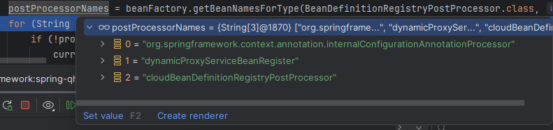

# Spring实例化源码解析(一)

## Spring实例化源码解析(一)

### invokeBeanFactoryPostProcessors

#### 前言

AbstractApplicationContext类的refresh方法是spring实例化流程的开始。本章主要是介绍invokeBeanFactoryPostProcessors(beanFactory)方法，对其内部源码进行详细分析。接下来就来看看这句简单的代码后面具体做了什么。**Spring源码版本6.0.12**，代码版本不同可能代码会稍有不同，但是核心逻辑大差不差。

#### 分析前的准备

接下来就直接从代码开始进行源码分析。源码的分析将会非常枯燥、并且常看常新。本章除了记录自己的源码学习内容，也希望能给大家带来帮助。

spring启动main方法，在调用refresh之前会register(AopConfig.class),这个是前提。

```java
public static void main(String[] args) {
		AnnotationConfigApplicationContext annotationConfigApplicationContext =
				new AnnotationConfigApplicationContext(AopConfig.class);
				}
```

AopConfig类其实可以是任意类，我只是为了加上@ComponentScan注解

```java
@EnableAspectJAutoProxy
@ComponentScan(value = {"com.qhyu.cloud.**"})
public class AopConfig {

}
```

**invokeBeanFactoryPostProcessors**

Instantiate and invoke all registered BeanFactoryPostProcessor beans,respecting explicit order if given.

实例化并调用所有已注册的 BeanFactoryPostProcessor beans，如果给定的话，请遵守显式顺序。次方法就在AbstractApplicationContext中。

```java
protected void invokeBeanFactoryPostProcessors(ConfigurableListableBeanFactory beanFactory) {
		// 核心方法
		PostProcessorRegistrationDelegate.invokeBeanFactoryPostProcessors(beanFactory, getBeanFactoryPostProcessors());

		// Detect a LoadTimeWeaver and prepare for weaving, if found in the meantime
		// (e.g. through an @Bean method registered by ConfigurationClassPostProcessor)
		if (!NativeDetector.inNativeImage() && beanFactory.getTempClassLoader() == null && beanFactory.containsBean(LOAD_TIME_WEAVER_BEAN_NAME)) {
			beanFactory.addBeanPostProcessor(new LoadTimeWeaverAwareProcessor(beanFactory));
			beanFactory.setTempClassLoader(new ContextTypeMatchClassLoader(beanFactory.getBeanClassLoader()));
		}
	}
```

PostProcessorRegistrationDelegate.invokeBeanFactoryPostProcessors(beanFactory, getBeanFactoryPostProcessors())是核心的方法，本以为getBeanFactoryPostProcessors()方法会获取到所有的BeanFactoryPostProcessors，毕竟看起来名字很像，但是打断点发现其实此处返回的List size为0。

那么接下来就直接查看invokeBeanFactoryPostProcessors(beanFactory, getBeanFactoryPostProcessors())方法。

**BeanFactoryPostProcessor**

在spring的实例化过程中我们可以经常看到BeanFactoryPostProcessor接口，几乎充斥着整个实例化过程。BeanDefinitionRegistryPostProcessor也是spring框架中一个比较重要的接口。因为BeanDefinitionRegistryPostProcessor继承了BeanFactoryPostProcessor，所以就放一起来讲解了。

* **BeanFacotryPostProcessor**

BeanFactoryPostProcessor是一个接口，用于在Spring容器实例化任何Bean之前修改BeanDefinition(Bean定义)或配置的后置处理器，它允许对BeanDefinition进行修改、添加自定义属性甚至可以完全替换beanDefinition。

关键点：

1、在spring容器加载BeanDefinition后，但在实例化Bean之前调用。

2、用于修改BeanDefinition的元数据(如类名、作用域、属性等)。

3、对所有的BeanDefinition生效，包括非延迟加载和延迟加载的bean。

4、可以通过实现BeanFactoryPostProcessor接口并注册为Spring容器的Bean来自定义处理逻辑。

示例：

```java
public class CustomBeanFactoryPostProcessor implements BeanFactoryPostProcessor {
    @Override
    public void postProcessBeanFactory(ConfigurableListableBeanFactory beanFactory) throws BeansException {
        // 在这里进行Bean定义的修改或自定义处理逻辑
    }
}
```

* **BeanDefinitionRegistryPostProcessor**

BeanDefinitionRegistryPostProcessor是BeanFacotryPostProcessor的子接口，用于在Spring容器实例化任何Bean之前修改Bean定义的后置处理器。与BeanFacotryPostProcessor相比，它提供了更广泛的功能，包括添加、修改和删除Bean定义。

关键点：

1、继承自BeanFactoryPostProcessor接口，扩展了修改Bean定义的功能。

2、在Spring容器加载Bean定义后，但在实例化Bean之前调用。

3、用于直接操作Bean定义的注册表，可以添加、修改和删除Bean定义。

4、可以通过实现BeanDefinitionRegistryPostProcessor接口并注册为Spring容器的Bean来自定义处理逻辑。

示例：

```java
public class CustomBeanDefinitionRegistryPostProcessor implements BeanDefinitionRegistryPostProcessor {
    @Override
    public void postProcessBeanDefinitionRegistry(BeanDefinitionRegistry registry) throws BeansException {
        // 在这里进行Bean定义的添加、修改或删除操作
    }

    @Override
    public void postProcessBeanFactory(ConfigurableListableBeanFactory beanFactory) throws BeansException {
        // 可以不实现该方法，或者在这里进行其他的BeanFactoryPostProcessor的处理逻辑
    }
}
```

**关系和使用区别：**

* BeanDefinitionRegistryPostProcessor是BeanFactoryPostProcessor的子接口，它们都用于在实例化Bean之前修改Bean定义。
* BeanDefinitionRegistryPostProcessor在功能上更加强大，可以添加、修改和删除Bean定义，而BeanFactoryPostProcessor只能修改Bean定义的元数据。
* BeanDefinitionRegistryPostProcessor在处理Bean定义之前，会先回调BeanFactoryPostProcessor的方法，因此它们可以一起使用，但是顺序上有所区别。
* BeanDefinitionRegistryPostProcessor可以直接操作Bean定义注册表，而BeanFactoryPostProcessor只能通过ConfigurableListableBeanFactory来间接操作Bean定义。
* 通常情况下，更常用的是实现BeanFactoryPostProcessor接口，而BeanDefinitionRegistryPostProcessor在特定需求下使用，例如需要动态地添加或修改Bean定义。

**PostProcessorRegistrationDelegate.invokeBeanFactoryPostProcessors**

这里引入了一个新的类PostProcessorRegistrationDelegate。

invokeBeanFactoryPostProcessors方法的参数解释如下：

参数1：默认是DefaultListableBeanFactory，实现了BeanDefinitionRegistry

参数2：一般情况下为空，除非调用Spring容器的refresh方法之前调用API手动添加了BeanFactoryPostProcessor

```java
public static void invokeBeanFactoryPostProcessors(
			ConfigurableListableBeanFactory beanFactory, List<BeanFactoryPostProcessor> beanFactoryPostProcessors) {

		// WARNING: Although it may appear that the body of this method can be easily
		// refactored to avoid the use of multiple loops and multiple lists, the use
		// of multiple lists and multiple passes over the names of processors is
		// intentional. We must ensure that we honor the contracts for PriorityOrdered
		// and Ordered processors. Specifically, we must NOT cause processors to be
		// instantiated (via getBean() invocations) or registered in the ApplicationContext
		// in the wrong order.
		//
		// Before submitting a pull request (PR) to change this method, please review the
		// list of all declined PRs involving changes to PostProcessorRegistrationDelegate
		// to ensure that your proposal does not result in a breaking change:
		// https://github.com/spring-projects/spring-framework/issues?q=PostProcessorRegistrationDelegate+is%3Aclosed+label%3A%22status%3A+declined%22

		// Invoke BeanDefinitionRegistryPostProcessors first, if any.
		// 如果有的话，首先调用 BeanDefinitionRegistryPostProcessors
		// 存放处理完毕的bfpp名称
		Set<String> processedBeans = new HashSet<>();

		// 因为默认传的DefaultListableBeanFactory==beanFactory实现了BeanDefinitionRegistry接口，所以进入if的逻辑
		if (beanFactory instanceof BeanDefinitionRegistry) {
			// 也就是说这个if里面要使用的就是BeanDefinitionRegistry的特性。
			BeanDefinitionRegistry registry = (BeanDefinitionRegistry) beanFactory;
			// regular常规的意思
			// regularPostProcessors记录通过硬编码方式注册的BeanFactoryPostProcessor类型的处理器
			// 存放直接实现了BeanFactoryPostProcessor接口的实现类集合，bfpp的作用是可以定制化修改bd
			List<BeanFactoryPostProcessor> regularPostProcessors = new ArrayList<>();

			// registryProcessors记录通过硬编码方式注册是BeanDefinitionRegistryPostProcessor
			// 存放直接实现了BeanDefinitionRegistryPostProcessor接口实现类的集合，brpp可以定制化修改bd
			List<BeanDefinitionRegistryPostProcessor> registryProcessors = new ArrayList<>();

			// 除非手动注入bfpp 否则这个for循环没有什么意义,也就是AnnotationConfigApplicationContext.addBeanFactoryPostProcessor
			// 此处可以作为扩展。AnnotationConfigApplicationContext.addBeanFactoryPostProcessor
			for (BeanFactoryPostProcessor postProcessor : beanFactoryPostProcessors) {
				if (postProcessor instanceof BeanDefinitionRegistryPostProcessor) {
					BeanDefinitionRegistryPostProcessor registryProcessor =
							(BeanDefinitionRegistryPostProcessor) postProcessor;
					registryProcessor.postProcessBeanDefinitionRegistry(registry);
					registryProcessors.add(registryProcessor);
				}
				else {
					regularPostProcessors.add(postProcessor);
				}
			}

			// Do not initialize FactoryBeans here: We need to leave all regular beans
			// uninitialized to let the bean factory post-processors apply to them!
			// Separate between BeanDefinitionRegistryPostProcessors that implement
			// PriorityOrdered, Ordered, and the rest.

			// currentRegistryProcessors记录通过配置方式注册的BeanDefinitionRegistryPostProcessor类型的处理器
			// 用于存放当前即将执行BeanDefinitionRegistryPostProcessor实现类
			List<BeanDefinitionRegistryPostProcessor> currentRegistryProcessors = new ArrayList<>();

			// First, invoke the BeanDefinitionRegistryPostProcessors that implement PriorityOrdered.
			// 第一次调用：首先调用实现了排序的BeanDefinitionRegistryPostProcessors

			// 这里这个方法多次调用返回不同的值是因为beanFactory中的BeanDefinitionRegistryPostProcessors的新增，一开始都想不明白。
			// 其实最主要的就是第一次执行了invokeBeanDefinitionRegistryPostProcessor方法
			// 真实逻辑就是ConfigurationClassPostProcessor的postProcessBeanDefinitionRegistry方法，
			// 这里会根据我们的AopConfig，也就是@ComponentScan注解的path来扫描我们自己的类，并且生产BeanDefiniton信息
			String[] postProcessorNames =
					beanFactory.getBeanNamesForType(BeanDefinitionRegistryPostProcessor.class, true, false);
			for (String ppName : postProcessorNames) {
				if (beanFactory.isTypeMatch(ppName, PriorityOrdered.class)) {
					currentRegistryProcessors.add(beanFactory.getBean(ppName, BeanDefinitionRegistryPostProcessor.class));
					processedBeans.add(ppName);
				}
			}
			// 很明显 这里是排序，先不进去看，因为此时currentRegistryProcessors只有一个ConfigurationClassPostProcessor
			sortPostProcessors(currentRegistryProcessors, beanFactory);

			registryProcessors.addAll(currentRegistryProcessors);
			// 这个方法就是核心内容，我这个工程使用了AOPConfig启动类，也就是说一开始会解析这个类，包含类上的ComponentScan注解，会把路径下的东西用ClassPathBeanDefinitionScanner来扫描出来
			// 生成beanDefinition放入BeanFactory(DefaultListableBeanFactory),所以第二次调用的时候就可以扫描出其他的BeanFactoryPostProcessors
			// ConfigurationClassPostProcessor ==  currentRegistryProcessors
			invokeBeanDefinitionRegistryPostProcessors(currentRegistryProcessors, registry, beanFactory.getApplicationStartup());
			// 清空当前注册的BeanDefinitionRegistryPostProcessors
			currentRegistryProcessors.clear();

			// Next, invoke the BeanDefinitionRegistryPostProcessors that implement Ordered.
			// 接下来，调用实现 Ordered 的 BeanDefinitionRegistryPostProcessors。
			// 第二次调用：这个时候已经获取了ComponentScan注解中的路径下的BeanDefinition了。
			// 所以会把我们定义的BeanDefinitionRegistryPostProcessor加载起来，或者第三方框架实现的BeanDefinitionRegistryPostProcessor加载
			postProcessorNames = beanFactory.getBeanNamesForType(BeanDefinitionRegistryPostProcessor.class, true, false);
			for (String ppName : postProcessorNames) {
				if (!processedBeans.contains(ppName) && beanFactory.isTypeMatch(ppName, Ordered.class)) {
					currentRegistryProcessors.add(beanFactory.getBean(ppName, BeanDefinitionRegistryPostProcessor.class));
					processedBeans.add(ppName);
				}
			}
			// 排序,看一下排序的规则是什么？，我可以实现Ordered接口PriorityOrdered接口或者注解
			sortPostProcessors(currentRegistryProcessors, beanFactory);
			registryProcessors.addAll(currentRegistryProcessors);
			// 调用了currentRegistryProcessors中的BeanDefinitionRegistryPostProcessors--》postProcessBeanDefinitionRegistry方法
			// 因为BeanDefinitionRegistryPostProcessor的职责就是加载Bean的BeanDefinition，后续才好加载这个bean，至于要修改的话，交给BeanFactoryPostProcessor
			invokeBeanDefinitionRegistryPostProcessors(currentRegistryProcessors, registry, beanFactory.getApplicationStartup());
			currentRegistryProcessors.clear();

			// Finally, invoke all other BeanDefinitionRegistryPostProcessors until no further ones appear.
			// 最后，调用所有其他 BeanDefinitionRegistryPostProcessors 直到不再出现。
			boolean reiterate = true;
			while (reiterate) {
				reiterate = false;
				postProcessorNames = beanFactory.getBeanNamesForType(BeanDefinitionRegistryPostProcessor.class, true, false);
				for (String ppName : postProcessorNames) {
					if (!processedBeans.contains(ppName)) {
						currentRegistryProcessors.add(beanFactory.getBean(ppName, BeanDefinitionRegistryPostProcessor.class));
						processedBeans.add(ppName);
						reiterate = true;
					}
				}
				sortPostProcessors(currentRegistryProcessors, beanFactory);
				registryProcessors.addAll(currentRegistryProcessors);
				invokeBeanDefinitionRegistryPostProcessors(currentRegistryProcessors, registry, beanFactory.getApplicationStartup());
				currentRegistryProcessors.clear();
			}

			// Now, invoke the postProcessBeanFactory callback of all processors handled so far.
			invokeBeanFactoryPostProcessors(registryProcessors, beanFactory);
			invokeBeanFactoryPostProcessors(regularPostProcessors, beanFactory);
		}

		else {
			// Invoke factory processors registered with the context instance.
			invokeBeanFactoryPostProcessors(beanFactoryPostProcessors, beanFactory);
		}

		/** =============下面就是处理BeanFactoryPostProcessor的实现类=============  */
		// Do not initialize FactoryBeans here: We need to leave all regular beans
		// uninitialized to let the bean factory post-processors apply to them!
		// 获取bfpp接口实现类
		String[] postProcessorNames =
				beanFactory.getBeanNamesForType(BeanFactoryPostProcessor.class, true, false);

		// Separate between BeanFactoryPostProcessors that implement PriorityOrdered,
		// Ordered, and the rest.
		List<BeanFactoryPostProcessor> priorityOrderedPostProcessors = new ArrayList<>();
		List<String> orderedPostProcessorNames = new ArrayList<>();
		List<String> nonOrderedPostProcessorNames = new ArrayList<>();
		for (String ppName : postProcessorNames) {
			if (processedBeans.contains(ppName)) {
				// skip - already processed in first phase above
			}
			else if (beanFactory.isTypeMatch(ppName, PriorityOrdered.class)) {
				priorityOrderedPostProcessors.add(beanFactory.getBean(ppName, BeanFactoryPostProcessor.class));
			}
			else if (beanFactory.isTypeMatch(ppName, Ordered.class)) {
				orderedPostProcessorNames.add(ppName);
			}
			else {
				nonOrderedPostProcessorNames.add(ppName);
			}
		}

		// First, invoke the BeanFactoryPostProcessors that implement PriorityOrdered.
		sortPostProcessors(priorityOrderedPostProcessors, beanFactory);
		invokeBeanFactoryPostProcessors(priorityOrderedPostProcessors, beanFactory);

		// Next, invoke the BeanFactoryPostProcessors that implement Ordered.
		List<BeanFactoryPostProcessor> orderedPostProcessors = new ArrayList<>(orderedPostProcessorNames.size());
		for (String postProcessorName : orderedPostProcessorNames) {
			orderedPostProcessors.add(beanFactory.getBean(postProcessorName, BeanFactoryPostProcessor.class));
		}
		sortPostProcessors(orderedPostProcessors, beanFactory);
		invokeBeanFactoryPostProcessors(orderedPostProcessors, beanFactory);

		// Finally, invoke all other BeanFactoryPostProcessors.
		List<BeanFactoryPostProcessor> nonOrderedPostProcessors = new ArrayList<>(nonOrderedPostProcessorNames.size());
		for (String postProcessorName : nonOrderedPostProcessorNames) {
			nonOrderedPostProcessors.add(beanFactory.getBean(postProcessorName, BeanFactoryPostProcessor.class));
		}
		invokeBeanFactoryPostProcessors(nonOrderedPostProcessors, beanFactory);

		// Clear cached merged bean definitions since the post-processors might have
		// modified the original metadata, e.g. replacing placeholders in values...
		beanFactory.clearMetadataCache();
	}
```

我们今天要分析的源码就是上面这一个方法，在源码分析的时候我们还是要稍微读一读方法名称和各个单词，因为在spring中我们很多时候都可以通过方法名称来判断出要做的事情，因为源码分析打断点的时候如果一直往下看可能就出不来了。所以有的时候需要我们智能的跳过一些个方法。

**beanFactory**

在进入到方法之前我们先看下beanFactory，这个beanFactory我感觉可以理解为bean工厂。beanfactory是spring框架中的一个核心接口，它提供了一种机制来管理和访问程序中的对象（也称为Bean）。在spring中，对象的创建、配置和管理是由beanfactory负责的。

首先可以知道传入的是DefaultListableBeanFactory，所以说beanFactory instanceof BeanDefinitionRegistry是true。会进入到if逻辑中。

其次当前beanFactory中已经注册了5个beanDefinition。aopConfig就不多说了，在调用refresh方法之前手动注册的，其他四个可以先不管。

#### 源码分析

接下来会集中拆解PostProcessorRegistrationDelegate类中的invokeBeanFactoryPostProcessors方法来逐步分析源码。

```java
public static void invokeBeanFactoryPostProcessors(
			ConfigurableListableBeanFactory beanFactory, List<BeanFactoryPostProcessor> beanFactoryPostProcessors) {
		Set<String> processedBeans = new HashSet<>();
		// 因为默认传的DefaultListableBeanFactory==beanFactory实现了BeanDefinitionRegistry接口，所以进入if的逻辑
		if (beanFactory instanceof BeanDefinitionRegistry) {
			// 也就是说这个if里面要使用的就是BeanDefinitionRegistry的特性。或者作为参数传递固定了类型。
			BeanDefinitionRegistry registry = (BeanDefinitionRegistry) beanFactory;
			// regular常规的意思
			// regularPostProcessors记录通过硬编码方式注册的BeanFactoryPostProcessor类型的处理器
			// 存放直接实现了BeanFactoryPostProcessor接口的实现类集合，bfpp的作用是可以定制化修改bd
			List<BeanFactoryPostProcessor> regularPostProcessors = new ArrayList<>();

			// registryProcessors记录通过硬编码方式注册是BeanDefinitionRegistryPostProcessor
			// 存放直接实现了BeanDefinitionRegistryPostProcessor接口实现类的集合，brpp可以定制化修改bd
			List<BeanDefinitionRegistryPostProcessor> registryProcessors = new ArrayList<>();	
```

**processedBeans**根据是用来存放String的集合，根据processedBeans.add方法可以知道存放的是处理完成的BeanDefinitionRegistryPostProcessor的名称。

**regularPostProcessors**存放的是BeanFacotyPostProcessor。

**registryProcessors**存放的是BeanDefinitionRegistryPostProcessor。

接下来拆解这个for循环，beanFactoryPostProcessors参数size=0，所以当前这个for循环肯定是不会执行的。然而整个invokeBeanFactoryPostProcessors方法中只有这个for循环中有使用regularPostProcessors.add方法。所以regular相关的后续遇到了可以先跳过。

此处可以作为一个扩展点。AnnotationConfigApplicationContext.addBeanFactoryPostProcessor可以让for循环生效。也就是手动注入beanFactoryPostProcessor，在这篇文章就不深入了。

```java
for (BeanFactoryPostProcessor postProcessor : beanFactoryPostProcessors) {
				if (postProcessor instanceof BeanDefinitionRegistryPostProcessor) {
					BeanDefinitionRegistryPostProcessor registryProcessor =
							(BeanDefinitionRegistryPostProcessor) postProcessor;
					registryProcessor.postProcessBeanDefinitionRegistry(registry);
					registryProcessors.add(registryProcessor);
				}
				else {
					regularPostProcessors.add(postProcessor);
				}
			}
```

```java
// 用于存放当前即将执行BeanDefinitionRegistryPostProcessor实现类
List<BeanDefinitionRegistryPostProcessor> currentRegistryProcessors = new ArrayList<>();
```

第一次调用实现了ProrityOrdered的BeanDefinitionRegistryPostProcessors逻辑，接下来将是最重要的部分了。

```java
		// First, invoke the BeanDefinitionRegistryPostProcessors that implement PriorityOrdered.
			
			String[] postProcessorNames =
					beanFactory.getBeanNamesForType(BeanDefinitionRegistryPostProcessor.class, true, false);
			for (String ppName : postProcessorNames) {
				if (beanFactory.isTypeMatch(ppName, PriorityOrdered.class)) {
					currentRegistryProcessors.add(beanFactory.getBean(ppName, BeanDefinitionRegistryPostProcessor.class));
					processedBeans.add(ppName);
				}
			}
			// 很明显 这里是排序，先不进去看，因为此时currentRegistryProcessors只有一个ConfigurationClassPostProcessor
			sortPostProcessors(currentRegistryProcessors, beanFactory);

			registryProcessors.addAll(currentRegistryProcessors);
			// 这个方法就是核心内容，我这个工程使用了AOPConfig启动类，也就是说一开始会解析这个类，包含类上的ComponentScan注解，会把路径下的东西用ClassPathBeanDefinitionScanner来扫描出来
			// 生成beanDefinition放入BeanFactory(DefaultListableBeanFactory),所以第二次调用的时候就可以扫描出其他的BeanFactoryPostProcessors
			// ConfigurationClassPostProcessor ==  currentRegistryProcessors
			invokeBeanDefinitionRegistryPostProcessors(currentRegistryProcessors, registry, beanFactory.getApplicationStartup());
			// 清空当前注册的BeanDefinitionRegistryPostProcessors
			currentRegistryProcessors.clear();
```

首先查看postProcessorNames会返回什么东西。

org.springframework.context.annotation.internalConfigurationAnnotationProcessor 这个有点印象。可以回到开始的beanFactory的截图中找到。beanDefinitonNames中第一个记录就是这个名称。

也就是说beanFactory.getBeanNamesForType方法是从spring的beanFactory中的beanDefinitionMap中去找有没有符合类型为BeanDefinitionRegistryPostProcessor的类，并且如果实现了PriorityOrdered.class就把这个BeanDefinitionRegistryPostProcessor加入到currentRegistryProcessors和processedBeans集合中。

beanFactory.getBean(ppName, BeanDefinitionRegistryPostProcessor.class)拿到的bean其实是ConfigurationClassPostProcessor。

解析下来就是关键先生**ConfigurationClassPostProcessor**类和**invokeBeanDefinitionRegistryPostProcessors**方法。

```java
private static void invokeBeanDefinitionRegistryPostProcessors(
			Collection<? extends BeanDefinitionRegistryPostProcessor> postProcessors, BeanDefinitionRegistry registry, ApplicationStartup applicationStartup) {

		for (BeanDefinitionRegistryPostProcessor postProcessor : postProcessors) {
			StartupStep postProcessBeanDefRegistry = applicationStartup.start("spring.context.beandef-registry.post-process")
					.tag("postProcessor", postProcessor::toString);
			postProcessor.postProcessBeanDefinitionRegistry(registry);
			postProcessBeanDefRegistry.end();
		}
	}
```

根据代码来看，就是执行ConfigurationClassPostProcessor类的postProcessBeanDefinitionRegistry方法，带上了registry这个参数，也就是DefaultListableBeanFacotry。

这个invokeBeanDefinitionRegistryPostProcessors方法的意思就是调用这个BeanDefinitionRegistryPostProcessor的postProcessBeanDefinitionRegistry方法，而ConfigurationClassPostProcessor类的postProcessBeanDefinitionRegistry方法是去加载并注册我们自定义的一些被spring管理的类到spring中。在本节中不会深入的去研究这个类的具体执行逻辑，将在下一章节进行分析。

invokeBeanDefinitionRegistryPostProcessors方法执行完成之后会清理currentRegistryProcessors集合。然后就开始第二次调用了。

```java
postProcessorNames = beanFactory.getBeanNamesForType(BeanDefinitionRegistryPostProcessor.class, true, false);
			for (String ppName : postProcessorNames) {
				if (!processedBeans.contains(ppName) && beanFactory.isTypeMatch(ppName, Ordered.class)) {
					currentRegistryProcessors.add(beanFactory.getBean(ppName, BeanDefinitionRegistryPostProcessor.class));
					processedBeans.add(ppName);
				}
			}
			sortPostProcessors(currentRegistryProcessors, beanFactory);
			registryProcessors.addAll(currentRegistryProcessors);
			invokeBeanDefinitionRegistryPostProcessors(currentRegistryProcessors, registry, beanFactory.getApplicationStartup());
			currentRegistryProcessors.clear();
```

其实第二次调用的这块代码和第一次调用的大差不差，主要是beanFactory.isTypeMatch(ppName, Ordered.class)的不同，第一次是PriorityOrdered.class。同时第二次不会处理第一次执行过的BeanFacotryPostProcessor。也就是processedBeans.contains(ppName)逻辑。

<figure><figcaption></figcaption></figure>

第二次调用beanFactory.getBeanNamesForType(BeanDefinitionRegistryPostProcessor.class, true, false)除了第一次出现的org.springframework.context.annotation.internalConfigurationAnnotationProcessor还有两个我自定义的类。

```java
@Component
public class CloudBeanDefinitionRegistryPostProcessor implements BeanDefinitionRegistryPostProcessor , PriorityOrdered {
	@Override
	public void postProcessBeanFactory(ConfigurableListableBeanFactory beanFactory) throws BeansException {
		System.out.println("beanFactoryPostProcessor used by cloud");
	}

	@Override
	public void postProcessBeanDefinitionRegistry(BeanDefinitionRegistry registry) throws BeansException {
		System.out.println("BeanDefinitionRegistryPostProcessor used by cloud");
	}

	@Override
	public int getOrder() {
		return 100;
	}
}
```

因为第一次调用的时候执行了ConfigurationClassPostProcessor类的postProcessBeanDefinitionRegistry方法,会把我们交给spring管理的beanDefinition注册到beanFactory中，所以第二次调用这个方法的时候就会把自定义的加载起来，当然三方jar包也可能做同样的事情，比如mybatis plus。

invokeBeanDefinitionRegistryPostProcessors方法还是会执行这些自定的BeanDefinitionRegistryPostProcessor的postProcessBeanDefinitionRegistry方法。执行完成之后继续清理currentRegistryProcessors集合。

接下来开始调用第三次，为什么会出现第三次，就是因为 beanFactory.isTypeMatch(ppName, Ordered.class)和beanFactory.isTypeMatch(ppName, PriorityOrdered.class)，相当于自定义的没有实现这两个接口的就在这里一次性处理完。

```java
boolean reiterate = true;
			while (reiterate) {
				reiterate = false;
				postProcessorNames = beanFactory.getBeanNamesForType(BeanDefinitionRegistryPostProcessor.class, true, false);
				for (String ppName : postProcessorNames) {
					if (!processedBeans.contains(ppName)) {
						currentRegistryProcessors.add(beanFactory.getBean(ppName, BeanDefinitionRegistryPostProcessor.class));
						processedBeans.add(ppName);
						reiterate = true;
					}
				}
				sortPostProcessors(currentRegistryProcessors, beanFactory);
				registryProcessors.addAll(currentRegistryProcessors);
				invokeBeanDefinitionRegistryPostProcessors(currentRegistryProcessors, registry, beanFactory.getApplicationStartup());
				currentRegistryProcessors.clear();
			}
```

在if方法的最后有两行代码比较重要。

```java
// Now, invoke the postProcessBeanFactory callback of all processors handled so far.
			invokeBeanFactoryPostProcessors(registryProcessors, beanFactory);
			invokeBeanFactoryPostProcessors(regularPostProcessors, beanFactory);
```

其实重要的就是这个方法，调用BeanFacotyPostProcessors的postProcessBeanFactory方法。也就是说自定义的这些BeanDefinitionRegistryPostProcessor会先执行BeanDefinitionRegistryPostProcessor的postProcessBeanDefinitionRegistry方法，待所有的BeanDefinitionRegistryPostProcessor执行完成之后再调用这些自定义的BeanDefinitionRegistryPostProcessor的postProcessBeanFactory方法。因为双方存在继承关系。

至此BeanDefinitionRegistryPostProcessor就结束了，接下来就会处理BeanFactoryPostProcessor了。

```java
// Do not initialize FactoryBeans here: We need to leave all regular beans
		// uninitialized to let the bean factory post-processors apply to them!
	
		String[] postProcessorNames =
				beanFactory.getBeanNamesForType(BeanFactoryPostProcessor.class, true, false);

		// Separate between BeanFactoryPostProcessors that implement PriorityOrdered,
		// Ordered, and the rest.
		List<BeanFactoryPostProcessor> priorityOrderedPostProcessors = new ArrayList<>();
		List<String> orderedPostProcessorNames = new ArrayList<>();
		List<String> nonOrderedPostProcessorNames = new ArrayList<>();
```

\*\*postProcessorNames：\*\*获取的是当前beanFactory中的实现了BeanFactoryPostProcessor的bean的名称。

\*\*priorityOrderedPostProcessors：\*\*很明显哈实现了PriorityOrdered的BeanFactoryPostProcessor存放在这，存放的是bean哦。

\*\*orderedPostProcessorNames：\*\*存放的是实现了Ordered的BeanFactoryPostProcessor，存放的是名称。

\*\*nonOrderedPostProcessorNames：\*\*存放的是没有实现排序的BeanFactoryPostProcessor，存放的是名称。

```java
for (String ppName : postProcessorNames) {
			if (processedBeans.contains(ppName)) {
				// skip - already processed in first phase above
			}
			else if (beanFactory.isTypeMatch(ppName, PriorityOrdered.class)) {
				priorityOrderedPostProcessors.add(beanFactory.getBean(ppName, BeanFactoryPostProcessor.class));
			}
			else if (beanFactory.isTypeMatch(ppName, Ordered.class)) {
				orderedPostProcessorNames.add(ppName);
			}
			else {
				nonOrderedPostProcessorNames.add(ppName);
			}
		}
```

接下来就是排序和invokeBeanFactoryPostProcessors，分别执行这几个集合中的BeanFactoryPostProcessor的postProcessBeanFactory方法。

#### 总结

本章主要分析了AbstractApplicationContext.refresh方法中的invokeBeanFactoryPostProcessors(beanFactory)方法，其中ConfigurationClassPostProcessor类的postProcessBeanDefinitionRegistry方法和排序方法将在下一章进行分析和讲解，循序渐进的完成整个逻辑的讲解。
