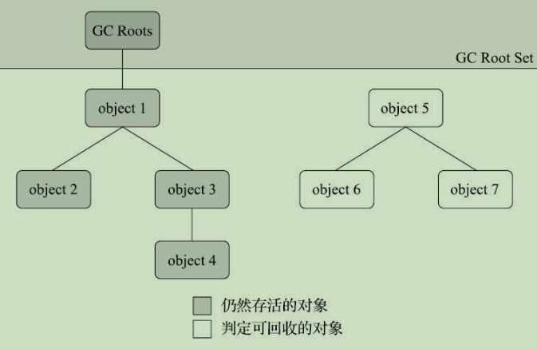
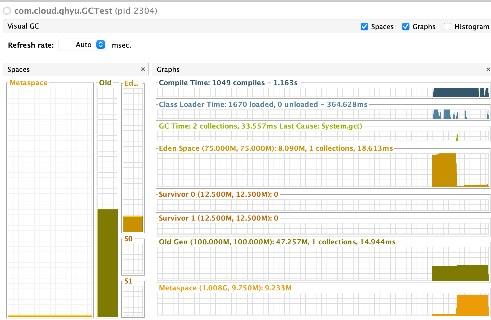
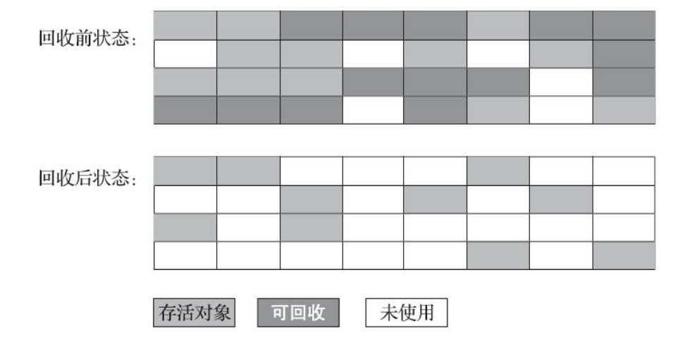
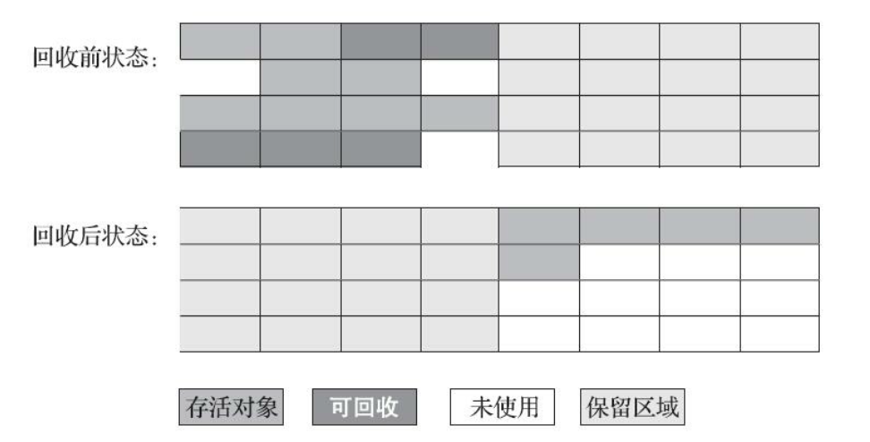
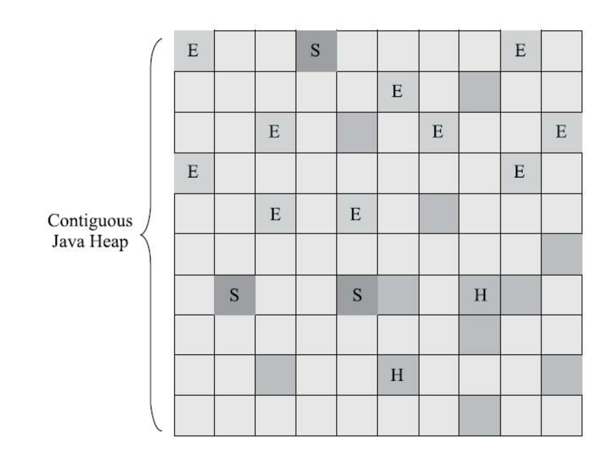

天朗气清，惠风和畅。打开知乎搜索一下Java垃圾回收的相关问题，来给自己充充电，突然一个大聪明提的一个问题，让我忍不住点开看看到底是什么样的机灵鬼能这么脑洞大开？


这个问题被浏览了58w，确实引起了我的兴趣。

我依然记得《深入理解Java虚拟机》这本书中说的一段话：Java与C++之间有一堵由内存动态分配和垃圾收集技术围成的高墙，墙外面的人想进去，墙里面的人却想出来。我摸了摸头感觉到了一丝凉意，想起了另外一梗：说在食堂里吃饭，吃完饭自觉把餐盘清理走的，是 C++ 程序员，吃完直接就走的，是 Java 程序员。简直精髓！直呼内行！

那我们就开始研究一下java垃圾回收是什么？为什么不使用360垃圾清理来回收垃圾。

#### 什么是垃圾回收

垃圾回收，顾名思义就是垃圾桶需要重复使用，垃圾到达一定容量的时候我需要去倒垃圾。释放垃圾占用的空间，避免内存泄漏。

#### 哪些内存需要被回收？什么时候回收？如何回收？

在堆里面存放着Java世界中几乎所有的对象实例，垃圾收集器在对堆进行回收前，第一件事情就是要确定这些对象之中哪些还“存活”着，哪些已经“死去”（即不可能再被任何途径使用的对象）。基于我的垃圾桶理论就是我倒垃圾前先翻垃圾，强迫症，我得检查是不是丢的都是我不需要的垃圾。

##### 哪些内存需要被回收？什么时候回收？

###### 引用计数算法

给对象中添加一个引用计数器，每当有一个地方引用它时，计数器值就加1；当引用失效时，计数器就减1；任何时刻计数器为0的对象就是不可能再被使用的。

据了解主流的Java虚拟机里面没有选用引用计数算法来管理内存，主要的原因是因为它很难解决对象之间相互循环引用的问题。

```java
/**
 *-XX:+PrintGCDetails -Xms20M -Xmx20M
 */
public class ReferenceCountingGC {

    public Object instance = null;

    // new对象的时候占用2M内存
    private byte[] bigSize = new byte[1024 * 1024 * 2];

    public static void main(String[] args) {
        ReferenceCountingGC gc1 = new ReferenceCountingGC();
        ReferenceCountingGC gc2 = new ReferenceCountingGC();
        gc1.instance = gc2;
        gc2.instance = gc1;
        // 当手动让gc1和gc2的引用指向空的时候，手动执行gc会让这两个对象回收吗？
        gc1 = null;
        gc2 = null;
        System.gc();
    }
}
```

执行结果如下：

```java
GC (Allocation Failure) [PSYoungGen: 4091K->480K(6144K)] 4091K->2709K(19968K), 0.0027519 secs] [Times: user=0.00 sys=0.01, real=0.00 secs] 
[GC (System.gc()) [PSYoungGen: 2640K->496K(6144K)] 4870K->2733K(19968K), 0.0006507 secs] [Times: user=0.01 sys=0.00, real=0.00 secs] 
[Full GC (System.gc()) [PSYoungGen: 496K->0K(6144K)] [ParOldGen: 2237K->423K(13824K)] 2733K->423K(19968K), [Metaspace: 3018K->3018K(1056768K)], 0.0027112 secs] [Times: user=0.00 sys=0.00, real=0.00 secs] 
Heap
 PSYoungGen      total 6144K, used 225K [0x00000007bf980000, 0x00000007c0000000, 0x00000007c0000000)
  eden space 5632K, 4% used [0x00000007bf980000,0x00000007bf9b86a0,0x00000007bff00000)
  from space 512K, 0% used [0x00000007bff80000,0x00000007bff80000,0x00000007c0000000)
  to   space 512K, 0% used [0x00000007bff00000,0x00000007bff00000,0x00000007bff80000)
 ParOldGen       total 13824K, used 423K [0x00000007bec00000, 0x00000007bf980000, 0x00000007bf980000)
  object space 13824K, 3% used [0x00000007bec00000,0x00000007bec69ee0,0x00000007bf980000)
 Metaspace       used 3025K, capacity 4620K, committed 4864K, reserved 1056768K
  class space    used 322K, capacity 392K, committed 512K, reserved 1048576K
```

我们可以看到一开始就显示了GC (Allocation Failure)，我们给分配的年轻代可使用的内存空间是6144k，当程序执行的时候没有足够的区域存放我们的对象数据，所以执行了一次minorGC，我们发现年轻代中原来4091k现在只有480k,是否能说明上面的gc1和gc2对象已被回收了？为了再一次证明我决定增加参数-Xmn10M，让年轻代大一点，然后再执行还是同样的效果。

```java
[GC (System.gc()) [PSYoungGen: 6232K->704K(9216K)] 6232K->712K(19456K), 0.0031510 secs] [Times: user=0.01 sys=0.01, real=0.00 secs] 
[Full GC (System.gc()) [PSYoungGen: 704K->0K(9216K)] [ParOldGen: 8K->504K(10240K)] 712K->504K(19456K), [Metaspace: 3014K->3014K(1056768K)], 0.0029988 secs] [Times: user=0.01 sys=0.00, real=0.00 secs] 
Heap
 PSYoungGen      total 9216K, used 246K [0x00000007bf600000, 0x00000007c0000000, 0x00000007c0000000)
  eden space 8192K, 3% used [0x00000007bf600000,0x00000007bf63d890,0x00000007bfe00000)
  from space 1024K, 0% used [0x00000007bfe00000,0x00000007bfe00000,0x00000007bff00000)
  to   space 1024K, 0% used [0x00000007bff00000,0x00000007bff00000,0x00000007c0000000)
 ParOldGen       total 10240K, used 504K [0x00000007bec00000, 0x00000007bf600000, 0x00000007bf600000)
  object space 10240K, 4% used [0x00000007bec00000,0x00000007bec7e058,0x00000007bf600000)
 Metaspace       used 3021K, capacity 4620K, committed 4864K, reserved 1056768K
  class space    used 322K, capacity 392K, committed 512K, reserved 1048576K
```

这就意味着虚拟机并没有因为这两个对象相互引用就不回收它们，这也从侧面说明虚拟机并不是通过引用计数算法来判断对象是否存活。

###### 可达性分析算法

当前主流的(java C#)内存管理子系统，都是通过可达性分析算法来判定对象是否存活的。这个算法的基本思路就是通过一系列称为“GC Roots”的根节点作为起始节点集，从这些节点开始，根据引用关系向下搜索，搜索过程所走过的路径为“引用链”，如果某个对象没到GC Roots间没有任和引用链相连，则说明这个对象不可能再被使用。



可达性分析算法成功的解决了引用计数算法所无法解决的循环引用问题，只要无法与GC Roots之间有直接或者间接的引用链，就判定为可回收对象。那么这就引出了另外一个问题，**哪些属于GC Roots**。

在java技术体系里面，固定可作为GC Root的对象包含以下4种：

- 虚拟机栈(栈帧中的本地变量表)中引用的对象
- 方法区中类静态属性引用的对象
- 方法区中常量引用的对象
- 本地方法栈中JNI(即一般说的Native方法)引用的对象

**虚拟机栈(栈帧中的本地变量表)中引用的对象**

localVariable就是GC Roots，当localVariable置空时，当前new出来的这个StackLocalVariable对象也将与GC Roots的引用链中断，所以对象将会被回收。

```java
public class GCTest {
		//-XX:+PrintGCDetails -Xms200M -Xmx200M -Xmn100M 
    //因为当前默认使用的是垃圾回收器是Parallel Scavenge && Parallel old
    //增加参数 -XX:-UseAdaptiveSizePolicy GC自适应调节策略(GC Ergonomics)
    public static void main(String[] args) throws IOException {
        StackLocalVariable localVariable = new StackLocalVariable("localVariable");
        localVariable = null;
      	// 单纯让main线程卡在这好观察Visual GC。
        System.in.read();
    }
}

public class StackLocalVariable {
    // 占用90M的空间
    private byte[] bytes = new byte[1024 * 1024 * 90];
    public StackLocalVariable(String param){}
}
```

我让对象直接放置到老年代，然后查看fullGC的日志回收情况，可以看出老年代中出现了断崖式的下降，是因为我手动的执行了*Perform* GC。


查看GC Details日志，[Full GC (System.gc())]查看ParOldGen确实是回收了。这里可以试试注释掉代码localVariable = null，然后再观察一下会发现不管怎么GC，老年代中内存依旧不减。
```java
[GC (System.gc()) [PSYoungGen: 35380K->2530K(89600K)] 127540K->94690K(192000K), 0.0159222 secs] [Times: user=0.05 sys=0.02, real=0.01 secs] 
[Full GC (System.gc()) [PSYoungGen: 2530K->0K(89600K)] [ParOldGen: 92160K->2319K(102400K)] 94690K->2319K(192000K), [Metaspace: 9626K->9626K(1058816K)], 0.0127110 secs] [Times: user=0.04 sys=0.00, real=0.02 secs] 
Heap
 PSYoungGen      total 89600K, used 11264K [0x00000007b9c00000, 0x00000007c0000000, 0x00000007c0000000)
  eden space 76800K, 14% used [0x00000007b9c00000,0x00000007ba700210,0x00000007be700000)
  from space 12800K, 0% used [0x00000007be700000,0x00000007be700000,0x00000007bf380000)
  to   space 12800K, 0% used [0x00000007bf380000,0x00000007bf380000,0x00000007c0000000)
 ParOldGen       total 102400K, used 2319K [0x00000007b3800000, 0x00000007b9c00000, 0x00000007b9c00000)
  object space 102400K, 2% used [0x00000007b3800000,0x00000007b3a43e00,0x00000007b9c00000)
 Metaspace       used 9635K, capacity 9990K, committed 10240K, reserved 1058816K
  class space    used 1084K, capacity 1178K, committed 1280K, reserved 1048576K
```

**方法区中类静态属性引用的对象**

命令参数[-XX:+PrintGCDetails -Xms200M -Xmx200M -Xmn100M -XX:-UseAdaptiveSizePolicy]

因为设置了年轻代的大小为100M，然后可以使用的年轻代大小大概在90M左右，所以对象创建的时候给了一个45M大小的字节数据来占内存，当创建methodArea对象时会占用大概45M的内存放入年轻代，因为这个时候空间充足，当指定类静态属性引用给新的methodAreaStaticProperties对象时年轻代放不下了，空间分配担保将会使这45M存入老年代代，也就是说当properties对象置空的时候年轻代的对象将被回收，而老年代的对象会存在。

properties为GC Roots，properties置为null，经过GC之后，properties指向的对象断开了与GC Roots之间的引用链，所以properties将会被回收。

而masp作为类的静态属性，也属于GC Roots，methodAreaStaticProperties对象依旧和GC Roots之间有引用关系，所以此时执行GC并不会回收。

```java
public class GCTest {
    //因为当前默认使用的是垃圾回收器是Parallel Scavenge && Parallel old
    //增加参数 -XX:-UseAdaptiveSizePolicy GC自适应调节策略(GC Ergonomics)
    public static void main(String[] args) throws IOException {
        MethodAreaStaticProperties properties = new MethodAreaStaticProperties("methodArea");
        properties.methodAreaStaticProperties = new MethodAreaStaticProperties("methodAreaStaticProperties");
        properties = null;
        System.in.read();
    }
    private static void stackLocalVariable() {
        StackLocalVariable localVariable = new StackLocalVariable("localVariable");
        localVariable = null;
    }
}

public class MethodAreaStaticProperties {
    private byte[] bytes = new byte[1024 * 1024 * 45];
    public static MethodAreaStaticProperties masp;
    public MethodAreaStaticProperties (String properties){};
}
```

查看visual GC，手动执行完GC之后，老年代中存在47.257M，eden区直接跳楼。
同样查看日志描述信息也能看出PSYoungGen的空间gc回收了不少，而Full GC中的ParOldGen不减反增了。

```java
[GC (System.gc()) [PSYoungGen: 76800K->2514K(89600K)] 122880K->48602K(192000K), 0.0186298 secs] [Times: user=0.07 sys=0.01, real=0.01 secs] 
[Full GC (System.gc()) [PSYoungGen: 2514K->0K(89600K)] [ParOldGen: 46088K->48391K(102400K)] 48602K->48391K(192000K), [Metaspace: 9454K->9454K(1058816K)], 0.0149473 secs] [Times: user=0.06 sys=0.01, real=0.02 secs] 
Heap
 PSYoungGen      total 89600K, used 8284K [0x00000007b9c00000, 0x00000007c0000000, 0x00000007c0000000)
  eden space 76800K, 10% used [0x00000007b9c00000,0x00000007ba4172a8,0x00000007be700000)
  from space 12800K, 0% used [0x00000007be700000,0x00000007be700000,0x00000007bf380000)
  to   space 12800K, 0% used [0x00000007bf380000,0x00000007bf380000,0x00000007c0000000)
 ParOldGen       total 102400K, used 48391K [0x00000007b3800000, 0x00000007b9c00000, 0x00000007b9c00000)
  object space 102400K, 47% used [0x00000007b3800000,0x00000007b6741db0,0x00000007b9c00000)
 Metaspace       used 9597K, capacity 9990K, committed 10240K, reserved 1058816K
  class space    used 1084K, capacity 1178K, committed 1280K, reserved 1048576K
```
结束了吗？不
我们接下来将MethodAreaStaticProperties类中的静态属性static去掉，来检验一下，我把Visual GC的图截出来了，我们可以看到在运行了一段时间后eden space区域自己回收了一部分，当我手动执行gc的时候，old gen才回收。这里看不明显，我们可以看下GC日志。

在运行过程中出现了一次年轻代无法分配足够的内存的错误信息提示，这个时候执行了一次minorGC，将本来存在年轻代中的45M给回收了，然后手动执行Full GC的时候重点关注老年代，发现老年代由46088变为2012了，也就是说大概就是回收了我们的另外一个对象。

```java
[GC (Allocation Failure) [PSYoungGen: 76800K->2498K(89600K)] 122880K->48578K(192000K), 0.0092876 secs] [Times: user=0.04 sys=0.01, real=0.01 secs] 
[GC (System.gc()) [PSYoungGen: 9487K->2208K(89600K)] 55567K->48296K(192000K), 0.0130084 secs] [Times: user=0.06 sys=0.02, real=0.01 secs] 
[Full GC (System.gc()) [PSYoungGen: 2208K->0K(89600K)] [ParOldGen: 46088K->2012K(102400K)] 48296K->2012K(192000K), [Metaspace: 9554K->9554K(1058816K)], 0.0148210 secs] [Times: user=0.05 sys=0.00, real=0.02 secs] 
Heap
 PSYoungGen      total 89600K, used 9907K [0x00000007b9c00000, 0x00000007c0000000, 0x00000007c0000000)
  eden space 76800K, 12% used [0x00000007b9c00000,0x00000007ba5acec0,0x00000007be700000)
  from space 12800K, 0% used [0x00000007bf380000,0x00000007bf380000,0x00000007c0000000)
  to   space 12800K, 0% used [0x00000007be700000,0x00000007be700000,0x00000007bf380000)
 ParOldGen       total 102400K, used 2012K [0x00000007b3800000, 0x00000007b9c00000, 0x00000007b9c00000)
  object space 102400K, 1% used [0x00000007b3800000,0x00000007b39f7048,0x00000007b9c00000)
 Metaspace       used 9640K, capacity 9990K, committed 10240K, reserved 1058816K
  class space    used 1085K, capacity 1178K, committed 1280K, reserved 1048576K
```

**方法区中常量引用的对象**

methodAreaStaticProperties就是方法区中常量引用的对象，也就是GC Roots，properties置为null之后，final对象也不会被回收。

```java
public class GCTest {

    //因为当前默认使用的是垃圾回收器是Parallel Scavenge && Parallel old
    //增加参数 -XX:-UseAdaptiveSizePolicy GC自适应调节策略(GC Ergonomics)
    public static void main(String[] args) throws IOException {
      MethodAreaStaticProperties properties = new MethodAreaStaticProperties("methodArea");
      properties = null;
      System.in.read();
    }
}
public class MethodAreaStaticProperties {
    private byte[] bytes = new byte[1024 * 1024 * 45];
    public static final MethodAreaStaticProperties methodAreaStaticProperties = new MethodAreaStaticProperties("init");
    public MethodAreaStaticProperties (String properties){};
}
```

**本地方法栈中JNI(即一般说的Native方法)引用的对象**

任何的Native接口都会使用本地方法栈，当线程调用java方法时，虚拟机会创建一个栈帧并压入栈，而当需要调用Native方法的时候，当先线程的栈不会发生改变，虚拟机只是简单的动态链接并直接调用本地方法栈。

其实这里我确实不知道找什么例子来合适，如果感兴趣的朋友有好的想法会有随时沟通，我这里就简单的描述来一下调用java方法和本地方法。

##### 如何回收?(垃圾收集算法)

要想了解如何回收垃圾，就得先知道一共有哪些垃圾收集算法，它们的优缺点分别是什么。当然我的实力还不能够涉及这些算法的实现细节。

###### 标记-清除算法

标记清楚是基础的收集算法，如同它的名字一样需要mark和sweep两个阶段。首先标记出所需要回收的对象，在标记完成后统一回收所有标记的对象。

优点：算法简单，逻辑十分清晰，并且很好操作

缺点：效率不高，标记清楚两个过程的效率都不高；空间问题，空间碎片太多可能会导致以后在程序运行过程中需要分配较大的对象时，无法找到足够的连续内存而不得不提前出发一次垃圾回收动作。



###### 复制算法

为了解决碎片化产生的效率问题，Copying收集算法出现了，它将可用内存按容量划分为大小相等的两块，每次只使用其中的一块。当这一块的内存用完了，就将还存活着的对象复制到另外一块上面，然后再把已使用过的内存空间一次清理掉。

优点：每次都是对半个区域进行内存回收，内存分配时也就不用考虑内存碎片化等复杂情况，实现简单运行高效。

缺点：代价就是内存缩小为原来的一半，这也太离谱了。

算法优化：IBM公司做过研究，新生代中的对象98%是“朝生夕死”，所以并不需要按照1:1来划分内存空间，而是将内存分为一块较大的Eden空间和两块较小的Survivor空间。



###### 标记-整理算法

标记整理算法过程和标记清除一样，但是后续不是直接对可回收对象进行清理，而是让所有存活的对象向一端移动，然后直接清理掉端边界以外的内存。

优点：解决了内存碎片的问题，同时也避免了内存只使用一半内存区域的弊端。

缺点：内存区域变动频繁

###### 分代收集算法

分代收集算法并没有什么新的思想，只是根据对象存活周期的不同将内存划分为几块。一般就是把Java堆分为新生代和老年代，这样可以根据各个年代的特点采用最合适的收集算法。

在新生代中，每次垃圾收集时都发现有大批对象死去，只有少量存活，就采用复制算法，只需要付出少量存活对象的复制成本就可以完成收集。

老年代中因为对象存活率高，没有额外空间对它进行担保，就必须使用标记清理或者标记整理算法来进行回收。

#### 垃圾收集器

图中展示了7种作用于不同分代的收集器，如果两个收集器之间存在连接线，说明它们可以搭配使用。上面三个是年轻代垃圾收集器，底下的是老年代垃圾收集器。G1收集器比较特殊，后面一一讲解，展示的JDK9表示在JDK9中完全取消了这些组合的支持。

查看JVM使用的默认垃圾收集器命令:java -XX:+PrintCommandLineFlags -version

解释这7种垃圾收集器之前，我们先了解下“并发”和“并行”概念的收集器

并行(Parallel)：并行描述的是多条垃圾收集器线程之间的关系，说明同一时间有多条这样的线程在协同工作，通常默认此时用户线程是处于等待状态。

并发(Concurrent)：并发描述的是垃圾收集器与用户线程之间的关系，说明同一时间垃圾收集器线程和用户线程都在运行。由于用户线程并未被暂停，所以程序仍然能响应服务请求。


##### Serial收集器

serial收集器被大家称为“单线程收集器”，但是它的单线程并不仅仅是说明它只会使用一个处理器或者一条收集线程去完成垃圾收集工作，更重要的是强调在它进行垃圾收集时，必须暂停其他所有的工作线程，直到它收集结束。

​																                                 Serial/Serial Old收集器运行示意图

暂停其他所有的工作线程这个动作被称为“Stop The World”，这项工作是由虚拟机在后台自动发起和自动完成的，在用户不可知、不可控的情况下把用户的正常工作线程全部停掉，对于用户来说，体验十分恶劣。但是对于设计者来说也完全理解，但也同时表示非常委屈：你妈妈在给你打扫房间的时候，肯定也会让你老老实实的在椅子或者房间外待着，如果她一边打扫，你一边乱扔纸屑，这房间还能打扫完？

迄今为止，Serial依旧在内存资源受限的环境中，它依旧是所有收集器里额外内存消耗最小的，对于单核处理器或者处理器核心数较少的环境来说，由于没有线程交互的开销，专心做垃圾收集自然可以获得较高的单线程收集效率。当然如果系统需要关注的点用户的响应速度上，那么这种停顿可能就不太能接受了。

##### ParNew收集器

ParNew收集器被称为是并行收集器，实质上ParNew是Serial收集器的多线程并行版本，ParNew的工作过程如下图所示：


​																                                 ParNew/Serial Old收集器运行示意图

ParNew收集器除了支持多线程并行收集之外，其他的与Serial收集器相比没有太多的创新，当然多线程收集的速度是建立在处理器核心数上的，在资源环境充足的情况下时候多线程收集会减少Stop The World的停顿，提升了用户体验。

ParNew收集器在单核心处理器的环境中绝对不会有比Serial收集器更好的效果，甚至由于存在线程交互的开销，该收集器的效率也不能说百分之百超过Serial收集器。

##### Parallel Scavenge收集器

Parallel Scavenge收集器也是一款新生代收集器，基于复制算法实现的收集器，也是能够并行收集的多线程收集器，被称为吞吐量优先收集器，描述完之后是不是觉得这和parnew收集器有啥区别？

我们了解了Serial收集器和ParNew收集器，这两个收集器的特点是不是在优化停顿时间，而我们的Parallel Scavenge收集器的特点是它关注点与其他收集器不同，Parallel Scavenge收集器的目标是达到一个可控制的吞吐量。所谓吞吐量就是运行用户代码时间与处理器总消耗时间(运行用户代码时间+运行垃圾收集时间)的比值。


也就是说如果用户代码加上垃圾收集总共消耗了100分钟，其中垃圾收集只花掉1分钟，那么吞吐量就是99%。停顿时间越短就越适合需要与用户交互或需要保证服务响应质量的程序，良好的响应速度能提升用户体验；而高吞吐量则可以最高效率地利用处理器资源，尽快完成程序的运算任务，主要适合在后台运算而不需要太多交互任务的分析任务。

Parallel Scavenge收集器的工作过程和parnew一致，该收集器提供了两个参与用于精准控制吞吐量，分别是控制最大垃圾收集停顿时间的-XX: MaxGCPauseMillis参数以及直接设置吞吐量大小的-XX: GCTimeRatio参数。但是不代表我们可以随意的将最大垃圾收集停顿时间设置的越小越好，垃圾收集停顿时间小了，必然会增加垃圾收集的次数，从而也不会直接的提高吞吐量。直接设置吞吐量大小也同理，参数的值应当是一个大于0小于100的整数，也就是垃圾收集时间占总时间的比例。默认为99，即最大1%(1/(1+99))的垃圾收集时间。

还有一个参数-XX: +UseAdaptiveSizePolicy值得我们关注一下，这是一个开关，当这个参数被激活之后，就不需要人工指定新生代大小-Xmn、Eden和Survivor区的比例、晋升老年代对象大小(-XX: PretenureSizeThreshold)等细节参数，这种调节方式被称为垃圾收集的自适应调节策略(GC Ergonomic)，默认就是打开的，不方便我们学习GC的时候我都是关闭了的，关闭就是-XX: -UseAdaptiveSizePolicy。

自适应调节也是ParNew 和Parallel Scavenge的一个重要区别。

##### Serial Old收集器(PS MarkSweep)

Serial Old是Serial收集器的老年代版本，使用的是标记整理算法。


Serial Old同样也是一个单线程收集器，使用场景和Serial差不多，如果在服务端模式下，它可能有两种用途，第一种是与Parallel Scavenge收集器搭配使用，另外一种就是作为CMS收集器发生失败时的后备预案，在并发收集发生Concurrent Mode Failure时使用，后续会有讲解。

##### Parallel Old收集器

Parallel Old时Parallel Scavenge收集器的老年代版本，支持多线程并发收集，基于标记整理算法实现。在注重吞吐量或者处理器资源较为稀缺的场合，都可以优先考虑Parallel Scavenge加Parallel Old收集器这个组合，这个组合的工作过程如下图所示：


##### CMS收集器

Concurrent Mark Sweep收集器是一种以获取最短回收停顿时间为目标的收集器，被称为并发低停顿收集器。从名字就能知道其是基于标记清除算法实现的，它的运作过程相对于前面几种收集器来说要相对复杂一点，整个过程分为四个步骤：

1）初始标记(CMS initial mark)

2）并发标记(CMS concurrent mark)

3）重新标记(CMS remark)

4）并发清除(CMS concurrent Sweep)


其中初始标记和重新标记这两个步骤仍然需要Stop The World。耗时最长的是并发标记和并发清除阶段。它的优点是并发收集、低停顿，但是有以下三个明显的缺点：

首先CMS对处理器资源非常敏感，面向并发设计的程序都对处理器资源比较敏感，并发收集占用一部分线程而导致应用程序变慢，降低总吞吐量。

然后CMS无法处理“浮动垃圾”(并发标记和并发清除的阶段，用户线程在运行，自然会伴随着垃圾的产生，这一部分垃圾CMS是等待下一次垃圾回收再清理掉)，有可能出现“Concurrent Mode Failure”失败而导致另一次完全Stop The World的full gc产生。“Concurrent Mode Failure”出现的原因是因为CMS收集器在运行期间内存无法满足程序分配，就会出现一次并发失败，而后备预案就是Serial Old收集器来进行老年代收集，会停止用户线程，这样会停顿很长时间。

最后一个缺点就是CMS的实现是标记清除方法，我们了解收集算法的时候知道，标记清除会产生较多的碎片，也就是碎片化会给大对象分配带来麻烦，如果无法找到足够的连续空间来分配这个大对象，就不得不提前触发一次full gc。CMS提供了一个-XX: +UseCMS-CompactAtFullCollection开关参数，在不得不进行full gc时开启内存碎片合并整理，这是无法并发的。

##### Garbage First收集器

简称G1收集器，JDK9发布之日宣告取代Parallel Scavenge加Parallel Old组合，成为服务端模式下的默认垃圾收集器，代表着CMS的没落。作为CMS收集器的替代者和继承人，设计者们希望做出一款能够建立起“停顿时间模型”的收集器，停顿时间模型的意思就是能够支持在一个长度为M毫秒的时间片段内，消耗在垃圾收集上的时间大概率不会超过N毫秒这样的目标，这几乎已经是实时Java的中软实时垃圾收集器特征了。

在G1收集器出现之前的所有其他收集器，包括CMS在内，垃圾收集的目标范围要么是真个新生代(Minor GC)，要么是整个老年代(Major GC)，要么是整个Java堆(Full GC)。而G1跳出这个樊笼，它可以面向堆内存任何部分来组成回收集(Collection Set，简称CSet)进行回收，衡量标准不再是它属于哪个分代，而是哪块内存中存放的垃圾数量最多，回收收益最大，这就是G1收集器的Mixed GC 模式。

G1开创的基于Region(区域)的堆内存布局是它能够实现这个目标的关键。虽然G1也仍是遵循分代收集理论设计的，但其堆内存的布局与其他收集器有明显的差异：G1不再坚持固定大小以及固定数量的分代区域划分，而是把连续的Java堆划分为多个大小相等的独立区域(Region)，每一个区域都可以根据需要，扮演新生代的eden空间、survivor空间或者老年代空间。收集器能够对扮演不同角色的Region采用不同的策略去处理，这样无论是新创建的对象还是已经存活一段时间、熬过过收集旧对象都能获得很好的收集效果。

Region中还有一类特殊的Humongous(庞大的)区域，专门用来存储大对象。G1认为只要大小超过了一个Region容量的一般的对象即可判定为大对象。每个Region的大小可以通过参数-XX: G1HeapRegionSize设定，取值范围在1M-32M，并且应该为2的幂次方。而对于那些超过了整个Region容量的超级大对象，将会被存放在N个连续的Humongous Region中，G1的大多数行为把Humongous Region作为老年代的一部分来进行看待。

虽然G1仍然保留新生代和老年代的概念，但新生代和老年代不再是固定的了，它们都是一系列区 域(不需要连续)的动态集合。G1收集器之所以能建立可预测的停顿时间模型，是因为它将Region作 为单次回收的最小单元，即每次收集到的内存空间都是Region大小的整数倍，这样可以有计划地避免在整个Java堆中进行全区域的垃圾收集。更具体的处理思路是让G1收集器去跟踪各个Region里面的垃圾堆积的“价值”大小，价值即回收所获得的空间大小以及回收所需时间的经验值，然后在后台维护一 个优先级列表，每次根据用户设定允许的收集停顿时间(使用参数-XX:M axGCPauseMillis指定，默 认值是200毫秒)，优先处理回收价值收益最大的那些Region，这也就是“Garbage First”名字的由来。 这种使用Region划分内存空间，以及具有优先级的区域回收方式，保证了G1收集器在有限的时间内获取尽可能高的收集效率。

下面是G1收集器Region分区示意图：



如果我们不去计算用户线程运行过程中的动作，G1收集器的运行过程大概可划分为以下四个步骤：

1）初始标记：仅仅只是标记一下GC Roots能够直接关联到的对象，并且修改TAMS指针的值，让下一阶段用户线程并发运行时，能正确地在可用的Region中分配对象。这个阶段需要停顿线程，但是耗时很短，而且是借助进行MinorGC的时候同步完成的，所以G1收集器在这个阶段实际并没有额外的停顿。

2）并发标记：从GC Root开始对堆中对象进行可达性分析，递归扫描整个堆里面的对象图，找出要回收的对象，这个耗时较长，可与用户程序并发执行。当对象图扫描完成以后，还要重新处理SATB记录下的并发时有引用变动的对象。

3）最终标记：对用户线程做另一个短暂的暂停，用户处理并发阶段结束后仍遗留下来的最后那少量的SATB记录。

4）筛选回收：负责更新Region的统计数据，对各个Region的回收价值和成本进行排序，根据用户所期望的停顿时间来指定回收计划，可以自由选择任意多个Region构成回收集，然后决定回收的那一部分Region的存活对象复制到空的Region中，再清理掉整个旧Region的全部空间，这里涉及到存活对象的移动，必须暂停用户线程，由多条收集器线程并行完成。


G1收集器从整体来看是基于标记整理算法实现的收集器，但从局部(两个Region之间)上看又是基于复制算法实现的，无论如何，这两种算法都意味着G1运作期间都不会产生内存空间碎片，垃圾收集完成后能够提供规整的可用内存。随着开发者对G1的不断优化，也会让G1越来越强劲。

#### 垃圾收集器参数总结


#### 理解GC日志

```java
[GC (Allocation Failure) [PSYoungGen: 76800K->2498K(89600K)] 122880K->48578K(192000K), 0.0092876 secs] [Times: user=0.04 sys=0.01, real=0.01 secs] 
[GC (System.gc()) [PSYoungGen: 9487K->2208K(89600K)] 55567K->48296K(192000K), 0.0130084 secs] [Times: user=0.06 sys=0.02, real=0.01 secs] 
[Full GC (System.gc()) [PSYoungGen: 2208K->0K(89600K)] [ParOldGen: 46088K->2012K(102400K)] 48296K->2012K(192000K), [Metaspace: 9554K->9554K(1058816K)], 0.0148210 secs] [Times: user=0.05 sys=0.00, real=0.02 secs] 
Heap
 PSYoungGen      total 89600K, used 9907K [0x00000007b9c00000, 0x00000007c0000000, 0x00000007c0000000)
  eden space 76800K, 12% used [0x00000007b9c00000,0x00000007ba5acec0,0x00000007be700000)
  from space 12800K, 0% used [0x00000007bf380000,0x00000007bf380000,0x00000007c0000000)
  to   space 12800K, 0% used [0x00000007be700000,0x00000007be700000,0x00000007bf380000)
 ParOldGen       total 102400K, used 2012K [0x00000007b3800000, 0x00000007b9c00000, 0x00000007b9c00000)
  object space 102400K, 1% used [0x00000007b3800000,0x00000007b39f7048,0x00000007b9c00000)
 Metaspace       used 9640K, capacity 9990K, committed 10240K, reserved 1058816K
  class space    used 1085K, capacity 1178K, committed 1280K, reserved 1048576K
```

GC日志开头的GC和Full GC说明了这次垃圾收集的停顿类型，如果调用了System.gc()方法所触发的收集，那么就会显示Full GC(System.gc())。

[GC (System.gc()) [PSYoungGen: 9487K->2208K(89600K)] 55567K->48296K(192000K), 0.0130084 secs] [Times: user=0.06 sys=0.02, real=0.01 secs] 

PSYoungGen代表使用的是Parallel Scavenge收集器，如果是DefNew使用的是Serial收集器，如果是ParNew就是ParNew收集器。后面的9487K->2208K(89600K)代表的含义是“GC前该区域已使用容量->GC后该内存区域已使用的容量(该区域的总容量)”。而在方括号外的55567K->48296K(192000K)表示：“GC前Java堆已使用的容量->GC后Java堆已使用的容量(Java堆的总容量)”

再往后，0.0130084 secs表示该内存区域GC所占用的时间，单位是秒。[Times: user=0.06 sys=0.02, real=0.01 secs] 分别代表用户消耗的CPU的时间、内核态消耗的CPU时间和操作从开始到结束所经历的撞钟事件。

#### 内存分配与回收策略

##### 对象优先在Eden分配

大多数情况下，对象在新生代Eden区分配，如果Eden区没有足够的空间进行分配，虚拟机会发起一次Minor GC。HotSpot虚拟机提供了-XX:+PrintGCDetails这个收集器日志参数。

我们通过代码来进行验证，我们尝试分配5个1M大小的对象，在运行时设置jvm参数如下方的注释内容。

```java
//-verbose:gc -Xms200M -Xmx200M -Xmn100M -XX:+PrintGCDetails -XX:+UseAdaptiveSizePolicy
public static void main(String[] args) throws InterruptedException, IOException {
        Byte[] bytes = new Byte[1024*1024*1];
        Byte[] bytes1 = new Byte[1024*1024*1];
        Byte[] bytes2 = new Byte[1024*1024*1];
        Byte[] bytes3 = new Byte[1024*1024*1];
        Byte[] bytes4 = new Byte[1024*1024*1];
        System.in.read();
    }
```

通过Visual GC可以清晰的看出确实在分配的时候一开是就是在Eden区域中。


然而等我截完图，把这些文字打完我发现突然之前Visual GC中survivor1区中有了9M左右的对象，如下图所示，我们可以看到Eden区域一开始是慢慢的爬升，到达最高点的时候我发现Idea中的日志打印GC(Allocation Failure)，也就是说Eden区域没有足够的空间存放对象所以执行了一次minorGC，然后查看GC日志，发现minorGC之后一部分对象进入了from区域也就是图中的survivor1区。


##### 大对象直接进入老年代

HotSpot虚拟机提供了-XX:PretenureSizeThreshold 参数，指定大于该设置值的对象直接在老年代分配，这样做的目的就是避免在Eden区及两个Survivor区 之间来回复制，产生大量的内存复制操作。

-XX:PretenureSizeThreshold参数只对Serial和ParNew两款新生代收集器有效，HotSpot 的其他新生代收集器，如Parallel Scavenge并不支持这个参数。

##### 长期存活的对象将进入老年代

HotSpot虚拟机中多数收集器都采用了分代收集来管理堆内存，那内存回收时就必须能决策哪些存 活对象应当放在新生代，哪些存活对象放在老年代中。为做到这点，虚拟机给每个对象定义了一个对 象年龄(Age)计数器，存储在对象头中。对象通常在Eden区里诞生，如果经过第一次 Minor GC后仍然存活，并且能被Survivor容纳的话，该对象会被移动到Survivor空间中，并且将其对象年龄设为1岁。对象在Survivor区中每熬过一次Minor GC，年龄就增加1岁，当它的年龄增加到一定程 度(默认为15)，就会被晋升到老年代中。对象晋升老年代的年龄阈值，可以通过参数-XX: MaxTenuringThreshold设置。

##### 动态年龄判断

为了能更好地适应不同程序的内存状况，HotSpot虚拟机并不是永远要求对象的年龄必须达到- XX: MaxTenuringThreshold才能晋升老年代，如果在Survivor空间中相同年龄所有对象大小的总和大于 Survivor空间的一半，年龄大于或等于该年龄的对象就可以直接进入老年代，无须等到-XX: MaxTenuringThreshold中要求的年龄。

##### 空间分配担保

在发生Minor GC之前，虚拟机必须先检查老年代最大可用的连续空间是否大于新生代所有对象总 空间，如果这个条件成立，那这一次Minor GC可以确保是安全的。如果不成立，则虚拟机会先查看- XX:HandlePromotionFailure参数的设置值是否允许担保失败(Handle Promotion Failure);如果允许，那会继续检查老年代最大可用的连续空间是否大于历次晋升到老年代对象的平均大小，如果大于，将尝试进行一次Minor GC，尽管这次Minor GC是有风险的;如果小于，或者-XX: HandlePromotionFailure设置不允许冒险，那这时就要改为进行一次Full GC。

