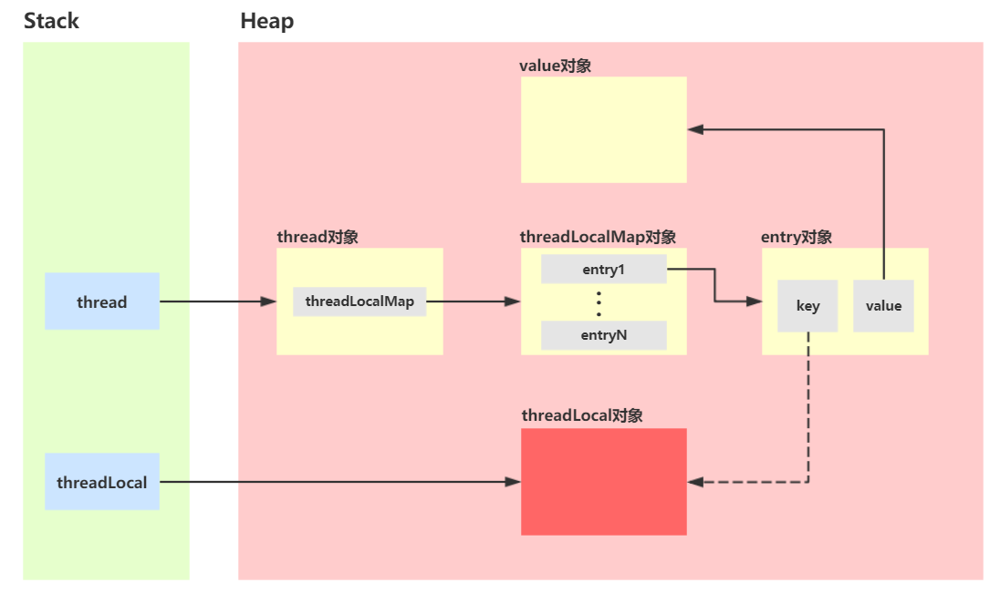
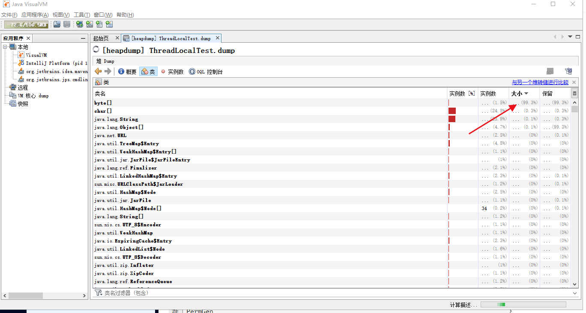

# ThreadLocal实例

- java中四种引用类型分别是什么？
- ThreadLocal使用时有哪些注意事项？
- 为什么ThreadLocalMap中的Entry要使用WeakReference？
- ThreadLocal内存溢出是否了解

### 引用类型介绍

#### 一、强引用

Java中默认声明的就是强引用，只要强引用存在，垃圾回收器将永远不会回收被引用的对象，哪怕内存不足的时候也只会直接抛出OOM，不会去回收。如果要中断强引用和对象之间的联系，可以显示的将强引用赋值为null，这样一来jvm就可以在合适的时候回收对象。

```java
Object obj = new Object();
// 手动赋值为null，解除强引用
obj = null;
```

#### 二、软引用(SoftReference)

在内存足够的时候，软引用对象不会被回收，只有当内存不足时，系统会回收软引用对象，如果回收了软引用对象之后还是没有足够的内存空间，才会抛出内存溢出异常

#### 三、弱引用（WeakReference）

无论内存空间是否足够，只要JVM开始进行垃圾回收，那么被弱引用关联的对象都会被回收。

#### 四、虚引用（PhantomReference）

虚引用是最弱的一种引用关系，如果一个对象仅持有虚引用，那么它就和没有任和引用一样，随时都可能会被回收。这个引用在平时基本用不到，大概了解这么一个东西就行。

### ThreadLocal介绍

ThreadLocal是什么？我们一般称为线程本地变量，在阿里的开发规约中,有强制性的提到SimpleDateFormat是线程不安全的类，其中我们项目是使用ThreadLocal的解决方案来处理这个问题的。代码示例如下：

```java
static final ThreadLocal<SimpleDateFormat> threadLocal = ThreadLocal.withInitial(SimpleDateFormat::new);

public void qhyu(){
    threadLocal.get().format(new Date());
}
```

ThreadLocal的方法和使用介绍

| 方法           | 方法介绍                                                     |
| -------------- | ------------------------------------------------------------ |
| get()          | 获取当前线程中ThreadLocal的值                                |
| set(T value)   | 设置当前线程中ThreadLocal的值                                |
| remove()       | 删除当前线程中ThreadLocal的值                                |
| initialValue() | 如果这个ThreadLocal在当前线程内没有值，会通过initialValue()进行初始化，默认返回null。可以通过匿名内部类或Thread.withInitial(Supplier<? extends S> supplier)实现override initialValue()方法 |

我们定义ThreadLocal变量都会默认的定义为static final，首先是为了避免重复创建TSO，其次就是避免修改。ThreadLocal可以理解成为一个大盒子，大家都可以放取东西，但是整个盒子不能被换掉，不然放进去的东西就不翼而飞了。

### ThreadLocal源码

我们在ThreadLocalMap中可以看创建了一个弱引用的key，图1展示了Thread对象、ThreadLocal对象、ThreadLocalMap对象以及Entry对象之间的联系，其中虚线箭头表示Entry中的弱引用key指向了ThreadLocal对象。



​																				       （图1）

首先，每个线程Thread对象内有一个ThreadLocalMap类型的threadLocals字段，里面保存着key为ThreadLocal，value为Object的映射

```java
public class Thread implements Runnable {
    /* ThreadLocal values pertaining to this thread. This map is maintained
     * by the ThreadLocal class. */
    ThreadLocal.ThreadLocalMap threadLocals = null;
}
```

ThreadLocal的get方法set方法remove方法的核心代码如下所示。

```java
  /**
     * Get the map associated with a ThreadLocal. Overridden in
     * InheritableThreadLocal.
     *
     * @param  t the current thread
     * @return the map
     */ 
	ThreadLocalMap getMap(Thread t) {
        return t.threadLocals;
    }
```

可以看到所有的操作都是操作的线程Thread类中的threadLocals字段。我们可以看一下ThreadLocal类中的ThreadLocalMap内部类，ThreadLocalMap中的节点Entry继承了WeakRefrence类，定义了一个类型为Object的value，用于存放塞到ThreadLocal里的值；定义了一个继承了WeakRefrence的ThreadLocal类型的key。如果这里使用默认的引用方式来定义存储结构，实质上会造成节点的生命周期与线程强绑定，只要线程没有销毁，那么节点在GC分析中一直处于可达状态，没有办法被回收，而程序本身也无法判断是否可以清理节点。

```java
static class ThreadLocalMap {

    /**
     * The entries in this hash map extend WeakReference, using
     * its main ref field as the key (which is always a
     * ThreadLocal object).  Note that null keys (i.e. entry.get()
     * == null) mean that the key is no longer referenced, so the
     * entry can be expunged from table.  Such entries are referred to
     * as "stale entries" in the code that follows.
     */
    static class Entry extends WeakReference<ThreadLocal<?>> {
        /** The value associated with this ThreadLocal. */
        Object value;

        Entry(ThreadLocal<?> k, Object v) {
            super(k);
            value = v;
        }
    }
    .....
}
```

### 为什么使用WeakRefrence对象引用？

我们可以详细看下图1，解析下问什么要使用弱引用。先来回顾一下WeakRefrence的作用，百度一下：

> WeakReference是Java语言规范中为了区别直接的对象引用（程序中通过构造函数声明出来的对象引用）而定义的另外一种引用关系。WeakReference标志性的特点是：reference实例不会影响到被应用对象的GC回收行为（即只要对象被除WeakReference对象之外所有的对象解除引用后，该对象便可以被GC回收），只不过在被对象回收之后，reference实例想获得被应用的对象时程序会返回null。

通过源码我们知道ThreadLocalMap创建了一个弱引用的key，如果当这个引用是强引用的话我们来看看会有什么问题。看了很多篇文章讲解的这个问题都感觉差点意思，我的理解是，如果是强引用的话，在线程运行过程中，我们不在使用threadLocal了，将threadLocal设置为null，但是threadLocal对象在线程的ThreadLocalMap中的Entry中有引用，导致无法被GC回收（当然，可以等到线程结束，线程结束是必会回收）而Entry声明为WeakRefrence，threadLocal设置为null，那么threadLocal对象也就可以被GC回收了。

### ThreadLocal内存溢出问题

当一个线程执行时间足够长，或者在线程池中的线程中就会引出一个新得问题：Entry对象中弱引用key指向了我们的ThreadLocal对象，当我们将ThreadLocal对象的引用置为null后，就没有强用用指向它，只剩这个弱引用指向ThreadLocal对象，那么JVM会在GC的时候回收ThreadLocal对象。然而Entry对象中value引用指向的value对象还是存活的，这样就会导致value对象一直得不到回收。但是，在我们调用ThreadLocal对象的get、set、remove方法时，会将上述提到的key为nul对应的value对象进行清除，从而避免了内存泄漏。值得注意的是，如果我们在创建一个ThreadLocal对象并set了一个value对象到ThreadLocalMap，然后不再调用前面提到的get、set、remove方法中的任意一个，此时就可能会导致这个value对象不能被回收。

解决办法就是ThreadLocal在线程处理完业务的时候建议主动调用remove方法

### 内存溢出示例

#### 不使用ThreadLocal

先设置VM options，堆大小设置为200M，oom的时候将dump文件生成在指定目录，打出GC信息。

-XX:+HeapDumpOnOutOfMemoryError  -XX:HeapDumpPath=D:\dump\ThreadLocalTest.dump  -XX:+PrintGCDetails -Xms200M -Xmx200M

```java
public class ThreadLocalTest {

    static class Qhyu{
        private byte[] bytes = new byte[1021*1024*5];
    }
    static List<Qhyu> list = new ArrayList<>();

    public static void main(String[] args) throws IOException, InterruptedException {

        for (int i = 0; i < 200; i++) {
            list.add(new Qhyu());
        }
    }
}
```



我们查看dump文件可以发现byte数组的的大小就占用了99.3%，点开查看发现byte大小为5M

#### 使用ThreadLocal，但是不remove

