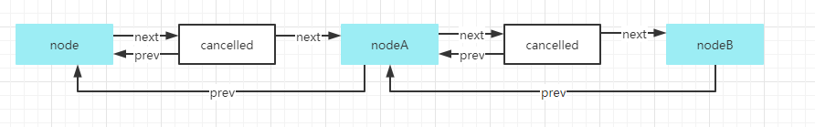
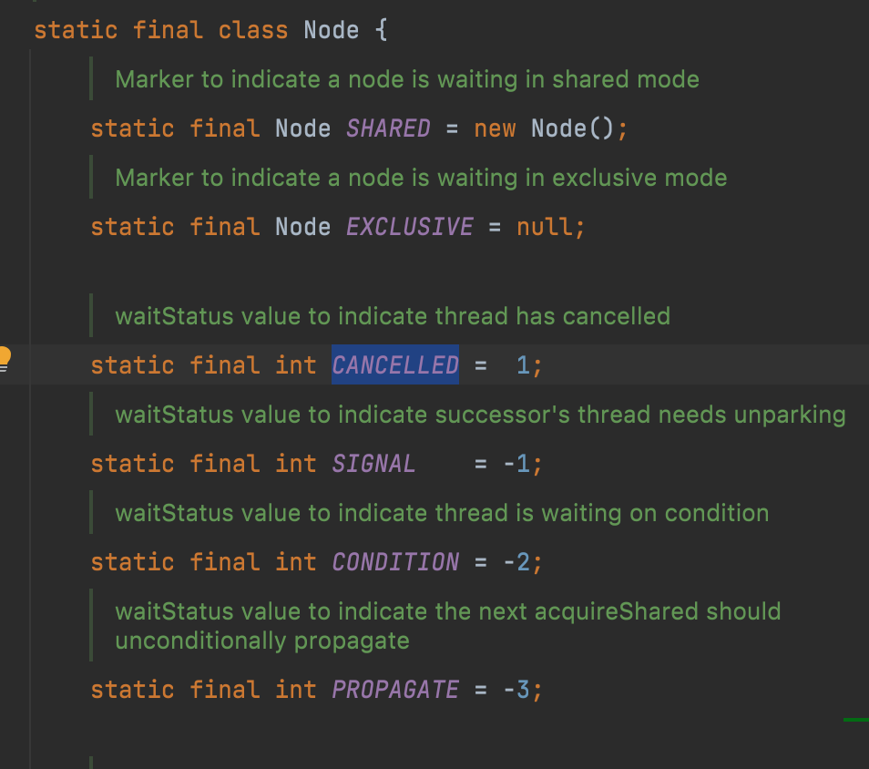

#### 序章

金九银十，又到了程序员迁徙的季节。抱着试一试的心态去鹅城闯闯，整理整理知识脉络，连接上远程面试的软件，接通语音，“吃着火锅”，“唱着歌”，就准备开始面试。

枪在手，跟鹅走！


面试官：请自我介绍一下。

我		：扒拉扒拉一堆废话。

面试官：介绍下做的项目吧。

我		：扒拉扒拉一堆废话。（越聊越对味）

面试官：那我们问一些Java基础知识

面试官：ReentrantLock用过吗？它的公平锁是真的公平吗？AQS知道吗？底层原理能描述下吗？

我		：？？？......

面试官：好的，再会。


总的来说面试的这个点我是回答的不好，所以面试完之后我就主动去看了下ReentantLock的源码，花了五天的时间研究编写了这篇文章，和大家一起探讨这个知识点，也希望能对不了解这个知识点的朋友有些帮助。

#### 简介

其实在我们的日常开发中主动去使用ReentrantLock是比较少的，但是看过源码的朋友们会知道ReentrantLock在ConcurrentHashMap中是有用到的。当然如果你经常接触到多线程编程肯定不陌生。

在Java多线程中，可以使用synchronized关键字来实现线程之间的同步互斥，但在JDK1.5中新增了ReentrantLock类也能达到同样的效果，并且在扩展功能上也更加强大，比如具有嗅探锁定、多路分支通知等功能，而且在使用上也比synchronized更加灵活。

#### 使用ReentrantLock类

我们在读源码看原理之前首先还是得了解这个类怎么用，大家都用ReentrantLock和synchronized比，既然ReentrantLock类在功能上比synchronized更多，那么就以一个初步的程序来介绍一下ReentrantLock类的使用。熟练使用的朋友可以跳过这个章节。


##### 使用ReentrantLock实现同步

创建一个ReentrantLockTest类，如下所示，调用ReentrantLock对象的lock()方法获取锁，调用unlock()方法释放锁。

```java
public class ReentrantLockTest {

    public static void main(String[] args) {
        Lock lock = new ReentrantLock();
       // 不建议使用Executors创建线程池，从平时做起。
        ExecutorService executorService = new ThreadPoolExecutor(5, 5,
                0L, TimeUnit.MILLISECONDS,
                new LinkedBlockingQueue<Runnable>(10));
        for (int i = 0; i < 5; i++) {
            executorService.execute(() -> {
                try {
                    Thread.sleep(100);
                } catch (InterruptedException e) {
                    e.printStackTrace();
                }
                System.out.println(Thread.currentThread().getName() + ":线程开始做事");
                lock.lock();
                System.out.println(Thread.currentThread().getName() + ":线程正在做事");
                lock.unlock();
                System.out.println(Thread.currentThread().getName() + ":线程做完事了");
            });
        }
    }
}
```

查看运行结果如下,从运行结果来看，当前线程开始做事，正在做事，做完事了都打印完毕了之后另外一个线程才可以继续打印。此处的unlock()方法释放了之后线程还能正常打印做完事了是因为进行了Thread.sleep(100)。

```java
pool-1-thread-4:线程开始做事
pool-1-thread-4:线程正在做事
pool-1-thread-4:线程做完事了
pool-1-thread-1:线程开始做事
pool-1-thread-1:线程正在做事
pool-1-thread-1:线程做完事了
pool-1-thread-5:线程开始做事
pool-1-thread-5:线程正在做事
pool-1-thread-5:线程做完事了
pool-1-thread-2:线程开始做事
pool-1-thread-2:线程正在做事
pool-1-thread-2:线程做完事了
pool-1-thread-3:线程开始做事
pool-1-thread-3:线程正在做事
pool-1-thread-3:线程做完事了
```

##### 使用Condition实现等待/通知

介绍Condition的时候先看下Object中的wait()方法，从注释中可以清楚得知关键字synchronized与wait()、notify()、notifyAll()等方法结合可以实现等待/通知模式，类ReentrantLock也可以实现相同的功能，但需要借助于Condition对象。


Condition类是在JDK1.5中出现的技术，在一个Lock对象里面可以创建多个Condition实例，线程对象可以注册在指定的Condition中，从而可以有选择性的进行线程通知，在调度线程上更加灵活。

在使用notify()/notifyAll()方法进行通知时，被通知的线程是由JVM随机选择的，线程进行通知的时候没有选择权。

接下来就用一个简单的例子演示一下Condition的等待/通知

```java
public class ReentrantLockTest {
    private Lock lock = new ReentrantLock();
    private Condition condition = lock.newCondition();

    public void await(){
        lock.lock();
        try {
            System.out.println("等待开始时间"+System.currentTimeMillis());
            condition.await();
        } catch (InterruptedException e) {
            e.printStackTrace();
        }finally {
            lock.unlock();
        }
    }

    public void signal(){
        lock.lock();
        System.out.println("等待结束时间"+System.currentTimeMillis());
        condition.signal();
        lock.unlock();
    }

    public static void main(String[] args) throws InterruptedException {
        ReentrantLockTest reentrantLockTest = new ReentrantLockTest();
        new Thread(()->{
            reentrantLockTest.await();
            System.out.println("逻辑执行时间"+System.currentTimeMillis());
        },"A").start();
        Thread.sleep(2000);
        reentrantLockTest.signal();
    }
}
```

ReentrantLock中还有很多其他的API没有一一举例了，本文主要讲的是加锁解锁的知识点，而这个知识点只是ReentrantLock类中的冰山一角。


##### 实现生产者消费者模式

写一个用ReentrantLock实现的生产者和消费者的代码示例：

```java
public class ConditionTest {
    private ReentrantLock lock =  new ReentrantLock();
    private Condition condition = lock.newCondition();

    private boolean hasValue = false;

    public void set(){
        try {
            lock.lock();
            while (hasValue==true){
                condition.await();
            }
            System.out.println("打印***1***");
            hasValue = true;
            condition.signal();
        } catch (InterruptedException e) {
            e.printStackTrace();
        }finally {
            lock.unlock();
        }
    }

    public void get(){
        try {
            lock.lock();
            while (hasValue==false){
                condition.await();
            }
            System.out.println("打印***2***");
            hasValue = false;
            condition.signal();
        }catch(InterruptedException e) {
            e.printStackTrace();
        }finally {
            lock.unlock();
        }
    }

    public static void main(String[] args) {
        ConditionTest conditionTest = new ConditionTest();
        ThreadPoolExecutor threadPoolExecutor = new ThreadPoolExecutor(20, 20,
                0L, TimeUnit.MILLISECONDS,
                new LinkedBlockingQueue<Runnable>());
        for (int i = 0; i < 10; i++) {
            threadPoolExecutor.execute(()->{
                conditionTest.set();
            });
        }
        for (int i = 0; i < 10; i++) {
            threadPoolExecutor.execute(()->{
                conditionTest.get();
            });
        }
    }
}
```


##### 公平锁和非公平锁

公平锁和非公平锁：锁lock分为“公平锁”和“非公平锁”，公平锁表示线程获取锁的顺序是按照入队的顺序来分配的，FIFO先进先出。而非公平锁就是一种获取锁的抢占机制，是随机获取锁的，和公平锁不一样的就是先来不一定先得到锁，这种方式可能造成某些线程一致拿不到锁，结果自然也就不公平了。

ReentrantLock默认是非公平的，带参的构造函数传入true则为公平锁。

```java
/**
 * Creates an instance of {@code ReentrantLock}.
 * This is equivalent to using {@code ReentrantLock(false)}.
 */
public ReentrantLock() {
    sync = new NonfairSync();
}

/**
 * Creates an instance of {@code ReentrantLock} with the
 * given fairness policy.
 *
 * @param fair {@code true} if this lock should use a fair ordering policy
 */
public ReentrantLock(boolean fair) {
    sync = fair ? new FairSync() : new NonfairSync();
}
```


#### 源码解析

ReentrantLock类的源码解析可以分为“公平的”和“非公平”的这两部分，首先可以查看这个类中的信息。类中有一个抽象的静态内部Sync类继承了AQS（AbstractQueuedSynchronizer简称AQS），NonfairSync和FairSync就是非公平和公平的具体实现。


##### FairSync公平锁

###### lock加锁

在使用ReentrantLock类进行公平同步的时候使用的加锁方法为lock()，源码如下，lock的核心就是acquire()方法。

```java
final void lock() {
    // 获取锁的方法，传入了一个int类型值为1
    acquire(1);
}
```


###### acquire

这个方法采用的模板方法设计模式，tryAcquire是AQS中的protected方法由子类实现来完成各种同步语义。

```java
public final void acquire(int arg) {
    //假定A&&B，A为false B不会执行。
    if (!tryAcquire(arg) &&
        acquireQueued(addWaiter(Node.EXCLUSIVE), arg))
        // 重新设置当前线程的中断状态，因为在acquireQueued中清除了中断状态。
        selfInterrupt();
}
```

**场景分析：**

A.tryAcquire=true 说明当前线程获取锁成功了，方法直接结束

B.tryAcquire=false 说明当前线程获取锁失败了，会继续走后续的判断条件

如果线程获取锁失败的时候最终会通过addWaiter包装Node入队，调用acquireQueued方法来让结点尝试获取锁。


###### tryAcquire获取锁

这个章节的所有方法都是基于公平版本FairSync类，首先会调用tryAcquire方法获取锁，如果获取不到才会执行addWaiter方法和acquireQueued的方法。FairSync类继承了AQS，而AQS中的int类型state属性默认值为0。

```java
protected final boolean tryAcquire(int acquires) {
    //获取当前的线程
    final Thread current = Thread.currentThread();
    //获取state的值
  	int c = getState();
    //c的值如果为0.说明该线程之前是没有获取到锁的
    if (c == 0) {
        // 先判断队列里面有没有排队的前辈，如果没有那么就进行CAS，如果state等于0的时候将state更新为1
        if (!hasQueuedPredecessors() && compareAndSetState(0, acquires)) {
          	// 记录当前线程的拥有者
            setExclusiveOwnerThread(current);
            return true;
        }
    }
    // 如果c的值不为0，那么就要看是否是冲入锁
    // 判断是不是重入的条件就是占用锁的线程拥有者和当前线程是否一致
    else if (current == getExclusiveOwnerThread()) {
        // 一致，那么c的值+1
        int nextc = c + acquires;
        if (nextc < 0)
            throw new Error("Maximum lock count exceeded");
        //更新state的值为nextc
        setState(nextc);
        return true;
    }
    return false;
}
```

**场景分析：**

A.当线程A和线程B并发进入次方法中的compareAndSetState(0, acquires)方法，必要条件是队列中没有排队的前辈(前驱结点)，此时共享变量state的值为0，进入CAS的时候只会有一个线程可以修改共享变量的值为1，假设线程A修改成功，那么线程A是当前线程的拥有者，记录下来，线程A获取锁成功。线程B获取不到锁，那么进入else if逻辑中，else if的逻辑是重入锁的逻辑，此时的线程B肯定不满足条件，所以获取锁失败。

B.线程A获取到锁之后，再次调用lock方法会再次进入tryAcquire方法尝试加锁，此时共享变量state的值为1，所以进入else if逻辑。判断当前线程是否和之前修改共享变量的线程是否为同一个。如果线程相同，将state的值加1并更新state的值，线程A获取锁再次成功。也就是说state的值不仅仅是0和1.


###### hasQueuedPredecessors有没有排队的前辈

多个线程并发的尝试获取锁的，一个线程获取到锁之后，长期占有锁，后边进入的并发首先会看队列中有没有排队的先驱结点，如果有说明它还没有资格获取锁，直接返回false。

```java
public final boolean hasQueuedPredecessors() {
    // The correctness of this depends on head being initialized
    // before tail and on head.next being accurate if the current
    // thread is first in queue.
    // 生成t指向tail结点
    Node t = tail; // Read fields in reverse initialization order
    // 生成h指向head结点
    Node h = head;
    // 生成s当h！=t的时候指向h的后继结点
    // h！=t说明什么？说明队列有值。那么意思就是h==t的时候，队列没有值，直接返回false
    // 队列有排队的前辈们就看head的后继结点是不是为null，如果为null的话直接返回true，如果不为null
    // 就获取head的后继结点中的thread变量拿到此结点占用的线程信息与当前线程比较，不相同返回true，相同返回false
    Node s;
    return h != t &&
        ((s = h.next) == null || s.thread != Thread.currentThread());
}
```

**问题分析：**为什么要判断head结点的下一个结点是不是null？

双向链表中，第一个结点我们称为虚结点，其实并不存储任何信息，只是占位，真正的第一个有数据的结点是从第二个结点开始的，当h！=t时：

A.如果(s = h.next) == null，等待队列正在有线程进行初始化，但只是进行到了tail指向head，下方的代码块是在enq方法中，也就是队列初始化的地方，一开始假定队列为空，那么线程并发的时候会创建head结点，也就是虚结点，此时 tail为null，此时队列中有元素，需要返回true。

```java
if (t == null) { // Must initialize
    if (compareAndSetHead(new Node()))
        tail = head;
} else {
    node.prev = t;
    if (compareAndSetTail(t, node)) {
        t.next = node;
        return t;
    }
}
```

B.如果(s = h.next) ！= null，说明此时等待队列中至少有一个有效结点，如果此时s.thread == Thread.currentThread()，说明等待队列的第一个有效结点中的线程与当前线程相同，那么当前线程是可以获取资源的；如果s.thread != Thread.currentThread()说明等待队列的第一个有效结点线程与当前线程不同，当前线程必须加入等待队列。


###### Node队列数据结构

我们一直说入队这个概念，得先了解它的数据结构到底长什么样，了解清楚之后才更方便理解。

先查看下Node类的源码，但是被其注释给吸引了，中间有个单向链表一样的图非常生动，这个注释属实整挺好，所以我google了一下拜读了这段注释。

###### 

注释一开始给我们介绍了CLH等待队列，这个队列是由（Craig、Landin 和 Hagersten）这三个人命名的，CLH锁通常用于自旋锁。使用CLH锁的时候相当于要保证入队的原子性，如果要出列，只需要设置head字段。

但是我们AQS中的队列并非长这样，作者沿用的是CLH这种思想，将其用于阻塞同步器，即在其结点的前驱中保存有关线程的一些控制信息，每个结点中的“state”字段跟踪线程是否应该阻塞。结点在其前驱结点唤醒时收到信号。队列中的每个结点都充当了一个特定的通知式监视器，并持有一个等待的线程。我看大牛们称这种队列为CLH变体队列，如下图所示：


可以看到所谓的CLH变体队列其实就是一个双向链表，每个入队线程都会被包装成一个Node结点塞入队列中，而且这些变量都使用了volatile关键字来保证内存的可见性。state状态对于AQS来说至关重要，为了保证线程安全，AQS是通过unsafe类的CAS更新值。


###### addWaiter入队、排队

接下来就开始分析入队的源码，同时验证一下数据结构是否和上图CLH变体队列一致。

我们假定有三个线程，当第一个线程thread1抢到锁之后一直持有锁，thread2和thread3并发去执行入队操作。

```java
private Node addWaiter(Node mode) {
    // 生成一个node结点，任何一个线程到达都会产生一个新的结点
  	// node.thread = Thread.currentThread()
    // 传入的参数Node.EXCLUSIVE=null，node.nextWaiter=null。
    Node node = new Node(Thread.currentThread(), mode);
    // Try the fast path of enq; backup to full enq on failure
  	// 将pred指向tail
    Node pred = tail;
    // 如果pred不为空，说明队列里面有结点在排队
    if (pred != null) {
      // 把生成的node结点的prev指向tail，也就是说要入队。
      // 这里可能存在多个node结点的prev都指向当前tail，并发情况下
        node.prev = pred;
        // 执行CAS，原子操作入队。刚刚在CLH变体队列的描述中有讲过这个。
        // 如果当前tail的值等于pred，那么将tail重新指向生成的node结点。
      	// 并发情况下只有一个可以成功，剩下的指向之前tail的结点怎么处理呢？
        if (compareAndSetTail(pred, node)) {
            // 完成指向
            pred.next = node;
            return node;
        }
    }
    // 如果tail为空会直接到这个方法
    // 并发情况下，除了CAS设置tail成功的线程结点，其他的都走enq方法
    enq(node);
    return node;
}
private Node enq(final Node node) {
        // 开始自旋，结束条件在else中的return t。
        for (;;) {
            // tail为空的时候，并发情况下会用CAS初始化队列
            // tail不为空的时候，会进入else方法
            Node t = tail;
            if (t == null) { // Must initialize
                // 生成head结点，tail也指向head。此结点被称为虚结点。thread=null，waitStatus=0
                if (compareAndSetHead(new Node()))
                    tail = head;
            } else {
                // 并发的时候有多个node结点的前驱指向t(tail)
                node.prev = t;
                // CAS又一个能设置成tail成功，其他的自旋入队尾。
                if (compareAndSetTail(t, node)) {
                    // 建立指针指向。
                    t.next = node;
                    return t;
                }
            }
        }
    }
```

**CLH变体队列数据结构验证：**

先假定thread2和thread3没有竞争，是按照顺序来进行入队。

thread2生成node结点，thread=thread2，nextWaiter=null，waitStatus=0。

此时AQS中的属性tail和head都是为null，所以pred为null，直接进入enq(node)方法。

因为tail为null，所以Node t指向null，进入分支if(t==null)中进行CAS，比较并交换。

compareAndSetHead(new Node())，当head为null的时候将head更新为new Node()假定名称为X。

最后tail=head；tail和head指向同一个对象X的地址。

但是thread2线程没有因此结束哈，这个for循环的终止条件return t并未触发，所以继续第二次循环。

此时的tail并非为null，而是指向X，X的thread=null，nextWaiter=null，waitStatus=0。

进入else中的逻辑，node.prev指向t，然后CAS当tail的值等于t时，tail更新指向到node结点。

执行t.next = nede，形成双向链表,整个过程如下图所示，到此thread2的入队执行完成。


thread3进入addWaiter方法或者是同样进入enq(node)方法都是一样的逻辑，因为此时tail不为null。

thread3生成node结点，thread=thread3，nextWaiter=null，waitStatus=0。

此时的pred指向tail，thread=thread2，nextWaiter=null。

进入if(pred !=null)的逻辑，将node（thread=thread3）的prev指向pred也就是当前的tail内存地址。

CAS更新tail的指向为当前thread=thread3的node内存地址。

将pred指向的node结点的内存地址的next指向更新后的tail内存地址。


**问题分析：**

前文有提过这个方法，获取锁失败的线程都会调用addWaiter方法来使用Node包装自己入队，方法传入的参数是同步模式，默认传入的是EXCLUSIVE独占模式。

```java
/** Marker to indicate a node is waiting in shared mode */
// 共享
static final Node SHARED = new Node();
/** Marker to indicate a node is waiting in exclusive mode */
// 独占
static final Node EXCLUSIVE = null;
```


A.并发情况下会不会有并发安全问题，如果没有那道格利是怎么做到的？

我们发现不管是enq(node)方法还是addWaiter(Node mode)方法都是没有加锁的，那么并发的情况是它是安全的吗？首先我们看下enq方法是否存在线程安全问题。


条件一：如果tail结点为空，同步队列做初始化。

假设当前tail为空，这个时候两个线程同时到达586行，587行只有一个线程可以返回true，也就是只有一个线程可以初始化队列，然而另外一个线程在compareAndSetHead的时候此时的期望值已不是null，返回的是false。那这个线程咋办呢，我们可以看到584行有个for(;;)，无条件的循环，下一次进入循环的时候tail就不是null也，就会执行590行后的逻辑，道格利只使用了CAS就做到了此处的线程安全。

条件二：tail不为空时，先调整node.prev=t。

假设当前tail不为空的时候，两个线程同时到达590，生成的node1和node2的prev都指向t，但是也只有一个能够执行CAS返回true，另外一个线程无法更新tail的值，只有返回false，进入下一次循环。这么看来enq(node)方法仅仅通过两个CAS方法就实现了线程安全。

条件三：t.next=node。

此处这是建立旧的tail结点和新得tail结点的连接，能保证当前这个线程看到的结点都是正确的，所以它可以安全的设置旧的tail的next指向node。


B.addWaiter方法中注释Try the fast path of enq; backup to full enq on failure说的是尝试enq方法的快速执行路径，猜测是为了提高性能，怎么提升的？

假设直接去掉addWaiter方法中的if逻辑，程序的逻辑是没有问题的，确实没想通此处这么做的作用，如果有朋友懂了道格利的想法，欢迎沟通。


C.排队真的是公平的吗？

排队的核心逻辑就是上图enq(node)方法的591行-593行代码。假设100个线程停到了591行进行CAS，有一个成功了，另外99个没抢到进入下一次循环，代码中并不是直接按照时间来排队进入，也是去抢，所以也不见得是完全公平。这世界上或许有完全的公平吧~


###### acquireQueued入队之后做了什么

该方法主要实现已入队线程的阻塞逻辑和已入队线程杯唤醒后继续尝试获取锁的逻辑。

```java
final boolean acquireQueued(final Node node, int arg) {
    // 生成一个标记，用来取消获取锁的线程，当for循环中异常的时候。
    boolean failed = true;
    try {
        // 中断标识
        boolean interrupted = false;
        for (;;) {
             // 找到当前结点的前驱结点
            ①final Node p = node.predecessor();①
            // 如果p等于head结点，相当于排队排在最前边(第二)，第一个结点为虚结点。
            // 然后回去执行获取锁的方法，获取成功进入if逻辑获取失败进入下方if条件判断
            // p不等于head直接进入下方if条件判断
            if (p == head && tryAcquire(arg)) {
                // head指向node结点，让node的thread=null，prev=null
              	// 把node结点变成虚结点了，这个时候waitStatus还是为0
                setHead(node);
                p.next = null; // help GC
                failed = false;
                return interrupted;
            }
            // ③方法名的直译是获取失败后就应该停住，但是内部做的是整理队列和修改前驱结点的waitStatus=-1。
            // ②park住，等待唤醒
            if (③shouldParkAfterFailedAcquire(p, node)③ &&
                ②parkAndCheckInterrupt())②
                interrupted = true;
        }
    } finally {
        // 异常进入，return后也进入
        if (failed)
            // 取消获取
            cancelAcquire(node);
    }
}
```

**流程分析：**

上面的代码用①、②、③标注了特殊的地方，需要特别关注。

还是用三个线程，第一个线程抢到锁占有后长期持有，第二个线程和第三个线程入队之后进入次方法。

①获取当前线程所在结点的前驱结点。

第三个线程进入的时候，发现它的前驱结点和head并不相等，因为它前面还有线程二放入的结点。

第三个线程进入shouldParkAfterFailedAcquire方法，将前驱结点的默认的waitStatus用CAS改为-1，如果改成功返回true。如果不成功则进入下一次循环。

当CAS修改成功之后会进入②标记的代码行，执行LockSupport.park(this)，代码阻塞在这等待唤醒再继续运行后续逻辑。

第二个线程进入的时候发现第一个结点与head结点相等，就进入获取锁的方法，如果不能用CAS将state=0改为1的话会进入③，③中也会修改head结点的waitStatus为-1，如果第二个线程第一次就将state修改成功的话，此时head的waitStatus还是等于0。

拿到锁之后会将当前结点设置为head，把之前的head与整个链表解绑。

finally中的方法，只有抛出异常和return的时候会执行。

②阻塞当前线程

```java
public static void main(String[] args) {
        List<Thread> threads = new ArrayList<>();
        new Thread(() -> {
            System.out.println("开始锁定");
            threads.add(Thread.currentThread());
            LockSupport.park();
            System.out.println("逻辑开始");
        }).start();

        new Thread(() -> {
            LockSupport.unpark(threads.get(0));
            threads.remove(threads.get(0));
            System.out.println("解锁成功");
        }).start();

    }
```


上面用了一个简单的示例来看LockSupport.park()的效果，执行park的时候相当于开车停在红灯前，unpark相当于绿灯放行。当不执行unpark的时候线程会阻塞不继续执行，直到unpark方法将这个线程放行为止。

③shouldParkAfterFailedAcquire获取失败后就应该停住

```java
private static boolean shouldParkAfterFailedAcquire(Node pred, Node node) {
    // 获取前驱结点的waitStatus
    int ws = pred.waitStatus;
    // ws == -1直接返回true
    if (ws == Node.SIGNAL)
        /*
         * This node has already set status asking a release
         * to signal it, so it can safely park.
         */
        return true;
    // ws大于0的时候就是cancelled，这个时候需要对队列进行处理
    if (ws > 0) {
        /*
         * Predecessor was cancelled. Skip over predecessors and
         * indicate retry.
         */
       //当前置结点被cancelled的时候，需要将node结点的前驱结点的指向进行更新
       //直到前驱结点的waitStatus大于0。
        do {
            node.prev = pred = pred.prev;
        } while (pred.waitStatus > 0);
        pred.next = node;
    } else {
        /*
         * waitStatus must be 0 or PROPAGATE.  Indicate that we
         * need a signal, but don't park yet.  Caller will need to
         * retry to make sure it cannot acquire before parking.
         */
        // 将node结点的前驱结点的值修改为-1.
        compareAndSetWaitStatus(pred, ws, Node.SIGNAL);
    }
    return false;
}
```

**流程分析：**

shouldParkAfterFailedAcquire方法，从名字就知道它是获取锁失败的情况下需要阻塞线程。

A.如果pred的waitStatus为SIGNAL(-1)，说明node结点应该阻塞，其他任何状态都返回false；

B.再不满足A的情况下，如果pred状态是CANCELLED，说明另一个线程取消了pred，使pred关联的线程放弃了获取锁的权力，而方法中的if(ws>0)的逻辑则是为CANCELLED状态的pred结点。

 node.prev = pred = pred.prev;是遍历找出前驱结点waitStatus>0的结点，将node的prev指向它。所以我怀疑此处会不会有线程安全问题。

假设有线程A（nodeA）和线程B（nodeB）进入这个流程，那么相当于nodeA和nodeB的前驱结点必定是CANCELLED状态，而nodeA和nodeB结点必定不会是CANCELLED状态，那么无论线程A还是线程B的执行时序的前后我们用图来表示。

我们建立一个初始模型如下图所示：


prev指针改变会出现下面这种情况，此处并不会产品prev指针交叉的情况。



最后执行pred.next=node，抛弃cancelled结点。


pred.next=node，这一步就是完成CANCELLED结点出队的操作，但是此时pred也并非可靠，当do-while结束之前我们拿到的pred.waitStatus可能<=0,但是出了do-while循环就可能杯取消，但是取消并不会影响当前的逻辑，假设node结点取消，nodeA再次进入循环的时候会重新调整prev和next指针。


###### cancelAcquire取消正在进行的尝试获取

我们从Node类中的属性中可以了解到waitStatus的值就几个，如下图所示，可以看到CANCELLED的注释就是线程已取消的waitStatus值，只有这个是大于1的。



Node节点的状态有如下五种：

| 状态      | 解释                                                         | 值   |
| --------- | ------------------------------------------------------------ | ---- |
| CANCELLED | 当前节点已经取消等待（超时或中断），该状态下的节点不会进入其他状态，也不会再阻塞。 | 1    |
| SIGNAL    | 后继结点已经或即将阻塞，当前节点需要唤醒后继结点。后继结点获取锁的时候，必须先收到SIGNAL，才能调用tryAcquire（如果再次失败就会重新阻塞） | -1   |
| CONDITION | 该节点正处于Condition队列中，因为等待condition.signalAll()而阻塞 | -2   |
| PROPAGATE | 仅用于共享模式下、释放锁时的队列头节点，用于向整个队列传播锁释放信号 | -3   |
| 0         | 一般是新建的节点                                             | 0    |


注意取消获取锁的时机除了抛出异常之外，还有一个地方就是tryLock超时的时候。

下面是cancelAcquire的源码

```java
private void cancelAcquire(Node node) {
    // Ignore if node doesn't exist
    // 无效结点过滤掉
    if (node == null)
        return;
		// 需要取消的结点thread设置为null
    node.thread = null;

    // Skip cancelled predecessors
    // 生成pred指向node的前驱结点
    Node pred = node.prev;
    // 通过前驱结点，跳过取消状态的node
    while (pred.waitStatus > 0)
        node.prev = pred = pred.prev;

    // predNext is the apparent node to unsplice. CASes below will
    // fail if not, in which case, we lost race vs another cancel
    // or signal, so no further action is necessary.
    // 通过前驱结点过滤后的前驱结点的后继结点
    Node predNext = pred.next;

    // Can use unconditional write instead of CAS here.
    // After this atomic step, other Nodes can skip past us.
    // Before, we are free of interference from other threads.
    // 把当前nod的状态设置为CANCELLED
    node.waitStatus = Node.CANCELLED;

    // If we are the tail, remove ourselves.
    //如果当前结点是尾结点，将从后往前的第一个非取消状态的结点设置为尾结点
    // 如果更新成功，将tail的后继结点设置为null，不成功直接进入else逻辑
    if (node == tail && compareAndSetTail(node, pred)) {
        compareAndSetNext(pred, predNext, null);
    } else {
        // If successor needs signal, try to set pred's next-link
        // so it will get one. Otherwise wake it up to propagate.
        int ws;
        // 如果当前结点不是head的后继结点，
        // 1:判断当前结点的前驱结点是否为-1
        // 2:如果不是，则把前驱机结点设置为-1看是否可以成功
        // 如果1和2中有一个为true，再判断当前结点的线程是不是为不null
        // 如果上述条件都满足，把当前结点的前驱结点的后继指针指向当前结点的后继结点
        if (pred != head &&
            ((ws = pred.waitStatus) == Node.SIGNAL ||
             (ws <= 0 && compareAndSetWaitStatus(pred, ws, Node.SIGNAL))) &&
            pred.thread != null) {
            Node next = node.next;
            if (next != null && next.waitStatus <= 0)
                compareAndSetNext(pred, predNext, next);
        } else {
            // 如果当前结点是head的后继结点，或者上述条件都不满足的时候，直接唤醒后继结点
            unparkSuccessor(node);
        }

        node.next = node; // help GC
    }
}
```

**流程分析：**

获取当前结点的前驱结点，如果前驱结点的状态时CANCELLED，那就一直往前遍历，找到第一个waitStatus<=0的结点，将找到的pred结点和当前结点关联，将当前node结点设置为CANCELLED。

**setp1：调整结点的prev指针并更新结点的状态为CANCELLED**

先考虑多线程同时调用cancelAcuire的场景，假设某一时刻同步队列的状态如下图所示，线程A取消nodeA，线程B取消nodeB，node1为CANCELLED状态，白色表示已取消。


结点的调整分为三步：

a首先调整pred指针；

b再调整prev指针；

c最后更改结点的状态。

所以在更改结点的状态之前，结点的状态一定未取消。

1、无论线程A执行到了a还是b，此时nodeA结点的状态肯定是未取消，线程B执行都是找到nodeA结点就不会再往前遍历，相当于nodeB的prev和nodeA的next指针无需变化，只需要改变nodeA的prev指针指向node。无论是线程A还是线程B先执行完c，都没有对逻辑造成影响，换句话说就是没有破坏prev指针链。


2、如果线程A指向完了c，而线程B读到nodeA为取消状态，所以NodeB的prev指向node结点，这种情况多个结点的前驱结点指向了同一个结点，也没有问题，因为我们可以看到这里多个结点的状态都变成已取消了，唤醒的逻辑和后续的逻辑会主动进行调整。


**step2 结点为tail结点的情况**


如图，B结点时已经取消的结点，当前结点node的prev指向了A，同时A的next指向了null，这是理想情况。

1、compareAndSetTail方法可能不成功。

tail结点并不可靠，tail结点在有新的线程添加结点的时候就会改变，如果不用CAS就可能覆盖了新添加的结点，导致结点丢失，显然不可靠；但是使用CAS更新失败的时候，就会进入step3或者step4的逻辑了；

当前结点在判断的时候时tail结点，但是线程尝试加锁的时候使用node包装自己入队，这个时候改变了tail的指向，此时当前结点虽然变成了取消状态，但是它还是建立了新结点的关联。

2、CAS更新当前结点的前驱结点的next指针为null。

compareAndSetNext(pred, predNext, null)如果pred结点的next结点和predNext相等，将pred的next指针指向null。此处也有不成功的时候。当有新的线程入队时，此时A后边会新增一个结点，此时CAS会失败，不会造成结点A的后继结点丢失的情况，因为当有后继结点的时候并不会CAS成功。

**step3 当前结点不为tail且不是head结点的后继结点且前驱结点的thread不为空且满足一堆复杂的条件**

```java
①(pred != head 
&&
②((ws = pred.waitStatus) == Node.SIGNAL ||(ws <= 0 && compareAndSetWaitStatus(pred, ws, Node.SIGNAL)))
&&
③pred.thread != null)
```

条件①当前结点不是head的后继结点

条件②中的pred.waitStatus== Node.SIGNA为true的时候，说明当前节点的前驱结点状态为SIGNAL，当前结点本来应该是阻塞等待，但是当前结点却被取消了，所以需要调整队列；如果pred.waitStatus!= Node.SIGNA，需要再次判断前驱结点是不是小于等于0，因为pred可能会变成取消状态，最后用CAS更新来保证没有别人线程来修改pred的状态。

条件③再次检测是不是有另外一个线程执行了cancelAcquire方法设置了pred结点的thread为null，从代码中可以看到直接查看thread被赋值为null在修改waitStatus状态之前，这样判断可以更早知晓是否执行了cancelAcquire。

这一系列的判断都是为了保证没有其他线程取消或者即将取消pred结点的情况下更新pred.next指针。

**更新pred.next指针**

next.waitStatus<0和CAS修改pred.next的意义？


如果不对next的waitStatus进行判断，假设nodeB结点先指向了一个正常的结点，然后nodeA指向了nodeB取消的结点，那么就会出现正常的结点丢失。

多个线程并发取消结点的时候，会不会同一个结点同时更新next指针？

当多个线程执行到此处的时候，nodeA和nodeB结点的值都会变成cancelled，也就是说并不会有这种情况，不满足同时更新next指针的条件。

如果一个线程被唤醒执行shouldParkAfterFailedAcquire更新pred，一个线程取消结点也更新pred，会不会导致线程安全问题？

假设有如下的同步队列：node1结点为取消状态（白色）


假设当前nodeA执行cancelAcquire(nodeA)，然后nodeA发现node1是cancelled状态，往前找到node结点，将nodeA的prev指向node结点，此时nodeB不是cancelled状态，即准备将node的next指针指向nodeB。nodeB突然被执行cancelAcuire(nodeB)，此时nodeC被唤醒执行shouldParkAfterFailedAcquire(nodeC)，nodeC往前找到waitStatus大于0的结点node，将nodeC的prev指向node，准备将node的next指针指向nodeC。此时的nodeA和nodeC发生冲突，有没有问题？

虚线代表即将执行的


我们发现shouldParkAfterFailedAcuire方法中改变next执行的代码pred.next = node不是CAS，而cancelAcquire中改变next指针的代码是compareAndSetNext(pred, predNext, next)。我们假设nodeC先执行成功，那么nodeA使用CAS的时候会失败，因为predNext发生了变化，导致CAS失败。如果nodeA先执行成功将node的next指针指向nodeB，然后执行nodeC时将会改变node的next指向，此时也是没有问题的，因为nodeB已经被cancelled。


###### unlock解锁

有加锁就必然有解锁，不然一个线程一直持有锁，第二个线程就一直在尝试加锁，后面的线程都在阻塞，所以猜测unpark肯定是在解锁的过程中执行的。

```java
public void unlock() {
  	//相当于执行state-1
    sync.release(1);
}

public final boolean release(int arg) {
    // 尝试释放锁
    if (tryRelease(arg)) {
        Node h = head;
        if (h != null && h.waitStatus != 0)
            unparkSuccessor(h);
        return true;
    }
    return false;
}
```


###### tryRelease尝试释放锁

获取当前state变量的值进行减1操作，如果当前线程和持有锁的线程不相同则抛出异常。

如果c等于0，那么就没有重入，将释放锁，将占用锁的线程变量exclusiveOwnerThread设置为null并返回true。

如果c不等于0，减1之后的值设置为state变量并返回true。

```java
protected final boolean tryRelease(int releases) {
    int c = getState() - releases;
    if (Thread.currentThread() != getExclusiveOwnerThread())
        throw new IllegalMonitorStateException();
    boolean free = false;
    if (c == 0) {
        free = true;
        setExclusiveOwnerThread(null);
    }
    setState(c);
    return free;
}
```


###### unparkSuccessor唤醒接班人(下一个可以需要唤醒的结点)

如果当前head结点不为null，并且waitStatus不为0时就开始唤醒接班人了。head结点为空的话确实不需要进行唤醒node结点了，也知道了waitStatus变量的作用就是一个标记，用来标识是否能唤醒接班人，waitStatus在每获取到锁入队之后被修改为-1，如果异常了将被设置为1。

```java
private void unparkSuccessor(Node node) {
    /*
     * If status is negative (i.e., possibly needing signal) try
     * to clear in anticipation of signalling.  It is OK if this
     * fails or if status is changed by waiting thread.
     */
    // 当前node结点的waitStatus
    int ws = node.waitStatus;
    // 如果小于0，就更新waitStatus的值为0
    if (ws < 0)
        compareAndSetWaitStatus(node, ws, 0);

    /*
     * Thread to unpark is held in successor, which is normally
     * just the next node.  But if cancelled or apparently null,
     * traverse backwards from tail to find the actual
     * non-cancelled successor.
     */
    // 获取当前结点的后继结点s
    Node s = node.next;
    // 后继结点为null，进入if逻辑；或者后继结点被中断也进入逻辑
    if (s == null || s.waitStatus > 0) {
        // 将后继结点指向null
        s = null;
        // 然后遍历tail结点，拿到一个离head最近的waitStatus<=0的结点
        for (Node t = tail; t != null && t != node; t = t.prev)
            if (t.waitStatus <= 0)
                s = t;
    }
    // 如果s不为空，就唤醒下一个结点的占用线程
    if (s != null)
        LockSupport.unpark(s.thread);
}
```

首先获取waitStatus的值，如果是-1就进入ws<0的逻辑，CAS将waitStatus变量由-1更新为0。

变量s为head的next结点，如果s不为空，那么s结点获取锁的线程将被唤醒，从哪里阻塞就是哪里开始运行。

如果s结点的next结点为空，或者waitStatus变量的值大于0。(什么时候waitStatus大于0呢？CANCELLED变量值)

for循环中就是跳过了取消的线程，从尾部开始往前遍历，找到离head最近的一个结点的waitStatus值小于或等于0的结点进行替换。如果最近的这个结点不为空就唤醒其获取锁的线程，开始自旋获取锁。


###### 公平锁小结

我们对于CANCELLED节点状态的产生和变化已经有了大致的了解，但是为什么所有的变化都是对Next指针进行了操作，而没有对Prev指针进行操作呢？什么情况下会对Prev指针进行操作？

（1）执行cancelAcquire的时候，当前节点的前置节点可能已经从队列中出去了（已经执行过Try代码块中的shouldParkAfterFailedAcquire方法了），如果此时修改Prev指针，有可能会导致Prev指向另一个已经移除队列的Node，因此这块变化Prev指针不安全。


（2）shouldParkAfterFailedAcquire方法中，会执行下面的代码，其实就是在处理Prev指针。shouldParkAfterFailedAcquire是获取锁失败的情况下才会执行，进入该方法后，说明共享资源已被获取，当前节点之前的节点都不会出现变化，因此这个时候变更Prev指针比较安全。
```java
do {
  node.prev = pred = pred.prev;
} while (pred.waitStatus > 0);
```


###### 公平锁流程图

我们探究了公平锁的部分源码，但是知识点和结构还比较散乱，所以拉通一个整体流程来看下理解的内容。红色的方块是AQS中的代码，灰色的方块为FairSync中的代码。

下面是lock的流程图


下面是unlock的流程图


##### NonFairSync

###### lock加锁

我们已经详细的解析了加锁过程中的基本流程，接下来再对解锁的基本流程进行分析。由于ReentrantLock在解锁的时候，并不区分公平和非公平锁，所以我们重点关注加锁的流程。

```java
final void lock() {
  // 如果state的值为0，就更新为1
    if (compareAndSetState(0, 1))
        setExclusiveOwnerThread(Thread.currentThread());
    else
        acquire(1);
}
```

非公平锁加锁的时候，多线程并发的情况下直接CAS进行共享变量state的修改，只有一个线程可以成功，并且记录占用线程。


###### acquire获取锁

那么其他的线程就会进入到acquire方法，你会发现这个不是和公平锁的获取方法一样一样的嘛。不要慌，毕竟FairSync和NonFairSync是两个不同的实现，所以我们还是继续往代码里面查看。

```java
public final void acquire(int arg) {
  	// 尝试获取锁，如果tryAcquire返回false，则执行&&后面的方法
    if (!tryAcquire(arg) &&
        acquireQueued(addWaiter(Node.EXCLUSIVE), arg))
        selfInterrupt();
}
```


###### tryAcquire尝试获取锁/nonfairTryAcquire

接下来准备查看非公平锁的获取锁代码tryAcquire，发现它的实现是在类Sync中的nonfairTryAcquire方法，源码如下。

```java
final boolean nonfairTryAcquire(int acquires) {
    //获取当前线程
    final Thread current = Thread.currentThread();
    // 获取贡献变量state的值
    int c = getState();
    // c只有可能大于等于0，当c大于0，说明是要么是重入，要么是其他线程占有锁。
    if (c == 0) {
        // 更新state的值为-1
        if (compareAndSetState(0, acquires)) {
            // 设置占有线程
            setExclusiveOwnerThread(current);
            return true;
        }
    }
    // 当c>0的时候进入，判断当前线程是否和占有锁的线程一致
    else if (current == getExclusiveOwnerThread()) {
        // 重入加1
        int nextc = c + acquires;
        if (nextc < 0) // overflow
            throw new Error("Maximum lock count exceeded");
        // 更新state的值
        setState(nextc);
        return true;
    }
    return false;
}
```

此方法其实和公平锁中的tryAcquire相似度极高，眼尖的朋友们会发现if (compareAndSetState(0, acquires))这里有点不同，公平锁会先看有没有排队的前辈，而非公平锁去掉了这个校验。

方法获取到当前的线程，如果当前的state等于0，那么就CAS，将state的值改为1，如果线程修改成功，那么设置占用线程，返回true；如果没有改成功的线程返回false。

如果当C大于0的时候，会进入else-if逻辑，只有重入的时候才会进入此逻辑内。判断当前线程和占用锁的线程是否一致，如果一致那就是重入锁，更新state的值返回true。


###### 非公平锁小结

后续的代码其实和FairSync的一致，我们看到公平锁和非公平锁的区别只是在于有没有排队的前辈这个逻辑，非公平锁在加锁的时候会有两个的直接抢占修改state的时机，虽然也有入队和出队的操作，队列中的排队线程还是有先后顺序，但是新加入的线程并不管队列中的线程排多久了，新线程执行lock方法的时候是直接参与竞争，这种方式就会导致某些线程可能一直获取不到锁，自然就是不公平的。


#### AQS中的条件对象ConditionObject

##### await

await方法主要是使线程进行等待，并且会释放锁。

```java
public final void await() throws InterruptedException {
    if (Thread.interrupted())
        throw new InterruptedException();  
    // 添加一个新的node结点到等待队列并返回
    Node node = addConditionWaiter();
    // 获得重入的锁记录变量state，将其全部释放，并且记录释放钱锁状态的值，恢复的时候使用
    int savedState = fullyRelease(node);
    int interruptMode = 0;
    // 判断结点是不是在同步队列中
    while (!isOnSyncQueue(node)) {
        // 线程park在这个地方，唤醒的时候会从这里开始
        LockSupport.park(this);
        // 如果signal之前被中断，会执行checkInterruptWhileWaiting中的transferAfterCancelledWait方法
        if ((interruptMode = checkInterruptWhileWaiting(node)) != 0)
            break;
    }
    // 要看是使用thread.interrupted中断还是signal唤醒
    // 如果使用的是thread.interrupted中断将会返回THROW_IE，抛出异常
    if (acquireQueued(node, savedState) && interruptMode != THROW_IE)
        interruptMode = REINTERRUPT;
    // 清理非CONDITION状态结点
    if (node.nextWaiter != null) // clean up if cancelled
        unlinkCancelledWaiters(); 
    if (interruptMode != 0)
        reportInterruptAfterWait(interruptMode);
}

final boolean transferAfterCancelledWait(Node node) {
        //signal之前被中断，取消CONDITION状态
        if (compareAndSetWaitStatus(node, Node.CONDITION, 0)) {
            enq(node); //将当前线程Node加入到同步队列中
            return true;
        }
        /*
         * 上面if如果不满足，很可能是另一个线程执行了signal()，导致node状态已经被改为0了，
         * 这个时候，node正在入同步队列的过程中
         * 此时当前线程让出资源，不需要处理，等待signal（）执行完成，
         * 这边检测到线程加入到同步队列中后，就返回false
         */
        while (!isOnSyncQueue(node))
            Thread.yield();
        return false;
    }
```

##### addConditionWaiter

```java
/**
 * Adds a new waiter to wait queue.
 * 加入一个新的waiter结点到等待队列
 * 返回一个新的等待结点
 * @return its new wait node
 */
private Node addConditionWaiter() {
    Node t = lastWaiter;
    // If lastWaiter is cancelled, clean out.
    // 清理等待队列中cancelled状态的等待结点
    if (t != null && t.waitStatus != Node.CONDITION) {
        unlinkCancelledWaiters();
        // 清理完之后更新t的内存指向
        t = lastWaiter;
    }
    // 生成一个新得结点node，thread为当前线程，状态为condition
    Node node = new Node(Thread.currentThread(), Node.CONDITION);
    // 如果t等于null，也就是队列中会没有元素，将头节点指向新建的node
    if (t == null)
        firstWaiter = node;
    //  尾插
    else
        t.nextWaiter = node;
    // 更新lastWaiter指向
    lastWaiter = node;
    // 返回新的等待结点
    return node;
}
```

##### unlinkCancelledWaiters

```java
// 清理等待队列中cancelled状态的等待结点
private void unlinkCancelledWaiters() {
    // 当前的结点t就是整个等待队列，通过t.nextWaiter进行循环遍历
    Node t = firstWaiter;
    // 新建一个node结点trail指向null
    Node trail = null;
    // 如果结点为空结束遍历
    while (t != null) {
        // 新建next指针，用于记录下次遍历的结点
        Node next = t.nextWaiter;
        // 如果结点的状态不为CONDITION，进入if逻辑
        if (t.waitStatus != Node.CONDITION) {
            // 结点不为CONDITION状态的位置有三种
            // 第一个就不是CONDITION
            // 第一个不是CONDITION且不是最后一个
            // 最后一个不是CONDITION状态
            // 当前结点不为CONDITION状态，将后继指向null，先端开与后继结点的链接
            t.nextWaiter = null;
            // 如果trail是null,说明当前结点的前置结点都是不为CONDITION状态，都被清理掉了。
            if (trail == null)
                // 更新firstWaiter为当前结点的后继结点。当前结点也不为CONDITION状态。
                firstWaiter = next;
            else
                // 如果trail不为空，将trail.nextWaiter指向next结点，删除当前结点
                trail.nextWaiter = next;
            // 如果当前是最后一个结点，更新lastWaiter
            if (next == null)
                lastWaiter = trail;
             } 
             else
                // 如果结点是CONDITION状态，把当前t赋值给trail
                trail = t;
               }
       //遍历整个等待队列
        t = next;
    }
}
```

##### fullyRelease

```java
final int fullyRelease(Node node) {
        boolean failed = true;
        try {
            int savedState = getState();
            if (release(savedState)) {
                failed = false;
                return savedState;
            } else {
                throw new IllegalMonitorStateException();
            }
        } finally {
            if (failed)
                node.waitStatus = Node.CANCELLED;
        }
    }
```

```java
 final boolean isOnSyncQueue(Node node) {
        // 首先我们得区分两个队列，condition等待队列和AQS等待队列
        // 如果结点得waitStatus得状态为condition，说明肯定不在AQS等待队列中
        // 如果node.prev=null;说明是AQS等待队列得头结点，已经获取到锁得结点
        if (node.waitStatus == Node.CONDITION || node.prev == null)
            return false;
        // condition队列中没有用next 和 prev指针，有值说明是在aqs等待队列中
        if (node.next != null) // If has successor, it must be on queue
            return true;
        /*
         * node.prev can be non-null, but not yet on queue because
         * the CAS to place it on queue can fail. So we have to
         * traverse from tail to make sure it actually made it.  It
         * will always be near the tail in calls to this method, and
         * unless the CAS failed (which is unlikely), it will be
         * there, so we hardly ever traverse much.
         */
        return findNodeFromTail(node);
    }

// 从后往前在clh的变体等待队列中找node结点。看是不是在队列中
private boolean findNodeFromTail(Node node) {
        Node t = tail;
        for (;;) {
            // 
            if (t == node)
                return true;
            if (t == null)
                return false;
            t = t.prev;
        }
    }
```

##### signal

```java
public final void signal() {
            // 当前线程与占有锁的线程是否一直，不一致就抛出异常
            if (!isHeldExclusively())
                throw new IllegalMonitorStateException();
    		// 拿到condition队列的第一个结点，没有就结束
            Node first = firstWaiter;
            if (first != null)
                doSignal(first);
        }
```

##### doSignal

```java
private void doSignal(Node first) {
            do {
                // 把当前结点的下一个等待结点赋值给firstWaiter
                if ( (firstWaiter = first.nextWaiter) == null)
                    // 如果nextWaiter为null，说明没有元素了，把lastWaiter指向空
                    lastWaiter = null;
                // 将当前结点的nextWaiter指向null，断开与condition队列的关联
                first.nextWaiter = null;
            } while (!transferForSignal(first) &&
                     (first = firstWaiter) != null);
        }
```

##### transferForSignal

```java
 final boolean transferForSignal(Node node) {
        /*
         * If cannot change waitStatus, the node has been cancelled.
         */
        if (!compareAndSetWaitStatus(node, Node.CONDITION, 0))
            return false;

        /*
         * Splice onto queue and try to set waitStatus of predecessor to
         * indicate that thread is (probably) waiting. If cancelled or
         * attempt to set waitStatus fails, wake up to resync (in which
         * case the waitStatus can be transiently and harmlessly wrong).
         */
        // 入CLH队列，并且返回node结点的prev指针指向的结点
        // 唤醒需要去竞争锁资源，所以需要入队去获得
        Node p = enq(node);
     	//如果前驱结点取消或者前驱结点的waitStatus无法将状态改为signal，就立刻唤醒它 
        int ws = p.waitStatus;
        if (ws > 0 || !compareAndSetWaitStatus(p, ws, Node.SIGNAL))
            LockSupport.unpark(node.thread);
        return true;
    }
```


#### 总结

我们日常开发中使用并发的场景是比较多的，但是对并发内部的基本框架原理了解的朋友却不多。本文仅仅介绍了可重入锁ReentrantLock加解锁的部分原理和AQS原理，希望能够成为大家了解AQS和ReentrantLock等同步器的敲门砖。

