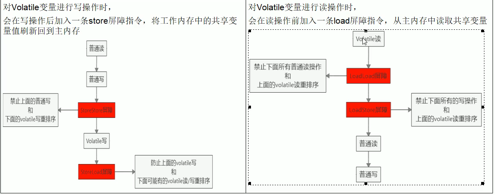

- 什么是volatile？
  
- 是java虚拟机提供得轻量级的同步机制，拥有三种特性：1、保证可见性 2、不保证原子性 3、禁止指令重排
  
- JMM（Java memory model java内存模型） JVM（java虚拟机）

  - JMM本身是一种抽象的概念，并不真实存在，它描述的是一组规则或规范，通过这组规范定义了程序中各个变量的访问方式
  - JMM关于同步的规定：
    - 线程解锁前，必须把共享变量刷新回主内存
    - 线程加锁前 ，必须读取主内存的最新值到自己的工作内存
    - 加锁解锁是同一把锁
  - 由于JVM运行程序的实体是线程，而每个线程创建时JVM都会为其创建一个工作内存（就是栈空间），工作内存是每个线程的私有数据区域，而java内存模型中规定所有的变量都存储在主内存，主内存是共享内存区域，所有的线程都可以访问，但线程对变量的操作（读取赋值等）必须在工作内存中进行，首先要将变量从主内存拷贝到自己的工作内存空间，然后对变量进行操作，操作完成之后再将变量写回主内存，不能直接操作主内存中的变量，各个线程中的工作内存中存储着主内存中的变量副本拷贝，因此不同的线程间无法访问对方的工作内存，线程间的通信必须通过主内存来完成。

- 证明volatile的可见性

  ~~~java
  class Mydata{
  
  	volatile int number = 0;
  
  	public void change(){
  		this.number = 60;
  	}
  
  }
  
  public class VolatileDemo {
  
  	public static void main(String[] args) {
  		// volatile是java虚拟机提供得轻量级得同步机制
  		// 保证可见性 不保证原子性 禁止指令重排
  		Mydata mydata = new Mydata();
  		new Thread(()->{
  			System.out.println("线程:"+Thread.currentThread().getName());
  			try {
  				TimeUnit.SECONDS.sleep(5);
  			} catch (InterruptedException e) {
  				e.printStackTrace();
  			}
  			mydata.change();
  			System.out.println("线程:"+Thread.currentThread().getName()+"将数据修改为60");
  		},"AAA").start();
  
  		// main线程也是一个线程
  		while (mydata.number ==0){
  			// 如果不加volatile关键字，就会一直在这空转
  		}
  		System.out.println("线程:"+Thread.currentThread().getName()+"将数据修改为"+mydata.number);
  	}
  }
  ~~~

- volatile不保证原子性

  - 原子性指的是什么？我的操作不要被其他的操作覆盖了，好比上课签到，我写了个姓（于），然后被别人抢了签到表，然后我再抢过来把名字写完，这样我就很不爽。也即某个线程正在做某个业务时，中间不可以被加塞或者被分割。

  - 不保证原子性测试
  
    ~~~java
    private static void setOkByVolatile() {
    		// volatile是java虚拟机提供得轻量级得同步机制
    		// 保证可见性 不保证原子性 禁止指令重排
    		Mydata mydata = new Mydata();
    		new Thread(()->{
    			System.out.println("线程:"+Thread.currentThread().getName());
    			try {
    				TimeUnit.SECONDS.sleep(5);
    			} catch (InterruptedException e) {
    				e.printStackTrace();
    			}
    			mydata.change();
    			System.out.println("线程:"+Thread.currentThread().getName()+"将数据修改为60");
    		},"AAA").start();
    
    		// main线程也是一个线程
    		while (mydata.number ==0){
    
    		}
    		System.out.println("线程:"+Thread.currentThread().getName()+"将数据修改为"+mydata.number);
    	}
    ~~~
  
  - 解决不保证原子性的问题，使用AtomicInteger。
  
- 有序性

  - 计算机在执行程序时，为了提高性能，编译器和处理器常常会对执行做重排
    - 源代码-》编译器优化重排-->指令并行的重排-->内存系统的重排-->最终执行的指令
  - 单线程环境里面确保程序最终执行结果和代码顺序执行结果一致，as-if-serial语义
  - 处理器在进行重排序时需要考虑指令之间的数据依赖性
  - 多线程环境中线程交替执行，由于编译器优化重排的存在，两个线程中使用的变量能否保持一致性是无法确定的，结果无法预测
  
- volatile实现禁止指令重排，从而避免多线程环境下程序出现乱序的现象

  - 先了解一个概念，内存屏障，是一个cpu指令，他的作用有两个
    - 一是保证特定操作的执行顺序
    - 二是保证某些变量的内存可见性
  - 由于编译器和处理器都能执行指令重排优化，如果在指令间插入一条内存屏障则会告诉编译器和CPU，不管什么指令都不能和这条内存屏障指令重排序，也就是说通过插入内存屏障禁止在内存屏障前后的指令执行重排优化。内存屏障的另外一个作用就是强制刷出各种CPU的缓存数据，因此任何CPU上的线程都能读取到这些数据的最新版本
  - 

- java Synchronized能防止指令重排吗？

  ```java
  public class Singleton {
  
      // 单例模式加不加volatle检验是否会有问题
     private static Singleton singleton;
  
     private Singleton() {
     }
  
     public static Singleton getInstance(){
        if (singleton ==null){
           synchronized (Singleton.class){
              if (singleton==null){
                  //简化分为3步
                  // 1、jvm为对象分配一块内存空间M
                  // 2、在内存M上为对象进行初始化
                  // 3、将内存M的地址赋值给singleton变量
                 singleton = new Singleton();
              }
           }
        }
        return singleton;
     }
  }
  ```

  - synchronized是无法禁止指令重排和处理器优化的。

  - synchronized靠操作系统内核互斥锁实现，volatile靠插入内存屏障防止指令重排保证有序性。synchronized是因为块与块之间看起来是原子操作，块与块之间有序可见；volatile是在底层通过内存屏障防止指令重排，变量前后之间的指令与指令之间有序可见。