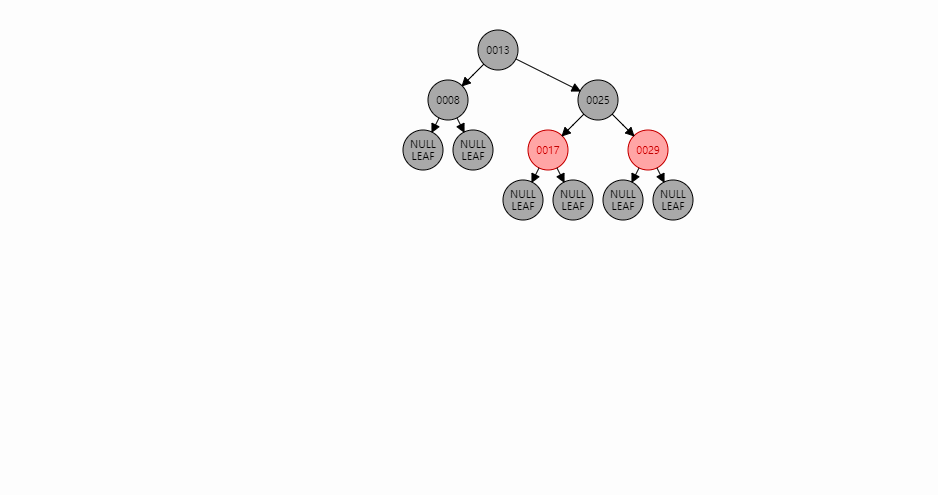

# 数据结构之红黑树（Red/Black Tree）

## 1、前言

- 我们知道java8中hashmap的数据结构为数组+链表+红黑树，看到很多资料里面写的红黑树的内容有点不对，所以结合我给出的GIF图来熟悉下红黑树的数据结构

## 2、红黑树的性质

- 结点是红色或黑色
- 根节点必须是黑色
- 每个叶子结点都是黑色（注意：每个叶子结点都是Null）
- 红色结点不能够连接在一起,也就是所有路径都不能有两个连续的红色结点
- 任意一个结点到每个叶子结点的所有路径中所包含的黑色结点数量是相等的

## 3、构建红黑树

- 根结点为黑色，也就是说第一个元素插入的时候是黑色的，后续的都为红色。原因就是根节点必须为黑色，同时如果后续插入的结点都为黑色那就是全黑树了。

- 红黑树中有变色和自旋，下面来关注什么时候变色，什么时候自旋，自旋又包含左自旋和右自旋。

  - 变色规则：当前结点是红色，父结点为红色，叔叔结点也是红色；当变色满足不了的时候就会自旋了。

    

  - 左旋：当前结点在右边且是红色，父结点红色，叔叔结点黑色

    

  - 右旋：当前结点在左边且是红色，父结点红色，叔叔结点黑色

    

- 变色：

  - 把父亲结点设置为黑色

  - 把叔叔结点设置为黑色

  - 把祖父结点设置为红色，这个地方如果涉及到根结点为祖父结点再把祖父结点变为黑色

     	

## 4、红黑树工具推荐    

[https://www.cs.usfca.edu/~galles/visualization/RedBlack.html](红黑树工具推荐)

